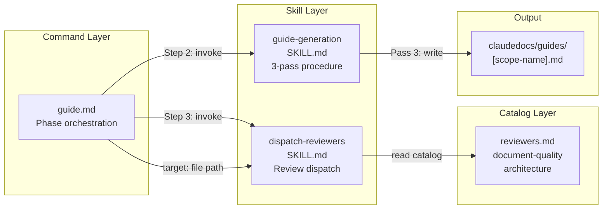
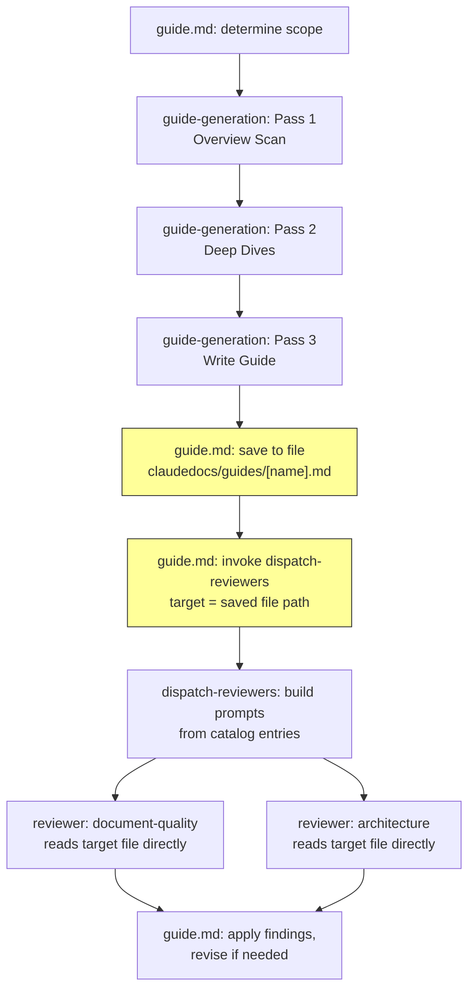

# Architecture Analysis: Guide-Generation System

_Generated: 2026-03-07. This is a point-in-time snapshot, not a live reference._

## Scope & Approach

Analyzed the guide-generation system: the command entry point, skill procedure, review dispatch integration, and reviewer catalog entries. Scope was narrowed from the full project to the specific components affected by the anticipated change (Markdown → HTML book output).

Method: Direct file analysis of all 4 Markdown procedure files + existing guide output inspection. Scout-level context gathered during research phase. Serena LSP tools not applicable (scope is Markdown procedures, not code).

Could NOT assess: runtime behavior of Claude writing HTML (no existing HTML generation to observe), actual token cost impact of inline CSS descriptions in skill prompt.

## Architecture Overview

The guide-generation system spans 4 components across 3 layers of the Claude Praxis framework.

| Component | Responsibility | Key Dependencies |
|-----------|---------------|------------------|
| `commands/guide.md` | Scope determination, skill invocation order, output path, review dispatch | guide-generation skill, dispatch-reviewers skill |
| `skills/guide-generation/SKILL.md` | 3-pass procedure (overview → deep dive → write), Guide Structure template | Serena MCP, scout agents, Write tool |
| `skills/dispatch-reviewers/SKILL.md` | Validate reviewer IDs, enforce tier floors, build prompts, parallel launch | catalog/reviewers.md, Task tool |
| `catalog/reviewers.md` | Reviewer definitions with focus, prompt, verification source, applicable domains | rules/document-quality.md (via reviewer prompt) |

## Dependency Structure

Data flows through the system in a linear chain with one branch at review time:

Yellow nodes indicate the integration points most affected by the HTML transformation.

## Structural Observations

### Observation 1: Output Path Coupling (Low Friction)

**Finding**: `commands/guide.md` (line 36) hardcodes the output pattern as `claudedocs/guides/[scope-name].md`. The `.md` extension is literal in the command text.

**Why it matters**: Changing to a folder structure (`claudedocs/guides/[scope-name]/index.html`) requires updating only this one line plus the overwrite logic (line 37). The coupling is localized — no other component references this path directly.

**Refactoring opportunity**: Straightforward text update. No structural change needed.

### Observation 2: Target Parameter Expects File Paths (Medium Friction)

**Finding**: `skills/dispatch-reviewers/SKILL.md` (line 25) defines `target` as "**File paths only** — list of files to review." The prompt-building step (line 60) constructs: "Review the following files: [file path list from `target` parameter]."

**Why it matters**: If guide output becomes a folder with multiple files (index.html, chapters, style.css), the command must decide WHICH files to pass as review target. Reviewers evaluate content structure, not CSS — so passing only the HTML content files (not style.css) is appropriate. The dispatch-reviewers skill itself needs no modification — it already accepts lists of file paths.

**Refactoring opportunity**: The command passes `[index.html, 01-chapter.html, 02-chapter.html]` as separate target files. dispatch-reviewers handles lists natively. No skill-level change needed.

### Observation 3: Reviewer Content Format Assumption (Medium Friction)

**Finding**: `catalog/reviewers.md` document-quality reviewer (line 42) checks "abstract-to-concrete structure, terminology consistency, progressive detailing, self-contained sections." These are content-structure rules, not Markdown-specific formatting rules. The `rules/design-doc-format.md` constraints (no h4+, no ASCII diagrams, no local file links) apply to design domain only — NOT guide domain.

**Why it matters**: Reviewers read files via the Read tool, which returns file contents as text. HTML files read as text are still structurally readable — `<h2>`, `
`, `<article>` tags are clear to Claude agents. The document-quality rules (abstract-to-concrete, terminology consistency) apply to content regardless of format. No reviewer prompt update is needed.

**Refactoring opportunity**: None required. The rules are format-agnostic for the guide domain. If future guides require format-specific review (e.g., HTML accessibility), a new reviewer catalog entry could be added.

### Observation 4: Guide Structure Template Is the Largest Change (Expected)

**Finding**: `skills/guide-generation/SKILL.md` (lines 84-126) defines the Guide Structure as a Markdown template with sections: Big Picture, Focus Areas (with Where We Are / Walkthrough / Back to the Big Picture), Coverage Boundary.

**Why it matters**: This template must be rewritten to describe HTML structure: semantic elements (`<nav>`, `<article>`, `<main>`), page-per-chapter split logic, CSS class names, navigation elements (sidebar TOC, prev/next links), and mermaid/highlight.js initialization. This is the core design change — the procedure stays the same (3 passes), but Pass 3's output format changes entirely.

**Refactoring opportunity**: Replace the Markdown template section with HTML structure description. The zoom-in/zoom-out pattern (hub Big Picture page + spoke chapter pages) maps naturally to multi-page HTML with navigation.

### Observation 5: Overwrite Logic Simplification (Low Friction)

**Finding**: `commands/guide.md` (line 37) states "If a guide already exists at that path, overwrite it (no versioning — latest guide only)." For a single .md file, this is implicit (Write tool overwrites).

**Why it matters**: For a folder structure, "overwrite" means removing the existing folder contents before writing new files. Claude can do this with a Bash `rm -rf` followed by `mkdir -p` and writes.

**Refactoring opportunity**: Add explicit folder cleanup step before write. Simple but must be stated in the command.

### Structural Fitness Assessment

**Does the current structure naturally support the anticipated changes?**

**Yes, with localized modifications.** The guide-generation system's architecture separates concerns well:

- The **command** (guide.md) owns the output path and review dispatch — updating the path pattern and target file list is a localized change
- The **skill** (guide-generation SKILL.md) owns the guide structure template — replacing the Markdown template with HTML structure description is the core change, but the 3-pass procedure (overview → deep dives → write) remains unchanged
- The **dispatch-reviewers** skill needs no modification — it already accepts file path lists
- The **reviewer catalog** needs no modification — document-quality rules are content-structure rules, not format-specific

No restructuring is needed before implementing this change. The current architecture's separation of command (what/where) from skill (how) naturally accommodates the output format change. The largest effort is in the skill's Pass 3 template description, which is expected — that's where the output format IS defined.

## Confidence Boundary

**Assessed:**
- All 4 component files in scope (fully read)
- Integration contracts between components (target parameter, file paths)
- Reviewer prompt applicability to HTML content
- Existing guide output structure (321 lines, 5 sections)

**Not assessed:**
- Whether Claude can reliably generate consistent multi-file HTML from prompt instructions (no precedent in this project — must be validated during implementation)
- Token cost impact of adding HTML structure + CSS descriptions to the skill prompt
- How reviewers will actually perform when evaluating HTML files (vs Markdown)
- Whether the existing guide's 321 lines warrants multi-page split (it does by industry standards, but shorter guides might be better as single-page)
