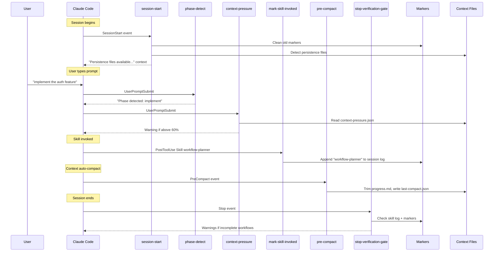
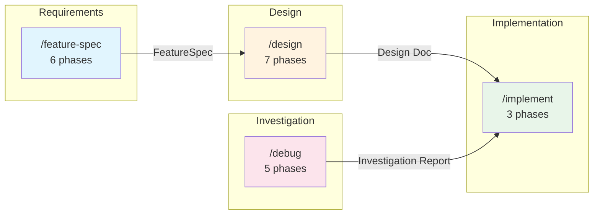
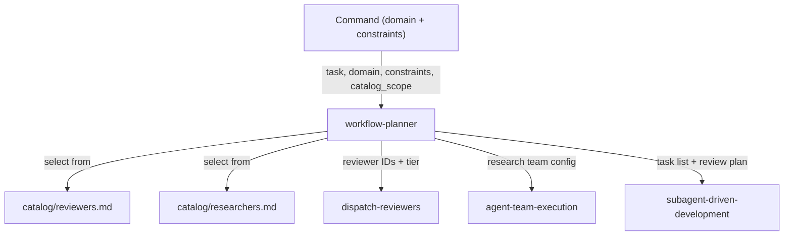
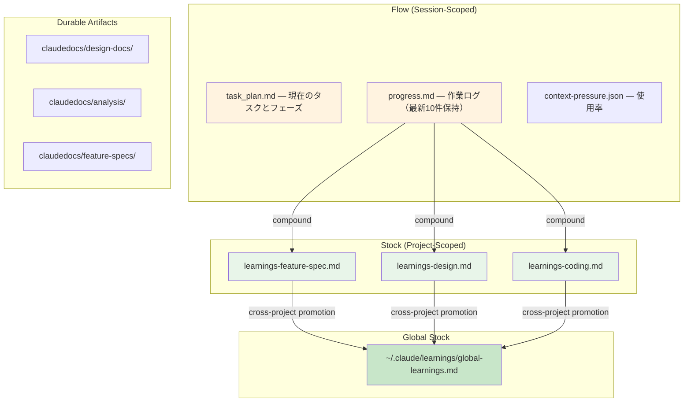

# Claude Praxis Plugin Architecture Analysis

## Overview

Claude Praxisは、Claude Codeのプラグインシステム上に構築された開発フレームワーク。AIがコードを書く過程で、エンジニアの「理解」を蓄積する仕組みを提供する。

プラグインの動作は **3つのメカニズム** で成り立つ：
1. **Hooks** — セッションライフサイクルイベントに応じた自動処理（TypeScript → Node.js）
2. **Commands/Skills** — ユーザーが呼び出すワークフロー手順（Markdown prompt）
3. **Rules** — 常時適用される品質制約（`@import`でコンテキストに注入）

これらが協調し、「設計 → 実装 → レビュー → 学習」のサイクルを回す。

## System-Context Diagram

```mermaid
graph TB
    subgraph "Claude Code Runtime"
        CC[Claude Code Engine]
        CTX[Context Window]
    end

    subgraph "Claude Praxis Plugin"
        subgraph "Layer 1: Always-On Rules"
            R1[code-quality.md]
            R2[document-quality.md]
            R3[design-doc-format.md]
            R4[verification.md]
        end

        subgraph "Layer 2: Hooks (Event-Driven)"
            H1[session-start]
            H2[phase-detect]
            H3[mark-skill-invoked]
            H4[pre-compact]
            H5[stop-verification-gate]
            H6[context-pressure-check]
        end

        subgraph "Layer 3: Commands (Phase Orchestration)"
            C1["feature-spec"]
            C2["design"]
            C3["implement"]
            C4["debug"]
            C5["analyze / research / plan / review / compare"]
            C6["compound / understanding-check"]
        end

        subgraph "Layer 4: Skills (Reusable Procedures)"
            S1[workflow-planner]
            S2[dispatch-reviewers]
            S3[tdd-cycle]
            S4[architecture-analysis]
            S5[subagent-driven-development]
            S6[agent-team-execution]
            S7[context-persistence]
            S8[check-past-learnings]
        end

        subgraph "Layer 5: Catalogs (Agent Pool)"
            CAT1["reviewers.md - 12 types"]
            CAT2["researchers.md - 6 types"]
        end

        subgraph "Layer 6: Agents (Execution)"
            A1["implementer - full model, write"]
            A2["reviewer - full model, read-only"]
            A3["researcher - haiku, read-only"]
            A4["scout - haiku, read-only"]
        end
    end

    subgraph "File System State"
        MK["tmp/claude-praxis-markers/"]
        PS[".claude/context/ - persistence files"]
        CD["claudedocs/ - durable artifacts"]
    end

    CC -->|"import"| R1
    CC -->|"import"| R2
    CC -->|"import"| R3
    CC -->|"import"| R4
    CC -->|"SessionStart"| H1
    CC -->|"UserPromptSubmit"| H2
    CC -->|"UserPromptSubmit"| H6
    CC -->|"PostToolUse(Skill)"| H3
    CC -->|"PreCompact"| H4
    CC -->|"Stop"| H5

    H1 -->|"additionalContext"| CTX
    H2 -->|"phase suggestion"| CTX
    H3 -->|"append marker"| MK

    C1 -->|"invoke"| S1
    C2 -->|"invoke"| S1
    C3 -->|"invoke"| S1
    C4 -->|"invoke"| S1
    S1 -->|"select from"| CAT1
    S1 -->|"select from"| CAT2
    S1 -->|"dispatch"| S2
    S2 -->|"spawn"| A2
    S5 -->|"spawn"| A1
    S6 -->|"spawn"| A3
    S6 -->|"spawn"| A4

    S7 -->|"write"| PS
    S4 -->|"write"| CD
```



## Component Architecture

### 1. Plugin Entry Point

プラグインは `.claude-plugin/plugin.json` で宣言される。Claude Code は以下を自動ロードする：

| 自動ロード対象 | ファイル | メカニズム |
|---|---|---|
| プロジェクト設定 | `CLAUDE.md` | `@import` で rules/ を参照 → 常時コンテキスト内 |
| フック定義 | `hooks/hooks.json` | イベント → Node.js スクリプト マッピング |
| コマンド定義 | `commands/*.md` | `/claude-praxis:xxx` としてスキル登録 |
| スキル定義 | `skills/*/SKILL.md` | 内部スキルとして登録（トリガー条件のみ） |
| エージェント定義 | `agents/*.md` | Task tool の `subagent_type` として登録 |

### 2. Hooks System (Event-Driven State Tracker)

TypeScript で書かれた 6 つのフックが、Claude Code のライフサイクルイベントに応答する。

#### Communication Protocol

```
Claude Code → stdin (JSON) → Hook Script → stdout (JSON) → Claude Code
```

入力: `session_id`, `hook_event_name`, イベント固有フィールド
出力: `hookSpecificOutput.additionalContext` (コンテキスト注入テキスト)

#### Hook一覧と役割



| Hook | Event | 機能 | ブロック? |
|------|-------|------|----------|
| **session-start** | SessionStart | マーカー清掃、永続ファイル検出、コンパクト復旧ガイダンス | No |
| **phase-detect** | UserPromptSubmit | ユーザー入力からフェーズを推定し、コマンドを提案 | No |
| **context-pressure-check** | UserPromptSubmit | コンテキスト使用率が閾値超えで警告（60%/75%） | No |
| **mark-skill-invoked** | PostToolUse(Skill) | 呼び出されたスキル名をセッションマーカーに記録 | No |
| **pre-compact** | PreCompact | progress.md トリミング、信頼度メトリクス集約、last-compact.json 書き込み | No |
| **stop-verification-gate** | Stop | 未完了ワークフローの警告（/implement Final Review等） | No (advisory) |

全フックは **アドバイザリーのみ** — 操作をブロックしない。

#### Marker System

マーカーは `/tmp/claude-praxis-markers/` にファイルベースで管理される：

- **セッションスキルログ**: `{sessionId}` — 呼び出されたスキル名を1行ずつ追記
- **ゲートマーカー**: `{sessionId}-implement-final-review` — ワークフロー完了を記録

SessionStart で当該セッションのマーカーを全削除（クリーンスタート）。

### 3. Commands System (Phase Orchestration)

11 コマンドが 3 つの階層に分類される。

#### Tier 1: Orchestrating Workflows（4つの主要ワークフロー）



各ワークフローの構造：

**`/feature-spec`** — AI 主導インタビューで要件を明確化
- Phase 0: 過去学習チェック → Phase 1: ヒアリング → Phase 2: ギャップ埋め → Phase 3: ドラフト作成 → Phase 4: レビュー → Phase 5: 提示
- PAUSE: Phase 1, 2, 5 後

**`/design`** — リサーチ → 分析 → アウトライン → Design Doc 作成
- Phase 0: 過去学習チェック → Phase 1: プランナーによるリサーチ計画 → Phase 2: Architecture Analysis → Phase 3: アウトライン → Phase 4: アウトラインレビュー(Light) → Phase 5: 本文執筆 → Phase 6: 最終レビュー(Thorough) → Phase 7: 提示
- PAUSE: Phase 7 後のみ（Phase 0-6 は自動実行）

**`/implement`** — Design Doc をもとに TDD で実装
- Phase 0: 過去学習チェック → Phase 1: Architecture Analysis + プランナーによる計画 → Phase 2: タスクごと TDD + レビュー → Phase 3: Final Review
- PAUSE: Phase 1 後（計画承認）、Phase 2 中（意思決定ポイント）、Phase 3 後（Final Review マーカー）

**`/debug`** — 体系的な問題調査
- Phase 0: 過去学習チェック → Phase 1: 再現 → Phase 2: 分離 → Phase 3: 診断 → Phase 4: 文書化
- PAUSE: Phase 1, 2, 3, 5 後

#### Tier 2: Standalone Commands（4つの補助コマンド）

| Command | 用途 | 主要ワークフローとの関係 |
|---------|------|------------------------|
| `/analyze` | コードベース構造分析 | `/design` Phase 2, `/implement` Phase 1 で自動呼び出し |
| `/research` | 問題空間の調査 | `/design` Phase 1 で自動呼び出し |
| `/plan` | 軽量な実装計画 | Design Doc がない場合のみ使用 |
| `/review` | コードレビュー | `/implement` Phase 3 で自動呼び出し |

#### Tier 3: Meta Commands（3つのメタコマンド）

| Command | 用途 | タイミング |
|---------|------|-----------|
| `/compare` | 2-4 選択肢の構造化比較 | 意思決定が必要な時 |
| `/compound` | Flow → Stock 学習蓄積 | ワークフロー完了後 |
| `/understanding-check` | AI 生成物の理解度確認 | 別セッション推奨 |

### 4. Skills System (Reusable Procedures)

スキルは「手順書」で、コマンドから呼び出される。SKILL.md にトリガー条件のみ記載し、本文はスキル呼び出し時にロードされる（CSO: Conditional Skill Orchestration）。

#### Central Orchestrator: workflow-planner



**workflow-planner の役割**：
- タスク分析 → 複雑度判定
- カタログからエージェント選択（理由付き）
- レビュー階層決定（None / Light / Thorough）
- 並列化可能なタスクの特定
- Axes Table 作成（要探索の軸を特定）

**コマンドが提供するもの**: domain（どのフェーズか）、constraints（TDD 必須等）、catalog_scope（使えるエージェント一覧）
**プランナーが決定するもの**: 誰を使うか、何段階のレビューか、どの軸を探索するか

#### Graduated Review: dispatch-reviewers

レビュー強度は成果物のリスクに応じて段階的に変わる：

| Tier | レビュアー数 | Devil's Advocate | 適用場面 |
|------|------------|-----------------|---------|
| None | 0 | No | 中間ドラフト（完全書き直し予定） |
| Light | 1-2 | Optional | アウトライン、低リスク中間物 |
| Thorough | 3+ | **Mandatory** | 最終成果物、高リスク決定 |

**構造的下限**: Thorough レビューは 3+ レビュアー + `devils-advocate` 必須（非交渉）。

**Context Isolation Rule**: 全レビュアーは会話履歴・実装議論・プランナー推論を参照不可。ファイルを独立に読み、独自判断する。

#### TDD Enforcement: tdd-cycle

`/implement` Phase 2 の各タスクで必須実行：

```
RED → 失敗するテスト作成
GREEN → 最小限の実装
REFACTOR → リファクタリング + 構造摩擦チェック
```

構造摩擦チェック: タッチするファイル数が複雑度に対して過大な場合、人間に選択肢を提示（続行 or 先にリストラクチャ）。

#### Independent Axis Evaluation

設計/実装の意思決定で複数の有効なアプローチがある場合：

1. Axes Table で各軸を独立に定義（A vs B）
2. "Requires exploration" の軸には `axis-evaluator` エージェントを並列ディスパッチ
3. 各エバリュエーターは **1つの軸のみ** 評価（他の軸を推測しない）
4. 結果統合: 軸間相関を確認 → 非衝突は自動解決 → 衝突のみ人間判断

### 5. Agents (Execution Layer)

| Agent | Model | Tools | maxTurns | 用途 |
|-------|-------|-------|----------|------|
| implementer | Full (sonnet) | Write, Edit, Bash, Grep, Glob | 50 | コード実装 |
| reviewer | Full (sonnet) | Read, Bash, Grep, Glob | 30 | コードレビュー（read-only） |
| researcher | Haiku | Read, Bash, Grep, Glob, WebSearch, WebFetch | 20 | 調査（軽量） |
| scout | Haiku | Read, Bash, Grep, Glob | 20 | コードベース探索（read-only） |

### 6. Persistence Model (Context Survival)



**Stock/Flow モデル**:
- **Flow**: session-start で検出、pre-compact でトリミング。一時的な作業記録
- **Stock**: `/compound` で Flow から昇格。プロジェクト寿命の永続学習
- **Write Auto, Read Manual**: 自動で書き込むがコンテキスト注入は自動しない。SessionStart はファイル名のみ通知

**信頼度メタデータ**: 学習エントリに `Confirmed: N回 | YYYY-MM-DD | phases` 形式で確認回数を追跡。pre-compact で集約統計を計算。

## Structural Friction Areas

### 1. check-skill-gate の無効化

`hooks.json` で `check-skill-gate`（PreToolUse）が設定されていない。元々はスキルロード前のファイル編集をゲートする意図だったが、現在は無効。ルール適用が `@import` で自動化されたため不要になった可能性があるが、明示的な廃止判断やコメントがない。

**影響**: 低。コードは存在するがテストも維持されており、将来の再有効化は容易。

### 2. context-pressure.json の書き込み元が不明

`context-pressure-check` フックは `context-pressure.json` を読み取るが、このファイルを書き込む機構がプラグイン内に存在しない。Claude Code 本体の機能か、外部ツールに依存している。

**影響**: 中。この機能が動作しない場合、コンテキスト圧迫の警告が出ない。

### 3. Marker の永続性

マーカーファイルは `/tmp/` に作成され、SessionStart で当該セッション分のみ削除される。古いセッションのマーカーが蓄積する可能性がある（OS の `/tmp/` クリーンアップに依存）。

**影響**: 低。マーカーは数バイトのファイルで、セッションID でスコープされるため機能的な問題はない。

### 4. Phase Detection の精度限界

`phase-detect` は正規表現ベースで、意味的な意図の曖昧さを完全には解消できない。`COMPOUND_OVERRIDES` で一般的なケースは処理するが、エッジケースは残る。

**影響**: 低。フェーズ検出はアドバイザリーのみで、誤検出しても操作をブロックしない。

## Confidence Boundary

### 分析範囲

- Plugin 全体の構造と動作メカニズム
- 全 6 フック、全 11 コマンド、主要 8 スキル、全 4 エージェント、全 2 カタログ
- 永続化モデルとマーカーシステム

### 未評価

- **実際のプロンプト品質**: スキル・コマンドの Markdown がどの程度効果的に Claude の行動を制御するかは実行時の評価が必要
- **パフォーマンス特性**: 並列エージェント実行時のトークン消費量やレイテンシ
- **学習蓄積の長期的効果**: Stock ファイルの品質が実際にどう変化するか
- **Claude Code 本体との互換性**: プラグイン API の安定性・バージョン互換性
