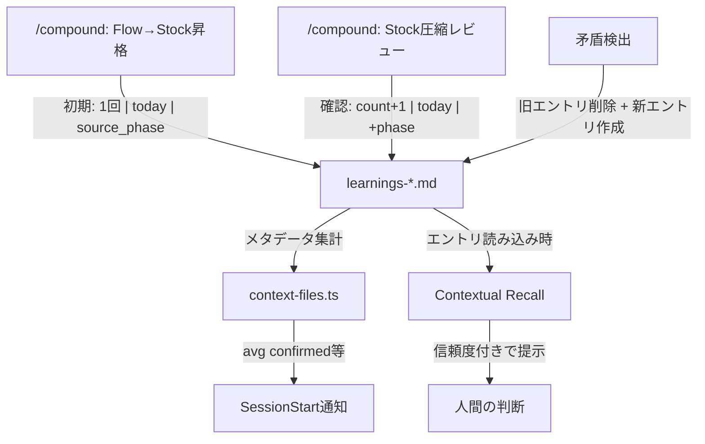

# Confidence-Scored Learning

## Overview

claude-praxisの学習システムは、一度記録された学びと繰り返し確認された学びを同じ重みで扱っている。信頼度スコアは、各学びエントリに「確認回数・最終確認日・確認元フェーズ」のメタデータを付与し、学びの成熟度を可視化する仕組みである。蓄積された知識の品質を透明にし、後続の機能（スキル自動生成、コンテキスト優先度制御）の判断基盤を提供することが目的である。

## Context and Scope

claude-praxisは「Stock vs Flow」モデルで知識を管理している。Flowは作業中の揮発的な記録（progress.md）で、Stockは永続的な再利用可能な学び（learnings-*.md）である。Flowの知見が再利用価値を持つとき、`/claude-praxis:compound`コマンドで人間の承認を得てStockに昇格する。

Contextsシステム（#2）により、Stockは3つのレベル別ファイルに分割済みである：`learnings-feature-spec.md`（要件・スコープ判断）、`learnings-design.md`（設計・アーキテクチャ）、`learnings-coding.md`（実装パターン・品質ルール）。各フェーズは必要なファイルだけを読み込み、コンテキストウィンドウの効率を確保している。

しかし、各ファイル内のエントリはすべて等しい重みで扱われている。1回のセッションで発見された知見も、5回のプロジェクトで繰り返し確認された知見も、同じフォーマットで並んでいる。この結果、3つの問題が生じている。

第一に、**学びの品質が不透明**である。23のエントリ（現時点）の中で、どれが十分に検証された信頼できる知見で、どれがまだ仮説段階なのかが見分けられない。`/claude-praxis:compound`の圧縮ステップで重複排除や類似統合を行う際にも、エントリの成熟度が判断材料にならない。

第二に、**知識の再利用精度が低い**。getting-startedのContextual Recallは過去の学びを提示して「同じ前提が成り立つか？」と問うが、学びの確認履歴がないため、提示の優先順位付けができない。すべてのエントリが等しく候補になる。

第三に、**スキル自動生成（#6）の基盤がない**。後続の#6は「信頼度が十分に蓄積された学習からスキル候補を生成」することを想定しているが、現在のフォーマットには信頼度を表現するデータがない。

FeatureSpecは、この問題に対して「learnings.mdの各エントリに信頼度（確認回数/最終確認日）を付与し、/compound時に信頼度を更新する仕組み」を要件として定義している。

ECC（everything-claude-code）のinstinctシステムは、各instinctに0.0〜1.0のconfidenceスコアを持たせ、>=0.8で高信頼としてスキル候補にクラスタリングする仕組みを実装している。ただし、FeatureSpecは「instinctsの完全再現ではなく、信頼度スコアの概念だけを取り入れる」と明記しており、ECCの概念を取り入れつつclaude-praxisの既存モデルに適合する設計が必要である。

## Goals / Non-Goals

### Goals

- 各learningsエントリに信頼度メタデータ（確認回数、最終確認日、確認元フェーズ）を付与するフォーマットを定義する
- `/claude-praxis:compound`のFlow→Stock昇格時に初期信頼度を設定し、既存Stockレビュー時に信頼度を更新する仕組みを設計する
- 信頼度メタデータをSessionStartの通知に含め、Claudeの読み込み判断を支援する
- getting-startedのContextual Recallで信頼度を活用した提示優先順位の指針を定義する
- 後続の#6（スキル自動生成）が依存するデータモデルを確立する
- 既存エントリへの移行パスを定義する

### Non-Goals

- 信頼度に基づく自動フィルタリングの導入（しきい値による自動除外は行わない。読み込み判断はClaudeに委ねる）
- スキル自動生成の実装（#6の責務。本設計はデータモデルの確立まで）
- 信頼度の時間減衰メカニズム（開発学習は時間経過で誤りにならない。無効化は明示的に行う）
- global-learnings.mdへの信頼度導入（クロスプロジェクト学習は単一ファイルを維持。将来の検討事項）
- hookによる信頼度の自動更新（更新は/compoundの人間承認フローでのみ行う）

## Proposal

### 信頼度メタデータモデル

各learningsエントリに3つの信頼度ディメンションを追加する：**確認回数**（confirmations）、**最終確認日**（last_confirmed）、**確認元フェーズ**（confirmed_in）。

この3ディメンションを選択した理由は、それぞれが信頼度の異なる側面を表現するためである。確認回数は「どれだけ繰り返し正しいと判断されたか」を示す。最終確認日は「最近も有効であることが確認されたか」を示す。確認元フェーズは「どれだけ多様な文脈で検証されたか」を示す。単一の数値スコア（ECC方式の0.0〜1.0）ではなく、3つの独立した値を保持する理由は、用途によって重要なディメンションが異なるためである。/compoundの圧縮判断には確認回数が重要であり、Contextual Recallの優先順位には最終確認日が重要であり、スキル自動生成の候補選定には確認元フェーズの多様性が重要になる。

ECCのinstinctシステムでは単一のconfidenceスコア（0.0〜1.0）を使用しているが、ECCはinstinct単位でのimport/export/evolveを前提としており、数値スコアは比較とフィルタリングに適している。claude-praxisのlearningsは人間が読み、人間が判断するMarkdownファイルであり、各ディメンションが独立して意味を持つ方が判断材料として有用である。

スコアに時間減衰は導入しない。開発における学びは「deny-by-defaultパターン」のように、時間経過で価値が減るものではない。学びが無効になるのは前提条件が変化した時であり、その判断は/compoundの圧縮ステップで人間が行う。ECCのinstinctシステムでも「confidence decay if contradicted」という設計だが、自動減衰ではなく矛盾検出時の処理として扱っている。

### エントリフォーマット

既存のLearning/Context/Implicationフィールドの後に、`Confirmed`フィールドを追加する。

> **Conceptual** — illustrates the approach, not the final implementation.

```markdown
## deny-by-default pattern in hooks
- **Learning**: エラーパス（JSON parse failure, empty session_id等）では...
- **Context**: gate-system-v2で導入。exit 0でのサイレント許可は...
- **Implication**: 新しいgate hookは全てdeny-by-defaultに従うべき
- **Confirmed**: 4回 | 2026-02-18 | implement, design, review
```

`Confirmed`フィールドの形式は`{回数} | {最終確認日} | {確認元フェーズのカンマ区切り}`とする。この形式を選択した理由は3つある。

第一に、人間が読んで即座に意味を理解できる。「4回確認、直近は2月18日、実装・設計・レビューで検証済み」と読める。

第二に、既存のエントリフォーマットとの整合性が高い。Learning/Context/Implicationと同じ`- **Key**: Value`パターンに従い、新しい構文規則を導入しない。

第三に、機械的に解析可能である。context-files.tsが既にh2ヘッダーのカウントを行っており、同様の正規表現パーサーで`Confirmed`フィールドを抽出できる。`|`区切りの3フィールドは位置ベースで解析でき、JSONやYAMLのパーサーは不要である。

### 信頼度の更新トリガー

信頼度が更新されるのは、/compoundの実行時のみである。自動更新は行わない。

この制約を設ける理由は、「Write Auto, Read Manual」原則のWrite側への拡張である。Flowへの書き込み（progress.md）は自動で行うが、Stockの変更は常に人間の承認を経る。信頼度の更新はStockの品質に直結するため、人間の判断を介在させる。

/compoundでの更新は3つの場面で発生する。

**場面1: Flow→Stock昇格時の初期設定**。新しいエントリがStockに昇格するとき、`Confirmed: 1回 | {昇格日} | {検出元フェーズ}`を付与する。昇格自体が最初の確認行為であるため、初期値は1である。

**場面2: 既存Stockのレビュー時の確認更新**。/compoundの圧縮ステップで既存エントリをレビューする際、「このエントリは現在も有効か？」の判断が行われる。有効と判断された場合、確認回数をインクリメントし、最終確認日を更新し、現在のフェーズを確認元に追加する（重複は除外）。

**場面3: 矛盾検出時のアーカイブ**。/compoundのレビューで学びの前提が崩れたと判断された場合、既存エントリを削除し、新しい前提に基づく新エントリを作成する（初期信頼度で）。旧エントリの「確認回数が高かったが無効になった」事実は、新エントリのContextに記録する。これにより、なぜ方針が変わったかの履歴が保持される。

### /compound への統合

/compoundコマンドの2つのフェーズに信頼度を組み込む。

**Phase 1（Flow→Stock昇格）の変更**: 昇格提案テーブルに`初期信頼度`カラムを追加する。すべての新規エントリは`1回 | {今日} | {元フェーズ}`で開始する。

**Phase 2（Stock圧縮）の変更**: 圧縮提案テーブルに`現在の信頼度`カラムを追加し、レビュー後の判断に応じて信頼度を更新する。圧縮の3操作（重複排除・陳腐化削除・類似統合）における信頼度の扱いは以下の通りである。

- **重複排除（Merge）**: 統合後のエントリは、統合元の確認回数の合計を継承し、確認元フェーズは和集合を取る。最終確認日は最も新しい日付を使用する
- **陳腐化削除（Delete）**: エントリを削除する。信頼度が高くても前提が崩れたエントリは削除対象になる。「高信頼度 = 削除不可」ではない
- **類似統合（Synthesize）**: 複数のエントリを抽象化して1つにまとめる場合、新エントリの確認回数は1から始める。抽象化された学びは新しい知見であり、元の個別学びの確認回数を引き継ぐのは不適切である。ただし、Contextに「N個のエントリから統合」と記録する

### SessionStart通知への拡張

context-files.tsの`PersistenceFileInfo`に信頼度のサマリーを追加する。SessionStartの通知に各learningsファイルの信頼度分布を含める。

> **Conceptual** — illustrates the approach, not the final implementation.

```
learnings-coding.md (12 entries, avg confirmed: 2.8, updated: 2026-02-20)
```

この通知により、Claudeは「このファイルには十分に検証されたエントリが多い」か「新規エントリが多く、まだ検証が浅い」かを判断できる。ただし、これはメタデータの通知であり、ファイル内容の自動注入ではない（Iron Lawを維持）。

### Contextual Recallでの活用

getting-startedスキルの「Contextual Recall of Past Learnings」で信頼度を活用する。過去の学びを提示する際、信頼度メタデータを含めて提示することで、人間の判断材料を増やす。

提示の優先順位は厳密なアルゴリズムではなく、ガイドラインとして定義する。確認回数が多く、確認元フェーズが多様なエントリは、より高い信頼度を持つ情報として提示される。ただし、信頼度が低いエントリを排除するのではなく、信頼度の情報を添えて判断材料として提供する。



### 既存エントリの移行

現在のlearnings-*.mdには信頼度メタデータがないエントリが存在する。移行は/compoundセッションで行う。

移行方針は「初回/compound実行時に一括で初期信頼度を付与する」である。具体的には、/compoundの圧縮ステップで既存エントリのレビューを行い、有効と判断されたエントリに`Confirmed: 1回 | {移行日} | compound`を付与する。確認回数1は、移行時の確認が最初の明示的な検証行為であることを反映している。

`Confirmed`フィールドを持たないエントリは「未検証」として扱う。context-files.tsはフィールドの有無を検出し、未検証エントリは確認回数0として集計する。これにより、移行中も既存の動作が壊れない。

## Alternatives Considered

### Alternative: 別ファイルによるメタデータ管理

learningsファイルは純粋なMarkdownとして維持し、信頼度メタデータを別のJSONファイルに格納する。

| Aspect | Detail |
|--------|--------|
| How it works | `.claude/context/learnings-metadata.json`にエントリID→信頼度のマッピングを格納する。エントリIDはh2見出しのslugify値を使用。learningsファイルの読み書きとは独立してメタデータを管理する |
| Why Proposal is preferred over this | 2つのファイルを同期し続ける必要がある。learningsファイルのエントリ名を変更した場合、メタデータファイルのIDも更新しなければならない。/compoundの圧縮（重複排除・統合）でエントリが変更されるたびにメタデータファイルも更新する必要があり、同期漏れのリスクが生じる。Proposalのインライン方式では、エントリとメタデータが物理的に同一の場所にあるため同期の問題が発生しない |
| When to reconsider this alternative | learningsエントリが100件を超え、メタデータの集計や検索がMarkdownパースでは非効率になった場合。またはメタデータの種類が大幅に増え（タグ、関連エントリリンク等）、Markdownフィールドでは表現しきれなくなった場合 |

### Alternative: ECC方式のYAMLベースinstinctシステム

各学びをYAMLフロントマター付きの独立ファイルとして管理し、0.0〜1.0の数値スコアで信頼度を表現する。import/exportによる共有機能を含む。

| Aspect | Detail |
|--------|--------|
| How it works | 各instinctが独立したYAMLファイル。`id`, `trigger`, `confidence: 0.7`, `domain`等のフロントマターを持つ。`evolve`コマンドでクラスタリングし、高信頼度のクラスターからスキル/コマンド/エージェントを生成する |
| Why Proposal is preferred over this | FeatureSpecが「instinctsの完全再現ではなく、信頼度スコアの概念だけを取り入れる」と明記している。claude-praxisのlearningsは人間が読むMarkdownドキュメントであり、「Learning/Context/Implication」というナラティブ構造がclaude-praxisの「なぜを言語化する」哲学の核心である。YAMLフロントマター形式はこのナラティブを分断する。また、instinct単位の独立ファイル管理は、現在23エントリの規模に対して過剰なインフラである |
| When to reconsider this alternative | learningsが個別ファイルとして管理する方が自然な規模（100件以上）に達し、かつクロスプロジェクトでのinstinct共有（import/export）の需要が具体化した場合 |

### Alternative: メタデータなしのContextual Recall強化

信頼度メタデータを導入せず、Contextual Recallの提示ロジックを改善することで「よく使われる学びが自然と優先される」体験を実現する。

| Aspect | Detail |
|--------|--------|
| How it works | learningsファイルには変更を加えず、getting-startedのContextual Recall指示を強化する。「このタスクに最も関連性の高い学びを選んで提示せよ」というプロンプトベースのフィルタリングに依存する。信頼度は暗黙的にLLMの判断に委ねる |
| Why Proposal is preferred over this | LLMの判断には構造的な限界がある（global learnings記載: 「Text-only rules are skipped when there is no mechanical enforcement」）。信頼度が暗黙的であると、/compoundの圧縮判断でも「どのエントリが十分に検証されているか」が見えない。また、#6（スキル自動生成）は信頼度データに依存するため、メタデータなしでは#6の実装が不可能になる |
| When to reconsider this alternative | learningsのエントリ数が非常に少なく（10件以下）、全件を提示しても人間の判断負荷が低い場合。かつ#6（スキル自動生成）を実装しない方針に変更した場合 |

## Cross-Cutting Concerns

### Observability

`Confirmed`フィールドの解析に失敗した場合（フォーマット不正、フィールド欠損等）、context-files.tsはそのエントリを確認回数0として扱い、処理を続行する。SessionStartの通知は中断しない。これは既存のdeny-by-default原則の適用範囲外である（メタデータの精度低下は許容できるが、セッション開始の失敗は許容できない）。

## Concerns

- **メタデータのフォーマット変更耐性**: `Confirmed`フィールドの`{回数} | {日付} | {フェーズ}`形式は固定的である。将来メタデータの種類を増やす場合（例: 無効化理由、関連エントリ参照）、フォーマットの拡張性が課題になる。対策として、パーサーは位置ベース（3フィールド固定）で実装し、フィールド追加時は末尾に`|`で追加するかフォーマットバージョンを導入する。ただし、YAGNI原則に基づき初期実装では現在の3ディメンションで十分と判断する
- **圧縮時の信頼度引き継ぎルール**: 重複排除（合計）と類似統合（1にリセット）で異なるルールを採用しているが、境界ケースが存在する。「ほぼ同じだが微妙に異なる2つのエントリ」は重複排除か類似統合か。この判断は人間に委ねるが、/compoundの提案テーブルで「重複排除 → 信頼度合算」「類似統合 → 信頼度1から」を明示し、人間が操作の種類を選択できるようにする
- **移行期間の混在状態**: `Confirmed`フィールドがあるエントリとないエントリが混在する期間がある。context-files.tsは未検証エントリを確認回数0として扱うため集計は可能だが、/compoundでのレビュー時に「未検証エントリは優先的にレビューすべきか」という判断基準が必要になる。移行完了まで、/compoundは未検証エントリを圧縮提案の対象に含め、レビュー時に信頼度を付与する運用とする
- **SessionStart通知の情報量**: 現在のper-file通知（エントリ数 + mtime）に平均確認回数を追加すると通知が長くなる。通知はメタデータであり内容注入ではないためIron Law違反ではないが、コンテキスト消費は微増する。平均確認回数1つの追加であれば影響は限定的と判断する

## Review Checklist

- [ ] `Confirmed`フィールドのフォーマットが明確で、手動でも機械的にも解析可能であること
- [ ] /compoundのPhase 1（昇格）とPhase 2（圧縮）の両方で信頼度更新が組み込まれていること
- [ ] 圧縮3操作（重複排除・陳腐化削除・類似統合）それぞれの信頼度引き継ぎルールが定義されていること
- [ ] 既存エントリ（`Confirmed`なし）からの移行パスが明確であること
- [ ] SessionStart通知への信頼度サマリー追加がIron Law（Write Auto, Read Manual）を維持していること
- [ ] #6（スキル自動生成）が依存するデータ（確認回数、確認元フェーズの多様性）がデータモデルに含まれていること
- [ ] global-learnings.mdへの信頼度導入がNon-Goalsとして明記されていること
