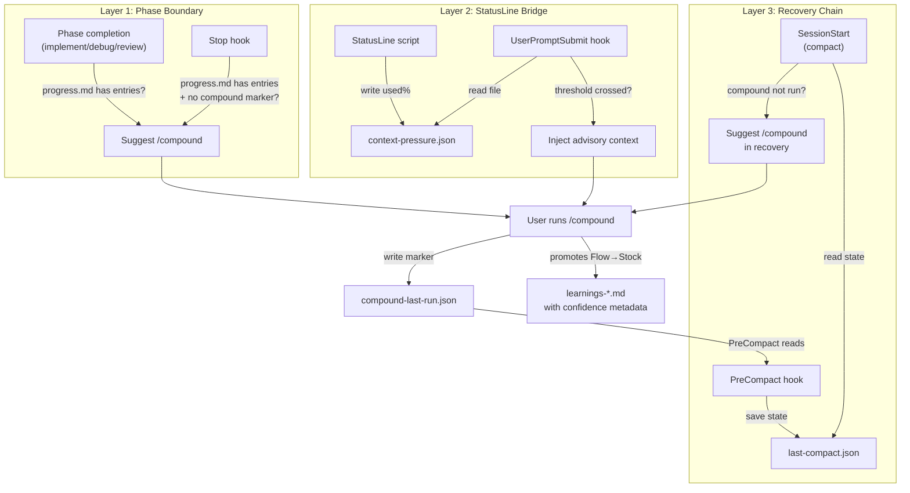

# Strategic Compact + Proactive Compound

## Overview

claude-praxisの/compoundと/compactは独立したコマンドであり、連携していない。ユーザーが/compoundを実行せずにコンテキストが逼迫すると、Flowに蓄積された知見がStockに昇格されないまま自動compactで失われる。Strategic Compact + Proactive Compoundは、コンテキスト圧迫の事前検知と/compound提案を連動させ、知識の保全と整理がセッションのライフサイクルに自然に組み込まれる仕組みである。

## Context and Scope

claude-praxisのコンテキスト管理は、Stock vs Flowモデルで構成されている。Flowはprogress.mdやtask_plan.mdなど作業中の揮発的な記録であり、Stockはlearnings-*.mdに蓄積された永続的な再利用可能な学びである。Flow→Stockの昇格は`/claude-praxis:compound`コマンドで人間の承認を得て行われ、Stock内のエントリには#3（信頼度スコア付き学習）で導入される確認回数・最終確認日・確認元フェーズのメタデータが付与される。

しかし、/compoundの実行とコンテキストcompactの発生は独立している。Claude Codeは使用率が約83.5%に達すると自動compactを実行する。PreCompact hookはcompact直前にprogress.mdのトリミングとtask_plan.mdのタイムスタンプ更新を行うが、これは機械的なクリーンアップであり、Flowの知見をStockに昇格させるLLM判断は行わない。その結果、以下の問題が生じている。

第一に、**知識喪失のリスクが不可視**である。コンテキストがどれだけ逼迫しているかをユーザーもClaudeも認識できないため、「そろそろ/compoundすべき」という判断のタイミングがない。PreCompact hookが発火した時点ではcompactは止められず、知見の昇格機会は既に失われている。

第二に、**compact後の復帰が不十分**である。SessionStart hookはpersistence filesの存在を通知するが、「compactが発生した」「/compoundが未実行だった」という文脈は伝えない。結果、compact後のClaudeは新しいセッションのように再出発し、直前の作業で得た知見に関する連続性が途切れる。

第三に、**/compoundのタイミングがセッションのライフサイクルに統合されていない**。getting-startedのPhase Completion Signalsには/compound提案が含まれるが、これはフェーズ完了時の静的な提案であり、コンテキスト消費の動的な状態とは連動しない。

Claude Codeのhookシステムには重要な制約がある。**hookはコンテキスト使用率を直接取得できない**。リアルタイムのコンテキストメトリクスを受信できるのはStatusLine（ステータスバースクリプト）のみであり、StatusLineは`context_window.used_percentage`と`remaining_percentage`を各アシスタントメッセージの後に受信する。ただしStatusLineは表示専用の仕組みであり、hookではない。この制約が本設計の中心的な課題である。

## Goals / Non-Goals

### Goals

- コンテキスト圧迫をユーザーに事前通知し、/compact前に/compoundの実行を促す仕組みを設計する
- PreCompact hookを拡張し、compact直前のFlow状態をより効果的に保全する
- SessionStart hookを拡張し、compact後の復帰フローに/compound提案を組み込む
- 既存のIron Law（Write Auto, Read Manual）を維持する
- StatusLineの有無に関わらず基本機能が動作する設計にする（StatusLineは強化オプション）
- #3（信頼度スコア付き学習）と連携し、信頼度メタデータを考慮した知識保全を実現する

### Non-Goals

- /compoundの自動実行（人間の承認を常に要求する。hookからコマンドをプログラム的に起動することはできず、また起動すべきでもない）
- /compactのブロックまたは遅延（PreCompact hookにブロック能力はなく、Claude Codeの設計上、compactはユーザー制御外で発生しうる）
- コンテキストウィンドウ使用量の精密な測定（StatusLineのused_percentageはシステムプロンプトを含まないため概算であり、精密な予測は目的としない）
- /compact前の/compound実行の機械的な保証（提案はできるが、実行するかはユーザーの判断）
- StatusLineの必須化（StatusLineはClaude Codeのオプション機能であり、全ユーザーが設定しているわけではない）

## Proposal

### 設計原則: 段階的検知と多層提案

コンテキスト圧迫の検知と/compound提案を単一のメカニズムに依存させない。代わりに、3つの独立した層を設け、それぞれが異なるタイミングと信頼性で機能する。いずれかの層が欠けても、残りの層が知識保全の機会を提供する。

この多層アプローチを採用する理由は、Claude Codeのhookシステムにはコンテキストメトリクスへの直接アクセスがないという根本的制約があるためである。単一のメカニズム（例：コンテキスト%の閾値チェック）ではこの制約を克服できない。複数の異なる検知手段を組み合わせることで、各手段の限界を補完し、「/compoundを忘れてcompactが来る」シナリオを最小化する。

### Layer 1: フェーズ境界での/compound提案

最も確実で追加インフラ不要の層。作業の自然な区切り（フェーズ完了、タスク間の移行）で/compoundを提案する。

この層を基盤にする理由は、/compoundの最適なタイミングがコンテキスト使用率の閾値ではなく、「意味のある作業の区切り」だからである。実装の途中で/compoundを提案しても中断になるだけだが、タスク完了後なら自然な振り返りのタイミングになる。

getting-startedスキルのPhase Completion Signalsを拡張し、/compound提案の条件を明確にする。/implement完了後、/debug完了後、/review完了後の3つのフェーズ完了時に、progress.mdにエントリが存在する場合は/compoundを提案する。この提案はadvisoryであり、ユーザーが判断する。

Stop hookも拡張する。現在のstop-verification-gate.tsはcode-sessionマーカーの有無を確認してverification-before-completionを強制するが、この判断ロジックの後に「progress.mdにエントリがあり、/compoundが未実行」の場合の通知を追加する。ただし、verification-before-completionのような品質ゲートとは異なり、/compoundは「推奨」であり「必須」ではない。したがってStop hookでは**ブロックせず**、`additionalContext`でClaudeに/compound提案を促す形にとどめる。

### Layer 2: StatusLine Bridgeによるリアルタイム検知（オプション強化）

StatusLineがコンテキスト使用率をファイルに書き出し、hookがそのファイルを読むことで、リアルタイムのコンテキスト圧迫検知を実現する。StatusLineが設定されていない環境ではこの層は不活性となり、Layer 1とLayer 3で基本機能を維持する。

StatusLineスクリプトは各アシスタントメッセージ後に`context_window.used_percentage`を受信する。スクリプトを拡張し、閾値を超えた場合にマーカーファイル（`.claude/context/context-pressure.json`）を書き出す。UserPromptSubmit hookに`type: "command"`の新規エントリを追加し、このマーカーファイルを読んで`additionalContext`を返す。

2段階の閾値を設ける。**60%で情報通知**（「コンテキストの60%を使用中。作業の区切りで/compoundを検討してください」）、**75%で緊急提案**（「コンテキストの75%を使用中。自動compactが近づいています。/compoundで知識を保全することを推奨します」）。

閾値が60%と75%である根拠は、自動compactが~83.5%で発動する点にある。60%は「まだ余裕があるが意識すべき」段階であり、75%はcompactまで約8.5%しかマージンがない「行動すべき」段階である。60%以下では通知がノイズになり、80%以上ではcompactまでの余裕が少なすぎて/compound実行が間に合わない可能性がある。

スロットリングとして、マーカーファイルに「最後に通知した閾値レベル」を記録し、同じ閾値では再通知しない。使用率が下がった場合（compactやclear後）はマーカーをリセットする。

StatusLineスクリプトの設定はclaude-praxisのプラグインスコープ外（ユーザーの`~/.claude/settings.json`で管理される）であるため、推奨にとどめ必須としない。context-persistenceスキルにStatusLine Bridgeの活用ガイドを記載する。

### Layer 3: PreCompact + SessionStart リカバリーチェーン

compact発生時の最後の防衛線とcompact後の復帰支援。Layer 1とLayer 2が機能しなかった（ユーザーが/compoundを実行しなかった）場合の安全ネットとして機能する。

**PreCompact hook拡張**: 現在のpre-compact.tsはprogress.mdのトリミングとtask_plan.mdのタイムスタンプ更新を行う。この処理に加えて、compact発生のメタデータを`.claude/context/last-compact.json`に記録する。含める情報は、compactのタイムスタンプ、トリガー種別（auto/manual）、/compound実行済みフラグ、トリミング前のprogress.mdの未昇格エントリ数と直近3件のh2見出しである。progress.mdの全文をJSON化するのではなくエントリ数と見出しのみを記録する理由は、compact後のコンテキスト消費を最小限に抑えるためである。

/compound実行済みフラグの判定には、/compound実行時に書き出されるマーカーファイル（`.claude/context/compound-last-run.json`）のタイムスタンプを参照する。最後の/compound実行が最後のcompactより新しければ「実行済み」と判定する。

**SessionStart hook拡張**: SessionStartはcompactマッチャー（`source: "compact"`）で発火した際に、last-compact.jsonを読み取り、復帰ガイダンスを`additionalContext`に注入する。/compoundが未実行の場合は「Compact occurred. Recent work entries were not promoted to learnings. Run /compound to review and preserve knowledge.」を注入し、実行済みの場合は「Compact occurred. Learnings preserved via /compound. Read persistence files to resume.」を注入する。この分岐により、compact後のClaudeは知識保全の状態を認識し、適切な復帰行動をとれる。

### /compound コマンドとの統合

/compoundコマンド自体への変更は最小限にとどめる。compoundの責務（Flow→Stock昇格、Stock圧縮）は既に明確であり、追加するのは以下の2点のみである。

第一に、compound実行時に`.claude/context/compound-last-run.json`にタイムスタンプと昇格エントリ数を記録する。PreCompact hookがこのファイルを読み、compact前に/compoundが実行されていたかを判定する。

第二に、compound完了後にcontext-pressure.jsonのマーカーをリセットする。/compound実行はコンテキスト消費を減らさないが、知識保全が完了したことを意味するため、Layer 2の「緊急提案」の根拠が消える。使用率が依然として高い場合は次のStatusLine更新で再度検知される。

### 信頼度スコアとの連携

#3（信頼度スコア付き学習）との連携は2つの接点で実現する。

**PreCompact hook**: compact前にlearnings-*.mdの信頼度サマリー（エントリ数、平均確認回数、未検証エントリ数）をlast-compact.jsonに含める。compact後の復帰フローで「高信頼度の学びはStockに保存済み、低信頼度の新しい発見がprogress.mdから失われた可能性がある」という文脈をClaudeに提供する。

**Layer 1のフェーズ境界提案**: SessionStart通知に含まれるメタデータ（平均確認回数等）を参照し、未検証エントリが多い場合は/compound提案に「最近の学びには未検証のものが多い」という追加コンテキストを含める。新たなファイル読み込みは発生せず、既存の通知メタデータのみを活用する。

### 既存インフラへの影響

| コンポーネント | 変更内容 | 影響範囲 |
|---|---|---|
| pre-compact.ts | last-compact.json書き出し、compound実行状態の確認 | 既存のtrim/timestamp処理は維持。追加処理のみ |
| session-start.ts | compact後の復帰ガイダンス注入（last-compact.json読み取り） | 既存のpersistence files通知は維持。追加処理のみ |
| stop-verification-gate.ts | /compound提案ロジック追加（ブロックではなく通知） | 既存のverification gate処理は維持。後段に追加 |
| context-files.ts | compound-last-run.json、context-pressure.json、last-compact.jsonの検出追加 | TRACKED_FILESの拡張。既存ファイル検出に影響なし |
| commands/compound.md | compound実行マーカーの書き出し指示追加 | 既存のPhase 1/Phase 2フローは維持 |
| getting-started SKILL.md | Phase Completion Signalsの/compound提案強化 | 既存のPhase Detection、Skill Checkに影響なし |
| hooks.json | UserPromptSubmit command hookの追加エントリ | 既存のprompt hookと並列実行 |

## Alternatives Considered

### Alternative: Stop hookによる/compound強制ブロック

Stop hookでClaudeの停止をブロックし、/compoundの実行を強制する。

| Aspect | Detail |
|--------|--------|
| How it works | Stop hookがprogress.mdのエントリ存在と/compound未実行を検知し、`decision: "block"`で停止を阻止する。Claudeは/compound実行をユーザーに促す。ユーザーが承認するまでセッションは終了しない |
| Why Proposal is preferred over this | /compoundは知識キュレーションであり品質ゲートではない。verification-before-completionのように「品質を保証するためにブロックする」正当性がない。毎回のセッション終了時にブロックされる体験はユーザーの作業を妨害し、/compoundを形骸化させるリスクがある（承認を押すだけの儀式になる）。Proposalはブロックではなく提案にとどめ、ユーザーの判断を尊重する |
| When to reconsider this alternative | /compoundが一度も実行されないままcompactが繰り返し発生し、知識喪失がプロジェクトの品質に明確な悪影響を及ぼしている場合。ユーザーからの明示的な要望がある場合 |

### Alternative: StatusLine Bridge必須化

StatusLine Bridgeを唯一のコンテキスト圧迫検知メカニズムとし、Layer 1のフェーズ境界提案を省略する。

| Aspect | Detail |
|--------|--------|
| How it works | StatusLineスクリプトがcontext-pressure.jsonに使用率を書き出し、UserPromptSubmit hookがこのファイルを読んで閾値超過時に/compoundを提案する。フェーズ境界での提案やStop hookの拡張は行わない |
| Why Proposal is preferred over this | StatusLineはClaude Codeのオプション機能であり、全ユーザーが設定しているわけではない。StatusLineを必須とすると、設定していないユーザーはStrategic Compactの恩恵を一切受けられない。Proposalの多層アプローチでは、StatusLineがなくてもLayer 1（フェーズ境界提案）とLayer 3（PreCompact + SessionStart）が基本的な知識保全を提供する |
| When to reconsider this alternative | Claude Codeがhookに対してコンテキスト使用率を直接提供するAPIを追加した場合。StatusLine Bridgeが不要になり、hookだけで完全な検知メカニズムが構築できるようになれば、Layer 2がLayer 1を完全に代替できる |

### Alternative: テキスト指示のみ（Hook拡張なし）

新しいhookやStatusLine Bridgeを導入せず、getting-startedスキルとcontext-persistenceスキルのテキスト指示を強化して/compound提案を行う。

| Aspect | Detail |
|--------|--------|
| How it works | getting-startedに「progress.mdにエントリが5件以上ある場合は/compoundを提案せよ」「セッションが長時間続いている場合は/compoundを提案せよ」という指示を追加する。Claudeの判断に委ねる |
| Why Proposal is preferred over this | project learningsに記録済みの教訓：「Text-only rules are skipped when there is no mechanical enforcement」。実行圧力の下でClaudeはテキスト指示を省略する傾向がある。特にコンテキストが逼迫している状況（まさに/compoundが必要なタイミング）では、新しいタスクの実行に注力してテキスト指示に従う余裕がない。機械的な検知と通知の仕組みがなければ、/compoundの提案は安定して行われない |
| When to reconsider this alternative | Claude Codeのモデルがテキスト指示を確実に遵守するようになり、機械的な強制が不要と判明した場合。hookの複雑さがメンテナンスコストに見合わないほど増大した場合 |

## Cross-Cutting Concerns

### Observability

context-pressure.json、last-compact.json、compound-last-run.jsonの3つのマーカーファイルはすべて`.claude/context/`ディレクトリに配置される。SessionStart hookがこれらのファイルの存在と内容をメタデータとして通知することで、セッション開始時にコンテキスト管理の状態が可視化される。

マーカーファイルの読み取りに失敗した場合（ファイル不存在、フォーマット不正）、各hookはその層の通知をスキップし処理を続行する。「メタデータの精度低下は許容できるが、セッション開始やツール実行の失敗は許容できない」原則を維持する。これは#2（Contextsシステム）および#3（信頼度スコア付き学習）と同じgraceful degradationパターンである。

## Concerns

- **StatusLine Bridgeの設定ハードル**: Layer 2はStatusLineスクリプトの拡張を必要とする。claude-praxisプラグインのhooks.jsonではStatusLine設定を制御できない（ユーザーの`~/.claude/settings.json`で管理される）。インストールガイドで推奨するが、設定しないユーザーにはLayer 2が不活性になる。対策として、Layer 1とLayer 3がStatusLineなしでも基本機能を提供する多層設計を採用している
- **UserPromptSubmit hookの追加レイテンシ**: Layer 2のcommand hookはユーザープロンプトごとに発火する。マーカーファイルの読み取りは1ms未満だが、フックプロセスの起動コスト（Node.jsの場合~50-100ms）が加算される。既存のprompt hook（フェーズ検出、1-3秒のLLM呼び出し）と並列実行されるため、クリティカルパスにはならない見込みだが、体感速度への影響を検証する必要がある
- **マーカーファイルの増加**: 本設計で3つの新しいファイル（context-pressure.json、last-compact.json、compound-last-run.json）が`.claude/context/`に追加される。context-filesのTRACKED_FILESは現在6ファイルであり、9ファイルに増加する。各ファイルの責務は明確に分離されているが、ファイル管理の複雑さが増す点は認識している
- **閾値の妥当性**: 60%と75%の閾値は自動compact（~83.5%）からの逆算だが、StatusLineのused_percentageはシステムプロンプトのサイズ（~40-65Kトークン）を含まないため、実際の余裕は見かけより少ない可能性がある。運用後にフィードバックを収集し、閾値を調整する必要がある。閾値はTypeScript定数として定義し、変更を容易にする
- **/compound未実行時のcompactリカバリー**: Layer 3のリカバリーチェーンは「compact後に/compoundを提案する」が、compact後のprogress.mdはトリミング済み（最新10エントリ）である。トリミングされた古いエントリの知見は復帰できない。これは根本的な制約であり、Layer 1とLayer 2でcompact前の/compound実行を促すことで対処する

## Review Checklist

- [ ] 3つの層（フェーズ境界、StatusLine Bridge、リカバリーチェーン）がそれぞれ独立して機能すること
- [ ] StatusLineが設定されていない環境でもLayer 1とLayer 3が基本的な知識保全を提供すること
- [ ] PreCompact hookの拡張が既存のtrim/timestamp処理を壊さないこと
- [ ] SessionStart hookのcompact復帰ガイダンスがIron Law（Write Auto, Read Manual）を維持すること
- [ ] Stop hookの/compound提案がverification-before-completionの品質ゲートと競合しないこと
- [ ] マーカーファイルの読み取り失敗時に各hookがgraceful degradationすること
- [ ] UserPromptSubmit command hookが既存のprompt hook（フェーズ検出）と並列実行可能であること
- [ ] #3（信頼度スコア付き学習）のメタデータモデルとの整合性が確認されていること
- [ ] /compoundコマンドへの変更が最小限であり、既存のPhase 1/Phase 2フローを壊さないこと
