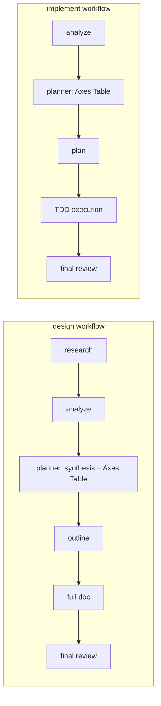

# /analyze — Code Architecture Understanding Command

## Overview

AI-assisted development creates a comprehension gap: AI can implement on any structure without friction, so the natural signal that drives restructuring — "this is harder than it should be" — is lost. `/analyze` rebuilds this by producing structured architecture reports as durable documents that serve as both AI planning input and human understanding material.

## Context and Scope

The structural simplicity work (structural fitness axis in planner, friction check in TDD cycle) established that simplicity should be a planning constraint, not just a review check. But these mechanisms assume the AI and human already understand the current architecture. For growing codebases, that assumption breaks down.

Research suggests the gap is real: industry reports indicate developers using AI may overestimate their productivity gains, and junior developers using AI risk losing foundational understanding. AI-generated code analysis has significant error rates — particularly for cross-file dependencies, where structural relationships are harder to infer from surface-level scanning. (These claims reflect general findings from 2024-2025 industry research on AI code quality. Exact figures vary by study and methodology.)

`/analyze` provides the missing foundation: shared understanding of current architecture before any design or implementation decisions. This understanding is captured as a durable document — not ephemeral agent output that disappears with the context window. The document serves three audiences: the human building understanding, the AI planner making design/implementation decisions, and future sessions that need to understand what was assessed.

## Goals / Non-Goals

### Goals
- Produce structured architecture reports (Markdown + mermaid) as durable documents that survive context compact and serve future sessions
- Serve as a mandatory workflow phase in `/design` and `/implement` — analysis output is required input for subsequent planning, not an optional step
- Detect structural friction signals that inform refactoring-before-adding decisions
- Always surface refactoring opportunities — the report must assess whether the current structure naturally supports anticipated changes or whether restructuring would be more effective

### Non-Goals
- Replace human judgment about architecture — the report is input, not authority
- Provide quantitative metrics (CBO, LCOM) — AI cannot reliably calculate these
- Become a comprehensive architecture documentation system — the report captures current state for a specific purpose, not permanent reference documentation

## Proposal

Two-mode operation: standalone command + mandatory workflow phase. Both modes use multi-pass analysis and produce the same durable document format. The difference is scope and invocation context, not analysis depth.

Multi-pass analysis serves a coverage purpose: a single pass cannot both scan broadly (identify which areas matter) AND examine deeply (understand coupling chains, data flow, cross-file dependencies). The first pass identifies what to examine; the second pass provides the depth needed to detect structural friction. This is a breadth-then-depth strategy, not an attempt to reduce AI error rates through repetition. The drill-to-source principle (verifiable references) is the primary accuracy mitigation.

### Standalone Mode

`/analyze [scope]` runs multi-pass analysis over user-specified scope (whole project, module, or cross-cutting concern). First pass: an overview agent scans directory structure, imports, and public interfaces, identifying friction areas (coupling, responsibility scattering, complexity). Second pass: one deep-dive agent per friction area reads flagged locations in detail (function bodies, data flow, coupling chains), up to a maximum of 3 deep-dive agents. If the first pass identifies more than 3 friction areas, the deep-dive phase prioritizes by severity (highest coupling/complexity first). Synthesis produces a single Markdown report with mermaid diagrams, saved to `claudedocs/analysis/[scope-name].md`.

Standalone use cases distinct from `/design`: understanding a module before deciding what to do (no design/implement intent yet), documenting current architecture for team onboarding, periodic codebase health evaluation.

### Workflow Phase Mode

`/analyze` becomes a distinct phase in both `/design` and `/implement` workflows, producing a durable document that both the human and AI can reference throughout the workflow.

The Axes Table (a mandatory decision matrix where every design/implementation choice with multiple valid approaches is enumerated and evaluated) remains part of the workflow-planner's internal process, not a separate phase. The diagram shows it for clarity — the analysis document feeds into the planner, which produces the Axes Table as part of synthesis.

In `/design`: analysis runs after research gathers external information but before any design decisions. The analysis document captures current architecture state and structural friction, which the planner then uses as input when producing the Axes Table. Research provides the "what's possible out there" context; analysis provides the "what exists here now" context. Both inform the design axes.

In `/implement`: analysis runs first because implementation planning needs to understand the existing structure before creating tasks. The analysis informs whether tasks should extend current structure or restructure first — a decision that fundamentally shapes the implementation plan.

### Scope Determination in Workflow Mode

In both workflows, scope is narrowed to the task-relevant area based on the task description and (in `/design`) research findings. The scoping strategy: start with the modules, directories, or layers explicitly named in the task or Design Doc. The overview agent expands scope to include direct dependencies of the named area (one level of imports/exports). It does NOT attempt whole-project analysis unless the task explicitly targets the whole project.

When scope determination is ambiguous (the task description names no specific modules), the overview agent defaults to analyzing the directory structure and top-level module boundaries to produce a high-level map, then flags areas that appear relevant for deep-dive. The human can override scope via the standalone command if the automatic narrowing proves inadequate.

The output is a durable document saved to `claudedocs/analysis/[scope-name].md`, not consumed as ephemeral agent output. This means the human can read the analysis independently of the AI's planning, and the document survives context compaction during long implementations.

### Mandatory Refactoring Consideration

Every analysis report must include an explicit assessment of structural fitness for anticipated changes. The report structure requires this — it is not optional content. The Structural Observations section must address: "Does the current structure naturally support the anticipated change, or would restructuring first make the change simpler?" When structural friction is detected, the report must describe what restructuring would look like and what benefit it would provide.

This assessment feeds directly into the Axes Table in subsequent workflow phases. When the analysis identifies structural friction, the Axes Table must include a structural fitness axis with "extend current structure" vs "restructure first" as choices. This ensures refactoring is always evaluated as a real option during outline/plan creation — not discovered as an afterthought during implementation when the cost of changing direction is highest.

The causal chain: analysis detects friction → Axes Table includes structural fitness axis → outline/plan considers restructuring as a first-class option → implementation either restructures first or extends with explicit rationale. Without the analysis phase, this chain starts too late — at the Axes Table, without evidence of what the current structure actually looks like.

### Verification Principle — Drill to Source

Every finding in the report must reference specific file paths and (where applicable) symbol names. This enables humans to verify any claim by reading the actual code. The report is a hypothesis document, not a conclusion document — findings say "this appears to be" rather than "this is."

This structural mitigation (verifiable references) addresses AI analysis errors more effectively than social mitigation (confidence markers alone). A reader encountering a questionable finding can navigate directly to the source code and form their own judgment.

### Report Structure

The report follows abstract-to-concrete ordering with a structured format that prevents selective omission. Each section is mandatory — omitting a section requires explicit justification in the Confidence Boundary.

1. **Scope & Approach** — what was analyzed, method used, what could NOT be assessed
2. **Architecture Overview** — component map (mermaid C4), responsibility summary per component
3. **Dependency Structure** — dependency graph (mermaid flowchart), circular dependencies if any
4. **Structural Observations** — friction signals with specific file references, coupling hotspots, patterns that may not fit future needs, and explicit refactoring opportunities with expected benefit
5. **Confidence Boundary** — explicit "assessed / not assessed" scope; each observation includes a verifiable reference (file path + symbol) so the human can check

### Document Lifecycle

Analysis documents are point-in-time snapshots, not live-updated references. The lifecycle:

- **Creation**: Generated fresh when `/analyze` runs (standalone or as workflow phase). Saved to `claudedocs/analysis/[scope-name].md`.
- **Overwrite**: Re-running `/analyze` on the same scope overwrites the existing document. No version history is maintained — the document reflects the latest analysis only.
- **Staleness**: Reports have no explicit expiration. Instead, staleness is managed by context: when running as a workflow phase, the analysis is always fresh (generated at the start of the workflow). For standalone reports that persist across sessions, the human judges whether the report is still relevant based on whether the analyzed code has changed since the report was generated. The report header includes a timestamp for this purpose.
- **No invalidation mechanism**: This is a deliberate simplicity choice. Automatic invalidation (detecting when analyzed files change and marking reports stale) adds complexity without clear benefit — the cost of re-running `/analyze` is low enough that "when in doubt, re-analyze" is a practical strategy.

### Cost Profile

First pass (1 overview agent, lightweight model) + second pass (1 deep-dive agent per friction area, up to 3, lightweight model, only if friction areas found). Typical workflow mode: 1-2 agents total. Standalone wide scope: 2-4 agents total. Note that context consumption per agent may be higher than typical research agents because analysis agents read source code files rather than performing web research. Total cost is comparable to existing researcher dispatch in `/design` Phase 1 but the per-agent context footprint may differ.

### Structural Impact

Adding this requires changes across multiple layers of the claude-praxis architecture:

- New command file for standalone `/analyze`
- Updates to `/design` command definition (new phase between research and outline creation)
- Updates to `/implement` command definition (new phase before plan creation)
- New skill for the multi-pass analysis execution
- Project documentation updates (CLAUDE.md workflow descriptions)

This is a moderate integration surface across 5+ files, consistent with the scope of adding a new orchestrating capability. The existing architecture naturally supports adding a new command and modifying phase sequences in existing commands — no structural restructuring of the framework itself is needed.

## Alternatives Considered

### A: Researcher catalog entry instead of workflow phase
Add an `architecture-analyzer` entry to the researcher catalog. The planner dispatches it during the research phase alongside other researchers. Output consumed internally by the planner.

**Why Proposal preferred**: Researcher output is ephemeral — consumed by the planner and lost after context compact. The analysis needs to persist as a document the human can read independently and that survives long implementation sessions. Making analysis a distinct workflow phase also makes it visible in the workflow structure — a researcher dispatch is an implementation detail the human never sees. The causal dependency learning (from past projects) shows that quality gates work when they are visible workflow phases with named outputs, not buried in planner internals.

**Reconsider when**: If the durable document adds friction without being read by humans, or if context consumption from the separate phase proves consistently problematic.

### B: Enhance existing codebase-scout instead of new command
Scout already explores code. Could add architecture analysis output to scout's prompt.

**Why Proposal preferred**: Scout is tactical (find patterns for a specific task), not analytical (build holistic understanding). Overloading scout blurs its purpose. Analysis needs multi-pass depth (overview + targeted deep dives) that doesn't fit scout's single-agent model. Scout also doesn't produce durable documents.

**Reconsider when**: If the standalone command is rarely used and only the workflow phase adds value, questioning the need for a separate command identity.

### C: Single-pass analysis only
Cheaper, faster, simpler. Use single-pass with explicit limitations stated in the report.

**Why Proposal preferred**: A single pass cannot both scan broadly and examine deeply. Structural issues — the kind that determine whether to refactor — often hide in cross-file dependency patterns that a surface scan misses. The first pass identifies where to look; the second pass provides the depth needed for structural friction detection. Since the analysis directly feeds planning decisions (extend vs restructure), the breadth-then-depth strategy is worth the additional agent cost.

**Reconsider when**: If multi-pass cost proves prohibitive, or if first-pass friction detection proves unreliable (meaning the second pass adds little value).

### D: No new command — rely on existing mechanisms
Let the structural fitness axis (planner) and friction check (TDD cycle) handle architecture understanding entirely.

**Why Proposal preferred**: Those mechanisms react to structure during planning/implementation. They don't produce a durable analysis that the human can read. `/analyze` provides proactive understanding before any workflow begins, and the output document gives humans the same architectural view that the AI uses for planning. Without this, the comprehension gap persists — the AI plans based on code it can read instantly, while the human operates on partial understanding.

**Reconsider when**: If the structural fitness axis consistently surfaces the same insights that `/analyze` would provide, making the separate analysis redundant.

### E: Standalone command only (no workflow integration)
Avoid auto-integration complexity. Users run `/analyze` when they want.

**Why Proposal preferred**: The causal dependency learning shows that quality gates work when upstream output is required input for downstream phases. If analysis is optional, it will be skipped — especially under time pressure. Making analysis a mandatory workflow phase ensures it happens consistently. The analysis document as required input for the Axes Table creates a structural guarantee that architecture is understood before design/implementation decisions.

**Reconsider when**: If context consumption from mandatory analysis consistently degrades workflow performance, or if humans find the mandatory phase annoying rather than useful.

## Cross-Cutting Concerns

### Observability

How to determine whether the analysis phase adds value over time: track whether analysis findings actually influence Axes Table decisions (does the structural fitness axis appear and change the plan?), whether humans read and reference the analysis documents, and whether the mandatory phase becomes friction that users work around. If the analysis phase consistently produces output that is ignored or that confirms what was already known, the mandatory integration should be reconsidered (per Alternative E's "reconsider when" clause).

## Concerns

- **AI analysis accuracy**: AI code analysis has significant error rates, particularly for cross-file relationships. Mitigated by drill-to-source principle (verifiable references), hypothesis framing ("appears to be" not "is"), and structured confidence boundary section. The report explicitly states what it could not assess, preventing false completeness.

- **Context consumption**: Multi-pass analysis as a mandatory workflow phase consumes context before design/implementation begins. Mitigated by cost bounds (1-4 agents total), automatic scope narrowing in workflow mode, and the fact that the durable document can be re-read without re-running analysis. Cost is comparable to existing researcher dispatch in `/design` Phase 1.

- **Authoritative-looking but unreliable output**: A comprehensive-looking report with inherent AI analysis limitations could create false confidence. Mitigated by: (1) drill-to-source references enabling verification, (2) hypothesis framing in language, (3) explicit confidence boundary section, (4) friction-focused report (structural observations and refactoring opportunities, not comprehensive catalog).

- **Report staleness in long implementations**: Architecture changes during implementation could make the analysis outdated. Mitigated by per-task structural friction checks (TDD cycle) that detect when reality diverges from the analysis. The analysis document serves as a starting-state reference, not a live-updated map.

- **Cross-session staleness**: Standalone reports persist on disk and may be read by future sessions when the code has changed. No automatic invalidation mechanism exists — this is a deliberate simplicity choice (see Document Lifecycle). The risk is that a stale report misleads planning. Mitigated by: (1) report header includes generation timestamp, (2) "when in doubt, re-analyze" is the intended practice, (3) the workflow phase always generates fresh analysis regardless of existing reports.

- **Standalone vs /design overlap**: When to use `/analyze` standalone vs let the workflow handle it? Distinct use cases: `/analyze` standalone is for understanding without committing to design or implementation — exploring a module, health checking, team onboarding. The workflow phase is for understanding that feeds a specific design or implementation task.

## Review Checklist
- [ ] Architecture approved
- [ ] Security implications reviewed (N/A — read-only analysis)
- [ ] Performance impact assessed (context consumption)
- [ ] Migration plan (N/A — additive feature; existing workflows gain a new phase)
