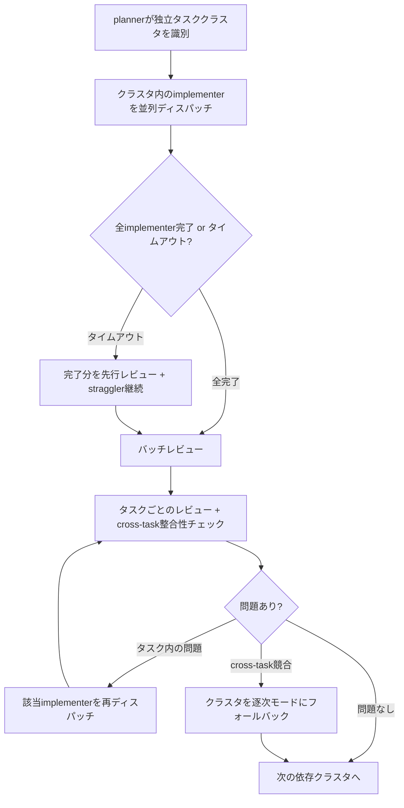

# Enhanced Multi-Agent Coordination

## Overview

claude-praxisの現行マルチエージェントモデルは逐次実行を基本設計とする。`subagent-driven-development`はタスクごとに実装→2段階レビュー→次タスクという直列パイプラインで動作し、ワークフロー内のフェーズ間（/design → /implement）で探索結果は保持されない。

この設計は安全性と品質管理の観点で合理的であり、多くのケースで適切に機能する。一方、計画に3つ以上の独立したタスクが含まれる場合や、フェーズ間で同一コードベースを繰り返し探索する場面では、コンテキスト効率と実行時間に改善余地がある。

本設計は2つの改善を提案する。いずれも**オプトイン**であり、条件を満たさない場合は現行モデルをそのまま維持する。

## Context and Scope

### 現行アーキテクチャ

claude-praxisは「制約付き動的オーケストレーション（constrained dynamic orchestration）」を採用している。これは、コマンド（`/implement`, `/design`等）がフェーズ構造と制約を定義し、`workflow-planner`（タスク分析・エージェント選定を行うスキル）がその制約内でエージェント選択の判断を行うモデルである。

エージェントは4種類が定義されている：

- **implementer** — コード変更を行う実装エージェント。TDDに従いテスト→実装→リファクタリングを実行する
- **reviewer** — コードを読み取り専用で検証するレビューエージェント。独立した検証ソースに基づいて品質を判定する
- **scout** — コードベースの構造・パターン・制約を探索する軽量エージェント（haiku model）
- **researcher** — Web検索やドキュメント調査を行う軽量エージェント（haiku model）

エージェントのディスパッチにはClaude CodeのTask toolを使用する。**2レベルネスト制約**があり、メインセッション（controller）がサブエージェントを起動できるが、サブエージェントが更にサブエージェントを起動することはできない。この制約はclaude-praxisの設計ではなく、Claude Codeプラットフォームの仕様である。

### 現行の実行モデル

`subagent-driven-development`（独立タスクの実装を管理するスキル）は以下の直列パイプラインで動作する：

1. controllerが計画からタスクを抽出
2. タスクごとに：implementerディスパッチ → Stage 1レビュー（仕様適合） → Stage 2レビュー（品質） → 次タスクへ
3. 全タスク完了後：最終レビュー（thorough tier、3名以上＋devils-advocate必須）

このモデルでは、タスクA・B・Cが互いに独立していても直列に実行される。

### 着想元と研究知見

本設計はCodebuff（オープンソースのAIコーディングエージェント）の並列マルチ戦略パターンに着想を得ている。Codebuffは複数のエディタエージェントを並列に起動し、異なる戦略で同一タスクに取り組み、selectorエージェントが最良の実装を選定するモデルを採用している。

ただし、研究知見はマルチエージェント並列化に対して慎重な姿勢を示す：

- **SWE-Agent研究**: スコープが明確なタスクでは、単一エージェント＋充実したツールインターフェースがマルチエージェント協調に勝る場合がある。マルチエージェントのオーバーヘッド（コンテキスト分割、結果統合）がメリットを上回るケースが存在する
- **マルチエージェント障害分析**: 41.77%がタスク仕様の曖昧さに起因し、36.94%が協調オーバーヘッドに起因する
- **コスト**: サブエージェント1体あたり2-3xのトークンコスト。エージェントチーム（3体）で4-6x、レビューチーム（4体）で5-8x

これらの知見から、並列化は「常に有効な最適化」ではなく「条件付きで有効なオプション」として設計すべきである。

### 核心の問い

**どの条件下で、並列化がトークンコスト増に見合う時間短縮をもたらすか？**

この問いに対する回答が、本設計の判断基準となる。

## Goals / Non-Goals

### Goals

- 並列実行が有効な条件を明確に定義する（独立性の判定基準、コスト閾値）
- 条件を満たす場合の並列ディスパッチプロトコルを設計する（2レベルネスト制約の下で動作するもの）
- ワークフロー内のフェーズ間でscout結果を受け渡す仕組みを設計する

### Non-Goals

- **デフォルト並列化**: 全タスクを並列化する設計にはしない。条件を満たさない場合は現行の逐次モデルを維持する
- **競合実装（selectorパターン）**: 同一タスクに複数のimplementerが異なる戦略で取り組みselectorが選定する方式は対象外（コスト15x+、selector信頼性未証明）
- **Codebuffのtoolless orchestrator再現**: 全操作をサブエージェントに委任するモデルは対象外（軽量操作へのオーバーヘッドが過大）
- **セッション跨ぎの永続キャッシュ**: scout結果のクロスセッション永続化は対象外（陳腐化検出の信頼性が不十分）

## Proposal

### Design Decision: Parallelization as Opt-In, Not Default

並列化は常にコスト増を伴い、SWE-Agent研究はスコープ明確なタスクでの単一エージェントの優位性を示す。従って、並列化を「デフォルトの改善」として導入するのではなく、**明示的な条件を満たした場合のみ適用するオプトイン**として設計する。

この判断の根拠は3つある：

1. **コスト対効果の不確実性**: 並列化は3-9xのトークン増を伴う。時間短縮がこのコストに見合うかは、タスクの規模と独立性に依存する
2. **独立性判定の困難さ**: 計画段階でタスク間の独立性を正確に判定することは難しい。保守的な基準を設けることで、誤った並列化のリスクを抑える
3. **既存モデルの健全性**: 現行の逐次モデルは安全で予測可能であり、多くのケースで十分に機能する。並列化は「現行モデルが不十分な場合」にのみ適用すべきである

再検討条件：Claude Codeプラットフォームが並列エージェントのコスト最適化（共有プロンプトキャッシュ等）を提供した場合、デフォルト並列化を再検討する。

### 1. Parallel Task Dispatch Protocol

計画に3つ以上の独立したタスクが含まれる場合、逐次実行はウォールクロック時間を浪費する。各タスクが30分以上の実装時間を要する場合、5つの独立タスクは逐次で7.5時間以上かかるが、並列では大幅に短縮される可能性がある（最も遅いタスク＋バッチレビュー時間に収束）。

現行の`subagent-driven-development`は並列実行の可能性に言及しているが、明確なプロトコル（独立性の判定基準、並列ディスパッチの手順、バッチレビューの方法）が定義されていない。

**並列化条件** — 以下の**全て**を満たす場合にのみ並列ディスパッチを適用する：

1. **タスク数**: 計画に3つ以上のタスクが存在する
2. **ファイル集合の非重複**: 各タスクが変更するファイル集合が重複しない
3. **共有依存の不在**: タスク間で共有される推移的依存（共通importモジュール、共有型定義等）がない。あるタスクがモジュールのインターフェースを変更し、別のタスクがそのモジュールに依存する場合、並列化は不可
4. **テスト集合の独立性**: 各タスクのテストが他タスクの変更に依存しない
5. **タスク規模の妥当性**: 各タスクが3ファイル以上の変更を伴い、推定実装時間が10分を超えること。それ以下の規模では並列化のオーバーヘッドが時間短縮を上回る

条件2〜4はplannerが計画段階で評価する。不確実な場合は逐次実行にフォールバックする（保守的アプローチ）。

**2レベルネスト制約への対応** — Claude Codeの2レベルネスト制約により、implementer（level 2）はレビュワー（level 3にあたる）をディスパッチできない。従って、レビューはcontroller（level 1）が担当する。並列ディスパッチのプロトコルは以下の通り：

**クラスタサイズ上限** — 1クラスタあたり最大5つのimplementerを並列ディスパッチする。6タスク以上の独立クラスタでは、5タスクずつの小クラスタに分割し逐次実行する。これはトークン消費の予測可能性と、バッチレビューの認知負荷を管理するためである。

**Straggler policy** — 並列ディスパッチでは、implementer間で実行時間に大きなばらつきが生じることが予測される。全implementerの完了を無条件に待機すると、最も遅いimplementerがボトルネックになる。対応方針：クラスタ内のimplementerの半数以上が完了し、かつ中央値の2倍以上の時間が経過した場合、完了分のタスクを先行してバッチレビューに進める。未完了のimplementerは継続し、完了後に追加レビューを実施する。

**バッチレビューモデル** — 現行はタスクごとに2段階レビューを逐次実行するが、並列モデルではクラスタ完了後にバッチレビューを実施する。ただし、レビュワーの注意力希薄化を防ぐため、レビューは2層で構成する：

1. **タスク別レビュー**: 各タスクに対してSpec ComplianceレビュワーとCode Qualityレビュワーをディスパッチ（現行と同等の深さを維持）
2. **Cross-task整合性チェック**: クラスタ全体に対して1名のレビュワーをディスパッチし、タスク間の型整合性、命名規則の一貫性、共有モジュールへの影響を検証する

この2層構造により、タスクごとのレビュー深度を犠牲にせず、並列実装間の整合性も確認できる。

**Cross-task競合の解決** — バッチレビューでタスク間の競合（互換性のない型変更、矛盾する設計判断等）が検出された場合、該当クラスタの残タスクを逐次モードにフォールバックする。具体的には：(a) 競合する2タスクのうち、より影響範囲の小さいタスクを再ディスパッチし、もう一方のタスクの実装を前提として修正させる。(b) 両タスクの影響範囲が大きい場合、controllerが人間に判断を求める。

**修正-レビューループの終了条件** — バッチレビューで問題が見つかり再ディスパッチした場合、修正→レビューのループは最大2回とする。2回の修正で解決しない場合、逐次モードにフォールバックし、controllerが直接修正を管理する。

**コスト閾値** — 並列化が正当化される目安：

- 3タスク × 推定30分以上の実装 = 逐次で90分+。並列で最遅タスク時間 + バッチレビュー。トークンコストは3x増だが、大幅な時間短縮が見込める
- 2タスク以下、または推定10分未満のタスク = 並列化のオーバーヘッドが時間短縮を上回る。逐次実行が適切

**既存設計との関係** — 過去のlearningから、「エージェント特化は独立した検証ソースがある場合のみ有効」という原則がある。本提案では、並列implementerは検証ソースの独立性（異なるファイル・テスト集合）を条件としており、この原則と整合する。タスクスコープによる並列化は、検証ソースの独立性という条件の下でのみ行われる。

### 2. Cross-Phase Scout Result Forwarding

`/design`が`codebase-scout`をディスパッチしてコードベースの構造・パターン・制約を探索した後、`/implement`に進む際にこの探索結果は保持されない。implementフェーズでは同一のコードベースを再探索する必要が生じる。

これは現行のコンテキスト永続化モデル（Stock/Flow）の設計に起因する。Flow file（ワークフロー中に生成される揮発性のファイル。現在は`task_plan.md`と`progress.md`が定義されている）にscout結果を格納するFlowは存在しない。Stock（永続知識、learnings-*.md）はscout結果を格納するには具体的すぎる（特定ファイルのパターン等）。

**設計判断** — scout結果をワークフロー内のFlow fileとして受け渡す。セッション跨ぎの永続キャッシュではなく、同一コマンドチェーン（/design → /implement等）内での情報伝達に限定する。

この判断には3つの理由がある：

1. **陳腐化リスクの限定**: ワークフロー内（同一セッション）であれば、コードベースの変更は限定的。セッション跨ぎでは変更量が予測できず、陳腐化検出が信頼できない
2. **既存フレームワークとの整合**: context-persistenceのFlow fileモデルに乗る
3. **構造情報への限定**: scout結果に含めるのは構造的事実（ディレクトリ構成、ファイル位置、テスト位置）のみとし、パターン解釈や設計判断は含めない。これによりバイアスリスクを構造的に低減する

**結果の内容と制限** — scout結果には構造的事実のみを含め、解釈は含めない：

- **含める情報**: ディレクトリ構造、主要ファイルの位置、テストファイルの位置、既存の命名規則（事実として観察可能なもの）、統合ポイント（エントリポイント、エクスポート一覧）
- **含めない情報**: 「パターンXが使われている」等の解釈、設計の良し悪しに関する判断、ファイルの具体的な実装内容
- **根拠**: 構造的事実（「ファイルAはディレクトリBにある」）は陳腐化しにくく、バイアスを生じにくい。パターン解釈（「このプロジェクトはパターンXを採用している」）は主観的であり、implementerのアプローチ選択にバイアスを与えるリスクがある

**Flow file仕様**:

- **ファイル名**: `scout-orientation.md`
- **配置先**: `{repo}/.claude/context/`（既存Flow fileと同一ディレクトリ）
- **ライフサイクル**: ワークフロー完了時、または次回scout実行時に削除。PreCompactフックでは保持する（同一セッション内で有効）
- **読み書きルール**: 既存の「WRITE AUTO, READ MANUAL」に従う。scoutディスパッチ時に自動書き込み。後続フェーズでcontrollerが手動で読み込むかを判断する

**陳腐化への対応** — ワークフロー内であっても、前のフェーズで大きなファイル変更が行われた場合、scout結果は陳腐化する。自動化された陳腐化検出は行わない（ファイル数ベースのヒューリスティックは意味的変更を捉えられないため）。plannerがフェーズ遷移時に判断する。

### 既存スキルへの修正

本提案の実装にあたり、以下の既存スキルを修正する：

**`context-persistence/SKILL.md`** — Flow fileテーブルに`scout-orientation.md`を追加。ライフサイクル：「ワークフロー完了時 or 次回scout実行時に削除」。PreCompact hook対象に追加（保持）。

**`subagent-driven-development/SKILL.md`** — The Pipelineセクションに条件分岐を追加。「並列化条件（5条件全て）を満たす場合、Parallel Task Dispatch Protocolに従いクラスタ単位で並列ディスパッチ。満たさない場合、既存の逐次パイプラインを維持」。バッチレビュー（タスク別 + cross-task整合性チェック）のプロトコルを追加。

**`implement.md`** — Phase 2の既存フック（「If 3+ independent tasks: evaluate subagent-driven-development」）は維持。並列化条件の5基準を評価し、人間に提案を提示する手順を明確化。

## Alternatives Considered

### 競合実装パターン（Competing Implementations）

3つのimplementerが異なる戦略で同一タスクに並列で取り組み、selectorエージェントが最良の実装を選定する。Codebuffが採用するパターン。

本提案より優れる点：単一のアプローチでは見つからない解法を発見する可能性がある。

本提案を選んだ理由：コストが15x+に達する。selectorエージェント（LLM-as-judge）の選定信頼性が未証明であり、3つの平凡な実装から最良を選んでも品質向上が保証されない。また、本提案の制約「独立した検証ソース」を満たさない（同一タスクの3実装は同一テストで検証される）。

再検討条件：LLM-as-judgeの信頼性が大幅に改善され、コスト対効果の実証データが蓄積された場合。

### Toolless Orchestrator（Codebuff方式）

オーケストレーターエージェントが自身ではツールを持たず、全ての操作をサブエージェントに委任する。これによりオーケストレーターのコンテキストウィンドウが中間結果で汚染されず、長期的な計画と判断に集中できる。

本提案より優れる点：コンテキスト効率が高く、長時間のセッションでコンテキスト圧を低減できる。

本提案を選んだ理由：全操作（ファイルの存在確認、テストの成否確認等）にサブエージェントが必要になり、軽量操作のレイテンシが増大する。Claude Codeの2レベルネスト制約により、toollessオーケストレーターはサブエージェントのサブエージェントを起動できないため、構造的に制限される。

再検討条件：コンテキストウィンドウの圧力が主要なボトルネックになった場合（複雑なプロジェクトで頻繁にcompactが発生する場合）。

### 完全動的オーケストレーション

plannerが制約なしにフェーズ順序、エージェント選定、レビューティアを全て動的に決定する。

本提案より優れる点：あらゆるタスクに最適化された実行計画を生成できる可能性がある。

本提案を選んだ理由：マルチエージェント障害の41.77%がタスク仕様の曖昧さに起因する。制約なしのplannerは過度に複雑な計画を生成するリスクがあり、デバッグが困難になる。現行の「コマンドが構造を定義し、plannerが判断を提供する」モデルは予測可能性とコスト管理の観点で優れている。

再検討条件：planner出力の形式検証が可能になり（生成計画の構造的正しさを機械的に検証）、障害率が有意に低下した場合。

### Plannerプロンプトの改善のみ（Proposal 1の代替）

並列ディスパッチプロトコルを新設する代わりに、plannerのプロンプトを改善してタスク独立性の判定精度を上げ、タスク順序の最適化（類似ファイルに触れるタスクを隣接配置しプロンプトキャッシュを活用）を行う。プロトコル変更なし。

本提案より優れる点：変更が最小限（プロンプト調整のみ）であり、リスクが極めて低い。

本提案を選んだ理由：タスク順序の最適化はプロンプトキャッシュの効率改善に寄与するが、逐次実行のウォールクロック時間は短縮しない。3タスク × 30分 = 90分という逐次実行の本質的なボトルネックは、順序最適化では解消できない。ただし、プロンプト改善は本提案と組み合わせて導入すべきである（並列化しないケースでも有効）。

再検討条件：並列ディスパッチの実装コストが見込みより高く、プロンプト改善だけで十分な効果が得られた場合。

### ファイルリスト受け渡し（Proposal 2の代替）

scout結果をFlow fileとして保存する代わりに、scoutが探索した関連ファイルのパスリストのみを後続フェーズに伝え、implementerにそれらのファイルを直接読ませる。新しいFlow fileタイプは不要。

本提案より優れる点：常に最新のファイル内容を読むため、陳腐化リスクがゼロ。Flow fileの追加もcontext-persistenceの変更も不要。

本提案を選んだ理由：ファイルリストは「どのファイルを読むか」を伝えるが、「プロジェクトのどの領域にどの種類のファイルがあるか」という構造的概観は伝えない。5ファイルのリストと50ファイルのプロジェクト構造概観では、implementerの初期理解の速度が異なる。ただし、この差は実測されておらず、理論的な推定に留まる。

再検討条件：scout結果のFlow file運用で陳腐化問題が想定より頻発した場合、ファイルリスト方式に切り替える。

### 検証後の並列レビュー

検証（typecheck/lint/test/build）完了後、レビューエージェントのディスパッチと残りの非同期チェックを並列実行する。

本提案より優れる点：レビュー開始を早められる。

本提案を選んだ理由：検証は通常数秒〜数十秒で完了する。並列化による時間短縮は微小（秒単位）であり、検証失敗時にレビューが無駄になるリスクと、エラーハンドリングの複雑化（進行中レビューのキャンセル等）に見合わない。

再検討条件：テストスイートが大規模化し、検証に数分以上かかるプロジェクトが増えた場合。

### セッション跨ぎのScoutキャッシュ永続化

scout結果をStock（永続知識）としてセッション間で保持する。

本提案より優れる点：セッション跨ぎでも再探索が不要になる。

本提案を選んだ理由：セッション間ではコードベースの変更量が予測できず、陳腐化検出が信頼できない。ファイル数ベースのヒューリスティックは意味的変更（1ファイルのインターフェース変更が多数のファイルに影響）を捉えられない。陳腐化したキャッシュはバイアスの原因となり、「参照しない方がまし」な状況を生む。

再検討条件：semantic diff tooling（意味的変更の影響範囲を検出するツール）が利用可能になった場合。

## Cross-Cutting Concerns

### コスト管理

並列ディスパッチはトークンコストを増加させる（クラスタ内タスク数 × 2-3x）。このコストを管理するため：

- 並列化は明示的な条件（タスク数3+、ファイル非重複、共有依存なし、タスク規模3ファイル以上）を満たす場合のみ適用する
- plannerが並列化を提案する際は、推定コスト増（並列タスク数 × 2-3x）を明示する
- controllerは人間に並列化の提案を提示し、承認を得てから実行する

### 導入順序

2つの提案は独立しており、任意の順序で導入できる。推奨順序：

1. **Proposal 2（Scout Result Forwarding）を先に導入**: context-persistenceの既存フレームワークに乗るため変更が小さく、リスクが低い。実装はFlow fileの定義追加とscoutエージェントの出力先指定のみ
2. **Proposal 1（Parallel Task Dispatch）を後に導入**: subagent-driven-developmentの実行モデル変更を伴い、バッチレビューのプロトコル設計が必要。導入前にProposal 2の運用経験を蓄積できる

### 既存ワークフローへの影響

両提案ともオプトインであり、既存のワークフローを変更しない。並列化条件を満たさない場合、`subagent-driven-development`は現行通り逐次実行する。scout結果のFlow fileが存在しない場合、後続フェーズは通常通りscoutを新規ディスパッチする。

## Concerns

### 並列implementerの推移的依存による競合

並列化条件でファイル集合の非重複と共有依存の不在を要求しているが、推移的依存の検出は計画段階では困難な場合がある。タスクAがモジュールXのインターフェースを変更し、タスクBがモジュールXを間接的にimportしている場合、直接的なファイル重複がなくても実行時に競合する。

緩和策：保守的な独立性基準を適用する。不確実な場合は逐次実行にフォールバックする。plannerの独立性判定には、直接importだけでなく、共有される型定義や共有ユーティリティモジュールの存在も考慮する。cross-task競合が検出された場合、クラスタを逐次モードにフォールバックするプロトコルをProposalに定義済み。

### Scout結果によるimplementerバイアス

scout結果を構造的事実に限定しても、implementerの探索範囲にバイアスを与える可能性がある。scoutが報告したファイルやディレクトリに注意が偏り、報告されなかった領域を見落とすリスクがある。

緩和策：scout結果に含めるのは構造的事実（ディレクトリ構成、ファイル位置）のみとし、パターン解釈や設計判断は含めない。implementerは自身のタスクに必要なファイルを独自に特定する責任を持つ。scoutの結果は「どこから探索を始めるか」のヒントであり、「何を読むべきか」の指示ではない。

### 並列ディスパッチのデバッグ難度

並列で実行された複数のimplementerのうち1つが失敗した場合、他のimplementerの成果物との整合性を確認する必要がある。逐次実行では問題の特定が直線的だが、並列実行では複数の変更が同時に存在するため、障害の切り分けが複雑になる。

緩和策：各implementerが独立した検証レポート（typecheck/lint/test結果）を生成する。バッチレビューの2層構造（タスク別 + cross-task整合性チェック）で、タスク間の整合性を明示的に検証する。修正-レビューループは最大2回で打ち切り、逐次モードにフォールバックする。

### 実測データの不在

本設計は理論的分析に基づいており、並列化が実際にどの程度の時間短縮をもたらすかの実測データは存在しない。導入後、以下のメトリクスを計測して設計判断を検証すべきである：

- タスクあたりの実行時間（逐次 vs 並列）
- トークンコスト増（予測 vs 実測）
- 並列化条件の適合率（計画のうち何%が並列化条件を満たすか）
- 並列実行後の競合発生率
- scoutのFlow file参照率（後続フェーズが実際に参照した割合）

## Review Checklist

- [ ] Architecture approved — 2レベルネスト制約との整合性確認
- [ ] Performance impact assessed — トークンコスト増のオプトイン条件が適切か
- [ ] Migration plan — 既存ワークフローへの影響なし（オプトイン）の確認
- [ ] Risk mitigations adequate — 推移的依存の競合、scoutバイアス、デバッグ難度、straggler、cross-task競合への対応
