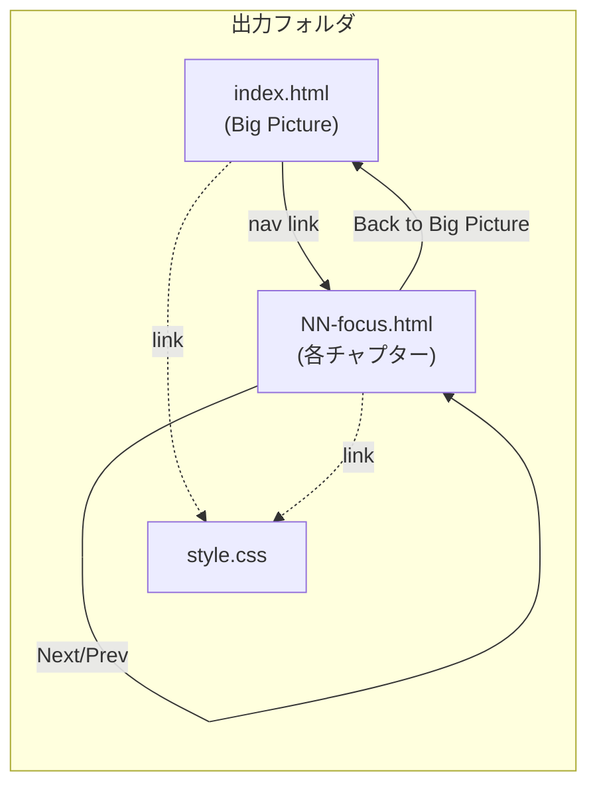

# Guide HTML Book Output

## Overview

guideコマンド（`/guide`）はコードベースのウォークスルーガイドを生成する。現在の出力は単一のMarkdownファイルだが、mermaid図はテキストのまま表示され、コードブロックにシンタックスハイライトはなく、300行を超えるガイドは線形に読むしかない。ガイドの目的は「コードと並べて読む学習コンパニオン」であり、読書体験の質がそのまま学習効果に直結する。

本Design Docでは、ガイド出力をフォルダ構成のHTML Webページ（本のような体験）に変更する設計を提案する。mermaid図のブラウザレンダリング、シンタックスハイライト、ページ間ナビゲーションにより、既存のガイド構造の強みをHTML上で強化する。

## Context and Scope

### 現在のガイド出力

guideコマンドは`claudedocs/guides/[scope-name].md`に単一のMarkdownファイルを出力する。ガイドは「hub-and-spoke構造」で構成されている — Big Picture（全体像のセクション）を起点に、各Focus Area（個別の深掘りセクション）に入り、"Back to the Big Picture"で全体像に戻る「ズームイン/ズームアウト」パターンだ。この構造は、読者が詳細に入った後も「今どこにいるか」を見失わないために設計された（過去の学び: 「人間向けドキュメントはzoom-in/zoom-out構造で全体像を見失わせない」）。

現在の概要ガイド（`claude-praxis-overview.md`）は321行、5セクション（Big Picture + 3 Focus Areas + Coverage Boundary）で構成されている。

### Markdownの限界

Markdownはシンプルで汎用的だが、ガイドの「学習コンパニオン」としての体験に3つの制約がある。

1. **mermaid図がテキストのまま** — ガイドにはコンポーネント関係やデータフローの図が含まれるが、mermaid対応ビューアでないとコードブロックとして表示される。図の視覚的理解ができない
2. **コードブロックにシンタックスハイライトがない** — ファイルパスや設定例が白黒テキストで表示され、コードの構造が読み取りにくい
3. **hub-and-spoke構造が概念止まり** — "Back to the Big Picture"セクションは存在するが、読者はスクロールで戻るしかない。ページ遷移によるhubへの物理的な「戻り」がないため、構造が意識されにくい

### 変更の範囲

ガイド出力の表現形式を変更する。guide-generationスキルの3パス手順（Overview Scan → Deep Dive → Write Guide）は変更しない。Pass 3の出力形式がMarkdownからHTMLに変わるのみ。アーキテクチャ分析で、既存アーキテクチャが本変更を自然にサポートすることを確認済み。コマンド層（何を・どこに）とスキル層（どうやって）の関心分離により、出力パス変更はコマンドに、出力形式変更はスキルに局所化される。dispatch-reviewersはファイルパスリストを受け取る設計のため変更不要。

## Goals / Non-Goals

### Goals
- ブラウザで`index.html`を開くだけで読めるガイド出力（フォルダ構成、チャプター分割、ページ間ナビゲーション）
- mermaid図のクライアントサイドレンダリング（ブラウザで図として表示）
- コードブロックのシンタックスハイライト
- hub-and-spoke構造のHTML上での強化（Big Pictureページをハブとし、各Focus Areaページへのナビゲーション）
- 画像生成MCPが利用可能な場合、概念的ビジュアルを自動生成してHTMLに埋め込み（MCPがなければスキップ）

### Non-Goals
- ビルドツール・外部依存関係の導入（Node.jsスクリプト、パッケージマネージャ等）
- 全文検索機能（将来検討。クライアントサイドの検索インデックスは複雑さに見合わない現段階）
- 印刷対応の完全なPDF出力
- 既存のMarkdownガイドの自動変換（新規生成時のみHTML出力。既存ガイドは必要時に`/guide`を再実行）

## Proposal

### 設計の前提

Claude Praxisはプロンプト駆動のフレームワークである。全14スキルがSKILL.mdファイルのみで構成され、コンテンツ変換パイプラインは存在しない。package.jsonとTypeScriptツーリングはhooks/（イベント検出・通知）のために存在するが、これらはコンテンツ生成・変換の目的では使用されていない。この文脈が以下3つの設計判断の土台となる。

### 直接HTML生成

guide-generationスキルのPass 3（Write Guide）で、Claudeがスキルプロンプトの指示に従いHTML/CSSファイルを直接書き出す。これは現在のMarkdown生成と同じメカニズムの拡張 — スキルプロンプトが出力の構造を定義し、ClaudeがWrite toolでファイルを生成する。

現在のMarkdownガイドが一貫した構造で生成されているのは、スキルプロンプトがGuide Structure（Big Picture → Focus Areas → Coverage Boundary）を具体的に定義しているためだ。同じ原理で、HTML構造（セマンティック要素、CSS class名、ナビゲーション要素）をスキルプロンプトに記述すれば、Claudeは一貫したHTMLを生成できる。

コンバータスクリプトやビルドステップは導入しない。この判断の根拠と、代替案（二段階パイプライン）の詳細はAlternatives Consideredに記述する。

### マルチページフォルダ出力

hub-and-spoke構造をフォルダ構成に直接マッピングする。各Focus Area（本Design Docでは「チャプター」とも呼ぶ — ページ遷移を伴うHTML出力の文脈では「本の章」の比喩が自然なため）が独立したHTMLページとなる。

- **index.html** = Big Picture（ハブページ）。ガイド全体の概要、mermaid図、各チャプターへのリンク
- **NN-[focus-area].html** = 各チャプター（スポークページ）。"Where We Are" → Walkthrough → "Back to the Big Picture"
- **style.css** = 共有スタイルシート。全ページからの相対パスで参照

ナビゲーション要素:
- **サイドバー目次** — 全ページに固定表示。現在のページがハイライトされ、読者が「今どこにいるか」を常に確認できる
- **前/次リンク** — 各ページ下部に配置。チャプター順の線形読書もサポート
- **"Back to the Big Picture"リンク** — 各Focus Areaページの冒頭と末尾に配置。hub-and-spoke構造の物理的な表現

### CSS/テンプレートは出力アーティファクトとして生成

CSSファイルはスキルディレクトリに格納するのではなく、ガイド出力フォルダ内に`style.css`として生成する。スキルプロンプト（SKILL.md）がCSSルールとHTML構造を記述し、Claudeがガイド生成時にCSSファイルも含めて書き出す。

この設計により:
- 全14スキルが「SKILL.mdのみ」で構成されるパターンを維持する（スキルディレクトリにSKILL.md以外のファイルを持たない）
- CSSはガイドのコンテンツと同時に生成されるため、構造とスタイルの整合性が保たれる
- CSSの変更はスキルプロンプトの更新で反映される。スキルプロンプトが唯一のソースオブトゥルース

### 統合への影響

変更はコマンド層とスキル層に局所化される:

- **コマンド層**（commands/guide.md）: 出力パスパターン、overwriteロジック、レビューtargetの変更
- **スキル層**（skills/guide-generation/SKILL.md）: Pass 3のGuide Structureテンプレートを HTML構造記述に置き換え

dispatch-reviewersとreviewer catalogは変更不要 — dispatch-reviewersは既にファイルパスリストを受け取る設計であり、reviewerの評価基準（abstract-to-concrete構造、用語一貫性）はコンテンツに対するルールでファイルフォーマットに依存しない

### 外部ライブラリ

mermaid.js（図のレンダリング）とhighlight.js（シンタックスハイライト）をCDN経由で読み込む。

- **mermaid.js**: jsDelivr CDN。`
`ブロックを自動レンダリング
- **highlight.js**: cdnjs CDN。`<pre><code>`ブロックを自動検出してハイライト
- **セキュリティ**: CDN読み込みには`integrity`属性（SRI: Subresource Integrity）と特定バージョン指定を必須とする。SRIハッシュにより、CDNが改ざんされた場合にスクリプトの読み込みがブロックされる。バージョン指定により、意図しないライブラリ更新による破壊的変更を防ぐ

CDN読み込みはインターネット接続を必要とする。Claude Codeは開発ツールでありオンライン環境を前提としているため、オフライン対応はNon-Goalとする。CDNが利用できない場合の劣化: mermaid図はテキスト表示、コードはハイライトなし。コンテンツ自体は読めるため、Markdownでmermaid非対応ビューアで開いた場合と同等の劣化。

### オプショナルな画像生成MCP連携

利用者が画像生成系のMCPサーバー（DALL-E、Stable Diffusion等）を接続している場合、ガイド生成時に概念的なビジュアル（アーキテクチャの概念図、データフローのイラスト等）を自動生成し、HTML内に``として埋め込む。MCPが利用できない場合はスキップし、mermaid図とテキストのみで構成する。

この設計の要点:

- **検出**: Pass 3の開始時にToolSearchで画像生成系ツールを探索する。見つかればビジュアル生成を行い、見つからなければスキップ。ガイドの品質は画像なしでも完結する
- **保存**: 生成画像はガイド出力フォルダ内（例: `images/`サブディレクトリ）に保存し、HTMLから相対パスで参照する。CDN依存ではなくローカルファイルとして永続化
- **用途の限定**: mermaid図が適する構造的な図（コンポーネント関係、フロー）はmermaidで表現する。画像生成MCPは、mermaidでは表現しにくい概念的・直感的なビジュアル（メンタルモデルのイラスト、比喩的な図解等）に限定する

スキルプロンプトに画像生成の判断基準とフォールバック動作を記述する。MCPの有無でガイドの構造が変わることはない — ビジュアルは補足的な強化であり、必須要素ではない。

## Alternatives Considered

### Alternative A: 二段階パイプライン（Markdown → コンバータスクリプト → HTML）

Claudeが従来通りMarkdownを出力し、別途Node.jsスクリプト（またはPandoc等の外部ツール）がHTMLに変換する。mdBook、Docusaurus、Sphinxなど主要なドキュメントツールが採用するパターンであり、関心の分離（コンテンツ生成とプレゼンテーションの分離）に優れる。

**Proposalより優れる点**:
- HTML出力のトークンコストを回避できる（Claudeの出力はMarkdownのまま）
- CSSの完全な一貫性が保証される（固定テンプレート適用）
- レビュアーは引き続きMarkdownを評価でき、HTMLタグのノイズがない
- 業界標準パターンに準拠

**不採用の理由**: Claude Praxisにはコンテンツ変換パイプラインが存在しない（hooks/のTypeScriptツーリングはイベント検出・通知用であり、コンテンツ生成・変換には使用されていない）。コンバータスクリプトの導入はプロジェクト初のコンテンツ変換ツーリングとなり、そのスクリプト自体のテスト・メンテナンス・ドキュメントが新たな責務となる。さらに、スキルプロンプトでガイド構造を定義する仕組みは変わらないため、複雑さがプロンプト（構造定義）とスクリプト（HTML変換）の2箇所に分散する。

**再検討条件**: (1) HTML出力のトークンコストが実測で問題になった場合（Concernsセクション参照）、(2) プロジェクトに他の目的でNode.jsツーリングが導入された場合、(3) ガイド出力の視覚的一貫性が手動では維持できないレベルに達した場合。

### Alternative B: 単一HTMLファイル（フォルダ構成なし）

全コンテンツを1つの`.html`ファイルに出力する。統合影響が最小 — ファイルパスが1つで済み、dispatch-reviewersの変更不要、overwriteロジックは既存のまま。

**Proposalより優れる点**:
- 統合影響が最小（パス変更のみ）
- ファイル共有が容易（1ファイルをコピーするだけ）

**不採用の理由**: 長いガイド（現在の概要ガイドは321行、HTML化するとさらに長くなる）ではページ分割なしの長大なHTMLになり、「本」としての体験が得られない。hub-and-spoke構造はページ遷移によってこそ物理的に体験でき、スクロールだけではhubに「戻る」感覚が薄い。ユーザーが「フォルダを切ってHTMLでWebページのようにして本にしたら」と提案した意図とも合致しない。

**再検討条件**: Focus Areaが1-2個の小スコープガイドでは単一ページの方が適切な場合がある。将来的にスコープの大きさに応じて出力形式を切り替える拡張を検討できる。

### Alternative C: テンプレートファイルをスキルディレクトリに格納

`skills/guide-generation/assets/style.css`や`template.html`を格納し、ガイド生成時に出力フォルダにコピーする。CSSの一貫性が保証される（毎回生成ではなく固定ファイル参照）。

**Proposalより優れる点**:
- CSSの完全な一貫性が保証される（固定ファイル）
- CSSのイテレーション（スタイルだけ変更して見た目を確認）がガイド再生成なしで可能

**不採用の理由**: 全14スキルが「SKILL.mdのみ」で構成されるパターンを破る。この一貫性はレイヤーアーキテクチャの意図的な設計（スキル = 手順のみ。保存先やアセットはスキルの責務外）であり、例外を作ると他のスキルへの先例となる。CSSの一貫性はスキルプロンプトの逐語的なCSS記述で確保する（Concernsセクション参照）。

**再検討条件**: (1) 複数のスキルがアセットファイルを必要とするユースケースが出現した場合、(2) CSSの一貫性が実際に問題になった場合（生成ごとにスタイルが大きく異なる状況が3回以上繰り返される場合）。この閾値（3回）は実装後早期に確認可能であり、問題が判明した場合の切り替えコストは低い（スキルディレクトリにstyle.cssを追加しコピーロジックを加えるのみ）。

## Cross-Cutting Concerns

### レビューワークフローへの影響

dispatch-reviewers SKILL.md自体は変更不要だが、レビュアーへの入力形式が`.md`から`.html`に変わる。この影響を3つの観点で評価する。

**レビュアーの読解能力**: Claude エージェントはHTMLを読みコンテンツ構造を評価できる。HTMLタグ（`<article>`, `<section>`, `<h2>`, `
`）はセマンティックであり、タグ自体がドキュメント構造を表現する。document-qualityルール（abstract-to-concrete、用語一貫性、progressive detailing）はコンテンツに対するルールであり、Markdownの`##`見出しを評価するのとHTMLの`<h2>`を評価するのは同等。

**レビュー対象の制限**: dispatch-reviewersへのtargetにはコンテンツHTMLファイルのみを含め、style.cssは含めない。レビュアーが評価すべきはコンテンツの構造と品質であり、CSSは対象外。

**リスクと緩和策**: HTMLタグがノイズとなりレビュー精度が低下する可能性はある。実運用で問題が判明した場合の対応:
- guide domain専用のレビュアープロンプト調整（「HTMLタグを無視してコンテンツ構造を評価せよ」等の指示追加）
- または Alternative A（二段階パイプライン）の再検討 — Markdownが残ればレビュアーはMarkdownを評価できる

## Concerns

### HTML出力のトークンコスト

HTMLはMarkdownより出力トークンが多い（タグ、属性、CSS class名のオーバーヘッド）。正確なコスト増加は実装時に実測が必要 — コンテンツ量、mermaid図の数、コードブロックの密度によりケースごとに異なるため、事前の定量見積もりは信頼性が低い。マルチページ分割により1ファイルあたりの出力量は小さくなるため、コンテキストウィンドウ制限への影響は限定的と想定する。

実測で問題があればAlternative A（二段階パイプライン）の再検討トリガーとなる。

### HTML/CSS生成の一貫性

同じガイドを再生成した際にHTML構造やCSSが微妙に異なるリスクがある。HTMLはMarkdownより構造が複雑（タグ属性、CSS class名、ネスト構造）であり、Markdown生成で確認されている一貫性がHTMLでも同等に得られるかは検証が必要。

**CSS一貫性は最も重要なリスク**: CSSが生成ごとに異なると、見た目の品質が不安定になり「本のような体験」の信頼性が損なわれる。これに対する緩和策:

- スキルプロンプトにCSSルールを逐語的に記述する（「以下のCSSをそのまま出力せよ」）。自由記述ではなくテンプレートとして扱うことで、生成ごとの差異を最小化する
- 検証: 同じスコープで2回ガイドを生成し、HTML構造とCSS classの一貫性を比較する

CSS一貫性が実測で維持できない場合、Alternative C（スキルディレクトリにstyle.cssを格納）への切り替えが適切となる。

### 短いガイドでのマルチページの適切性

Focus Areaが1-2個の小スコープガイドでは、マルチページ分割が冗長になる可能性がある。スキルプロンプトに「Focus Area数に応じた出力形式判断」ルールを含めることで対応可能（例: Focus Area 2個以下は単一index.htmlに集約）。

### CDN障害時の劣化

mermaid.js/highlight.jsのCDNが利用不可の場合、図はテキスト表示、コードはハイライトなしになる。コンテンツ自体は読めるため、Markdownでmermaid非対応ビューアで開いた場合と同等の劣化。許容範囲と判断する。

## Review Checklist

- [ ] Architecture approved（既存アーキテクチャとの適合性）
- [ ] Integration impact reviewed（dispatch-reviewers, catalog互換性）
- [ ] Reviewer workflow compatibility confirmed（HTMLレビューの実用性）
- [ ] Performance impact assessed（トークンコスト、生成時間）
- [ ] Security: CDN読み込みのSRI/バージョン固定確認
