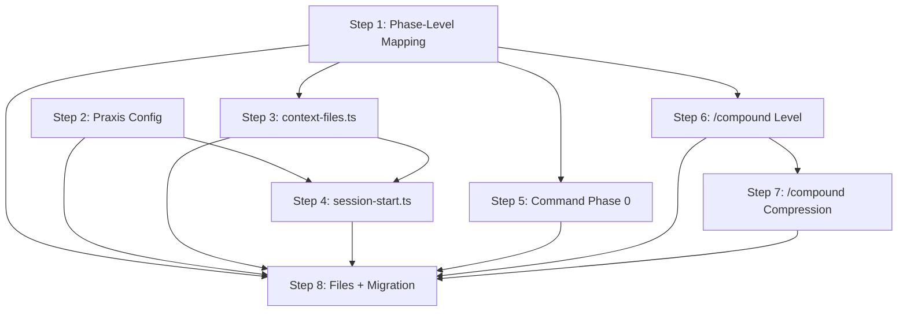

# Implementation Plan: Contexts System

Design Doc: `claudedocs/design-docs/02-contexts-system.md`

## Purpose

learnings.mdを3つのレベル別ファイルに分割し、作業フェーズに応じて必要なファイルだけを読み込む仕組みを構築する。これにより、コンテキストウィンドウに不要な学びが載らなくなり、学びの再利用精度が向上する。

## Prerequisites

- Node.js hookインフラが稼働済み（`hooks/src/lib/context-files.ts`, `hooks/src/session-start.ts`）
- 全8コマンドが `commands/*.md` に存在
- 既存 `learnings.md` に23エントリ

## Overview

8ステップで段階的に構築する。Step 1-2で基盤（フェーズ-レベル定義、設定ファイル）を作り、Step 3-4でhookインフラを拡張し、Step 5-7でコマンド側を更新し、Step 8で既存エントリを移行する。

**共通定数:**
- `CONTEXT_DIR = ".claude/context"`
- 新ファイル: `learnings-feature-spec.md`, `learnings-design.md`, `learnings-coding.md`
- 設定ファイル: `.claude/praxis.json`

---

## Step 1: Phase-Level Mapping Config + Type Definitions

**Goal:** フェーズとlearningsファイルの対応関係をTypeScript定数として定義する。後続すべてのステップがこの定義を参照する。

### Why This First

他のステップ（context-files.tsの追跡対象、コマンドのファイル指定、/compoundのレベル分類）はすべて「どのフェーズがどのファイルを読むか」の定義に依存する。この定義を最初に確立することで、後続の実装が一貫する。

### Files to Create

**Tests first (RED):**

1. **`tests/unit/phase-learnings.test.ts`**
   - `LEARNINGS_FILES` contains exactly 3 file names
   - `PHASE_LEARNINGS_MAP` covers all 8 phases
   - `getLearningsForPhase("feature-spec")` → `["learnings-feature-spec.md"]`
   - `getLearningsForPhase("design")` → `["learnings-feature-spec.md", "learnings-design.md"]`
   - `getLearningsForPhase("implement")` → `["learnings-design.md", "learnings-coding.md"]`
   - `getLearningsForPhase("debug")` → `["learnings-coding.md"]`
   - `getLearningsForPhase("review")` → `["learnings-design.md", "learnings-coding.md"]`
   - `getLearningsForPhase("research")` → all 3 files
   - `getLearningsForPhase("plan")` → `["learnings-design.md", "learnings-coding.md"]`
   - `getLearningsForPhase("compound")` → all 3 files
   - `getLearningsForPhase("unknown-phase")` → all 3 files（安全なフォールバック）

**Implementation (GREEN):**

2. **`hooks/src/lib/phase-learnings.ts`**
   - `LearningsLevel = "feature-spec" | "design" | "coding"` 型定義
   - `LEARNINGS_FILES: Record<LearningsLevel, string>` — 3ファイル名
   - `PHASE_LEARNINGS_MAP: Record<string, LearningsLevel[]>` — 8フェーズの対応
   - `getLearningsForPhase(phase: string): string[]` — フェーズからファイル名を解決。未知のフェーズは全ファイルを返す

### Verification
```bash
npm run typecheck
npm run lint
npm run test  # new unit tests pass
npm run build
```

### Estimated Lines: ~100

---

## Step 2: Praxis Config — global-learnings パスの設定可能化

**Goal:** `.claude/praxis.json` から設定を読み込むモジュールを作り、`global-learnings.md` のパスを設定ファイルで変更可能にする。デフォルトは従来通り `~/.claude/learnings/global-learnings.md`。

### Why Configurable

`global-learnings.md` のパスは現在 [session-start.ts:36-41](hooks/src/session-start.ts#L36-L41) でハードコードされている。チーム共有やバックアップ先変更など、パスをプロジェクトごとに変えたいケースに対応する。ライブラリ層（`context-files.ts` の `detectPersistenceFiles`）は既に `globalLearningsPath` を引数で受け取るため、パス解決の起点を設定ファイルに切り替えるだけで実現できる。

### Config Format

`.claude/praxis.json`:
```json
{
  "globalLearningsPath": "/path/to/custom/global-learnings.md"
}
```

- ファイルが存在しない → 全項目デフォルト値（エラーにしない）
- `globalLearningsPath` が未指定 → デフォルト `~/.claude/learnings/global-learnings.md`
- 相対パスが指定された場合 → cwd基準で解決
- `~` はNode.jsが展開しないため、`$HOME` で置換する

### Files to Create

**Tests first (RED):**

1. **`tests/unit/praxis-config.test.ts`**
   - Config file not found → returns defaults (no error)
   - Config with `globalLearningsPath` → returns specified path
   - Config without `globalLearningsPath` → returns default path
   - Config with relative path → resolved from cwd
   - Config with `~` prefix → expanded to `$HOME`
   - Malformed JSON → returns defaults (no error, stderr warning)
   - `loadPraxisConfig()` returns `PraxisConfig` type

**Implementation (GREEN):**

2. **`hooks/src/lib/praxis-config.ts`**
   ```
   PraxisConfig { globalLearningsPath: string }
   DEFAULT_GLOBAL_LEARNINGS_PATH = path.join(homedir(), ".claude", "learnings", "global-learnings.md")
   loadPraxisConfig(cwd: string): PraxisConfig
   ```
   - `path.join(cwd, ".claude", "praxis.json")` を読む
   - JSON.parse、フィールド抽出、デフォルト値マージ
   - エラー時はデフォルト値を返す（hookがブロックしないよう）

3. **`hooks/src/session-start.ts`** — 変更:
   - ハードコードの `globalLearningsPath` 構築を `loadPraxisConfig(cwd).globalLearningsPath` に置換
   - 既存の `const globalLearningsPath = path.join(process.env.HOME ?? "", ".claude", "learnings", "global-learnings.md")` → `const config = loadPraxisConfig(process.cwd()); const globalLearningsPath = config.globalLearningsPath;`

### Critical Behavior to Preserve
- 設定ファイル未作成でも従来通り動作する（後方互換）
- 設定ファイルの読み込み失敗でSessionStartがブロックしない
- テストの `HOME` env var override が引き続き機能する（`DEFAULT_GLOBAL_LEARNINGS_PATH` は `process.env.HOME` ではなく `os.homedir()` を使うが、テストでは config 経由でパスを指定するため影響なし）

### Verification
```bash
npm run typecheck
npm run lint
npm run test
npm run build
```

### Estimated Lines: ~120

---

## Step 3: context-files.ts 拡張 — レベル別ファイルの追跡

**Goal:** `detectPersistenceFiles()` が3つのlearningsファイルを個別に追跡し、各ファイルのエントリ数を返す。旧`learnings.md`との後方互換を維持する。

### Why This Approach

`detectPersistenceFiles()` はSessionStartメタデータの情報源である。ここが3ファイルを認識しなければ、session-start.tsはファイル別のエントリ数を通知できない。後方互換として旧ファイルも追跡し続けることで、移行期間中に情報が欠落しない。

### Current State

[context-files.ts:10](hooks/src/lib/context-files.ts#L10) の `TRACKED_FILES` は `["task_plan.md", "progress.md", "learnings.md"]` を追跡。エントリ数カウントは `progress.md` のみ（[context-files.ts:24](hooks/src/lib/context-files.ts#L24)）。

### Files to Modify/Create

**Tests first (RED):**

1. **`tests/unit/context-files.test.ts`** — 追加テストケース:
   - `detectPersistenceFiles()` detects `learnings-feature-spec.md` with entry count
   - `detectPersistenceFiles()` detects `learnings-design.md` with entry count
   - `detectPersistenceFiles()` detects `learnings-coding.md` with entry count
   - Entry count = h2 (`## `) header count（learningsファイル共通）
   - 新3ファイル + 旧`learnings.md` が共存 → 全4ファイルを返す（移行期間の後方互換）
   - 旧`learnings.md` のみ存在 → 従来通り返す（regression防止）
   - 新3ファイルのみ存在 → 旧ファイルは結果に含まれない
   - 空のlearningsファイル → entryCount = 0

**Implementation (GREEN):**

2. **`hooks/src/lib/context-files.ts`** — 変更:
   - `TRACKED_FILES` を拡張: `["task_plan.md", "progress.md", "learnings.md", "learnings-feature-spec.md", "learnings-design.md", "learnings-coding.md"]`
   - エントリ数カウント条件: `progress.md` に加え `learnings-` で始まるファイルもh2セクション数をカウント
   - `PersistenceFileInfo` インターフェースは変更不要（既に `entryCount?: number` を持つ）

### Critical Behavior to Preserve
- `task_plan.md`, `progress.md` の追跡は変更しない
- `global-learnings.md` の追跡は変更しない（別パス）
- ファイル非存在時はスキップ（既存動作を維持）
- `detectPersistenceFiles` のシグネチャは変更しない

### Verification
```bash
npm run typecheck
npm run lint
npm run test  # 既存テスト + 新規テストすべてpass
npm run build
```

### Estimated Lines: ~80

---

## Step 4: session-start.ts 拡張 — レベル別メタデータ出力

**Goal:** SessionStart通知にレベル別ファイルのメタデータ（エントリ数、更新日時）を個別に表示する。Claudeはこの情報とフェーズ検出結果を組み合わせて、必要なファイルだけを読む。

### Why Minimal Changes

Step 3で `detectPersistenceFiles()` が各learningsファイルの `entryCount` を返すようになる。session-start.ts側は `entryCount` の表示条件を広げるだけで、新ファイルのメタデータが自然に表示される。また、Step 2で `loadPraxisConfig()` が導入されるため、global-learnings パスの解決も設定ファイル経由に切り替わる。

### Current State

[session-start.ts:48-53](hooks/src/session-start.ts#L48-L53) で persistence files を出力。`entryCount` 表示は `f.entryCount !== undefined` で判定すべきだが、現在は `progress.md` しか `entryCount` を持たないため実質同じ動作をしている。

### Files to Modify/Create

**Tests first (RED):**

1. **`tests/integration/session-start.test.ts`** — 追加テストケース:
   - 3つのlearningsファイルが存在 → 各ファイルがエントリ数付きで表示
   - 出力フォーマット: `learnings-feature-spec.md (3 entries, updated: YYYY-MM-DD HH:MM)`
   - 旧ファイルと新ファイルが共存 → 全ファイル表示（移行期間）
   - 旧`learnings.md`のみ存在 → エントリ数なしで表示（既存動作。旧ファイルはカウント対象外だった）

**Implementation (GREEN):**

2. **`hooks/src/session-start.ts`** — 変更:
   - 現在の `entryCount` 表示条件は既に `f.entryCount !== undefined` で判定している（[session-start.ts:50](hooks/src/session-start.ts#L50)）
   - Step 3で `context-files.ts` が learnings ファイルの `entryCount` を返すようになるため、表示側の追加変更は不要の可能性がある
   - Step 2で `loadPraxisConfig()` が導入済みなので、`globalLearningsPath` は設定ファイル経由で解決される
   - テストで確認し、必要な場合のみ調整

### Critical Behavior to Preserve
- SessionStartは**メタデータのみ**通知（ファイル内容は注入しない = Write Auto, Read Manual）
- 出力: `{ "hookSpecificOutput": { "additionalContext": "..." } }`
- `task_plan.md`, `progress.md`, `global-learnings.md` の表示は変更しない

### Verification
```bash
npm run typecheck
npm run lint
npm run test
npm run build
```

### Estimated Lines: ~60

---

## Step 5: コマンド Phase 0 更新 — フェーズ別ファイル指定

**Goal:** 各コマンドのlearnings読み込み指示を、フェーズに対応する具体的なファイル名に更新する。不要なファイルをRead toolで開かないことで、コンテキスト消費をゼロにする。

### Why Static File Names in Commands

Design Docの設計判断: 「hookは通知、コマンドは指示」という責務分離を維持する。hookが動的にマッピングを適用するのではなく、コマンドの静的な指示としてファイル名を記述する。これにより、各コマンドを読むだけで「何を参照するか」が明確になる。

### Current State

[feature-spec.md](commands/feature-spec.md), [design.md](commands/design.md), [debug.md](commands/debug.md) のPhase 0:
```
1. Read `.claude/context/learnings.md` and `~/.claude/learnings/global-learnings.md` if they exist
```

[implement.md:16](commands/implement.md#L16) のPhase 1内:
```
2. **Check learnings before starting**: Read `learnings.md` and `global-learnings.md` if they exist.
```

### Files to Modify

Phase-Level Mapping（Design Doc表）に基づく変更:

| Command | Before | After |
|---------|--------|-------|
| `commands/feature-spec.md` | `learnings.md` | `learnings-feature-spec.md` |
| `commands/design.md` | `learnings.md` | `learnings-feature-spec.md` + `learnings-design.md` |
| `commands/implement.md` | `learnings.md` | `learnings-design.md` + `learnings-coding.md` |
| `commands/debug.md` | `learnings.md` | `learnings-coding.md` |
| `commands/plan.md` | 該当箇所があれば | `learnings-design.md` + `learnings-coding.md` |
| `commands/review.md` | 該当箇所があれば | `learnings-design.md` + `learnings-coding.md` |
| `commands/research.md` | 該当箇所があれば | 全3ファイル |

`global-learnings.md` はすべてのコマンドで引き続き参照する（クロスプロジェクト学習は単一ファイル維持、Design Doc Non-Goals）。

### Verification
- 各コマンドのPhase 0で正しいファイル名が指定されていること（目視確認）
- フェーズ-レベルマッピング表と一致していること

### Estimated Lines: 変更のみ（新規ファイルなし）

---

## Step 6: /compound 拡張 — レベル分類ステップ

**Goal:** Flow→Stock昇格時に、学びのレベル（feature-spec / design / coding）を判定し、対応するファイルに書き込む仕組みを組み込む。

### Why Level Column

現在の /compound は project learnings を単一ファイルに書き込む。3ファイル分割後は、各学びのルーティング先を決める必要がある。テーブルに Level カラムを追加することで、人間が各エントリの配置先を判断・調整できる。

### Current State

[compound.md](commands/compound.md) の routing proposal テーブル:
```
| # | Learning | Context / Rationale | Proposed Destination |
```

Destination は `project learnings`, `global learnings`, `code-quality-rules`, `framework improvement`, `discard` の5択。project learnings は `.claude/context/learnings.md` の1ファイルに書き込む。

### Changes

1. **`commands/compound.md`** — 変更:

   routing proposal テーブルに **Level** カラムを追加:
   ```
   | # | Learning | Context / Rationale | Proposed Destination | Level |
   |---|----------|---------------------|---------------------|-------|
   | 1 | "JWT chosen over session..." | "Stateless requirement..." | project learnings | design |
   | 2 | "deny-by-default..." | "Error paths should block..." | project learnings | coding |
   | 3 | "Scope creep on auth..." | "Started login, added 2FA..." | project learnings | feature-spec |
   | 4 | "CORS before auth..." | "Preflight rejection..." | global learnings | — |
   ```

   Level カラムは Destination が `project learnings` の場合のみ記入。他のDestination（global learnings, code-quality-rules等）では `—` とする。

   Destination テーブルを更新:
   ```
   | Destination | Level | Target File | Criteria |
   |-------------|-------|-------------|----------|
   | project learnings | feature-spec | `.claude/context/learnings-feature-spec.md` | 要件定義・スコープ判断の学び |
   | project learnings | design | `.claude/context/learnings-design.md` | 設計判断・アーキテクチャの学び |
   | project learnings | coding | `.claude/context/learnings-coding.md` | 実装パターン・品質ルールの学び |
   | global learnings | — | `~/.claude/learnings/global-learnings.md` | Cross-project knowledge |
   | code-quality-rules | — | self-evolution | Universal quality rule |
   | framework improvement | — | `[skill or command]` | Better way to work |
   | discard | — | — | Not reusable |
   ```

   レベル判定ガイダンスを追加:
   > **Level判定基準**: この学びが再利用される場面を考える。「要件を決めるとき」に役立つならfeature-spec、「設計を決めるとき」ならdesign、「コードを書くとき」ならcoding。複数に該当する場合は、最も影響の大きいレベルに1箇所だけ配置する。

### Verification
- テーブルフォーマットが正しいこと（目視確認）
- Level判定基準がDesign Docの分類定義と一致していること

### Estimated Lines: 変更のみ

---

## Step 7: /compound 拡張 — 圧縮ステップ

**Goal:** 既存Stockの圧縮（重複排除・陳腐化削除・類似統合）を提案し、人間の承認を得て実行するフェーズを追加する。学びファイルが「量で膨らむ」のではなく「密度で進化する」方向を実現する。

### Why Compression

エントリが蓄積されるだけでは、時間と共にファイルが肥大化し、Contextsシステムが解決しようとする問題（コンテキストの無駄遣い）を再び引き起こす。人間の記憶と同じく、回想→整理→圧縮のプロセスで学びの品質を維持する。

### Current State

/compound は Flow→Stock昇格のみ。既存Stockのメンテナンスは行わない。

### Changes

1. **`commands/compound.md`** — 圧縮フェーズを追加:

   Flow→Stock昇格（既存フロー）の**後に**、Stock圧縮フェーズを追加する。

   ```markdown
   ## Phase 2: Stock Compression

   After promotion is complete, review existing learnings for compression opportunities.

   1. Read all 3 learnings files
   2. Identify compression candidates:

   | Category | What to look for | Example |
   |----------|-----------------|---------|
   | 重複排除 (Dedup) | Same insight, different expressions | "deny-by-default" + "error=exit 2" → merge |
   | 陳腐化削除 (Obsolete) | Learning invalidated by project evolution | Bash hook patterns after Node.js migration |
   | 類似統合 (Synthesize) | Multiple learnings sharing a common principle | 3 hook patterns → "hooks = mechanical state checks" |

   3. Present compression proposal:

   | # | Category | Target Entries | Proposed Action | Rationale |
   |---|----------|---------------|-----------------|-----------|
   | 1 | Dedup | entry A + entry B | Merge into single entry | Same pattern, different expressions |
   | 2 | Obsolete | entry C | Delete | Node.js migration complete |
   | 3 | Synthesize | entries D, E, F | Unify into higher abstraction | Common principle |

   4. Wait for human confirmation
   5. Execute approved compressions
   6. Report: entries before → entries after per file
   ```

   **Rationale必須**: 各圧縮候補に「なぜこの操作が妥当か」の理由を付ける。理由なしの提案は形骸化するため。

   **圧縮候補がない場合**: 「No compression candidates found.」と報告して終了。無理に圧縮しない。

### Verification
- 3つのカテゴリがDesign Docと一致していること
- 人間の承認フローが維持されていること
- Rationale必須のガイダンスが含まれていること

### Estimated Lines: 変更のみ

---

## Step 8: Learnings ファイル作成 + 初回マイグレーション

**Goal:** 3つの空learningsファイルを作成し、既存23エントリの分類を /compound セッションで実行する。全ステップの統合確認を行う。

### Why Last

このステップは全ステップの成果を統合するものであり、hookインフラ（Step 2-4）とコマンド（Step 5-7）の両方が完成している必要がある。空ファイルを先に作ると、context-files.tsが未対応のまま認識してしまうリスクがある。

### Files to Create

1. **`.claude/context/learnings-feature-spec.md`**
   ```markdown
   # Learnings — Feature Spec Level

   要件定義・スコープ判断に関する学び。feature-specフェーズで参照される。
   ```

2. **`.claude/context/learnings-design.md`**
   ```markdown
   # Learnings — Design Level

   設計判断・アーキテクチャに関する学び。design, implement, review, planフェーズで参照される。
   ```

3. **`.claude/context/learnings-coding.md`**
   ```markdown
   # Learnings — Coding Level

   実装パターン・品質ルールの学び。implement, debug, review, planフェーズで参照される。
   ```

### Migration Process

既存23エントリの分類は **/compound セッション**で人間が判断する（自動分類は信頼性が低い）。

1. `/claude-praxis:compound` を実行
2. 既存 `learnings.md` の全エントリを読む
3. 各エントリのレベルを提案するテーブルを提示
4. 人間が承認・調整
5. 承認後、対応するファイルに書き込む
6. 旧 `learnings.md` は削除せず残す（context-files.tsが両方を追跡する移行期間）

### Post-Migration Cleanup

移行完了を確認した後（別セッション）:
- `context-files.ts` の `TRACKED_FILES` から `"learnings.md"` を削除
- 旧 `learnings.md` を削除
- 関連テストの後方互換テストケースを削除

### Verification
- 3ファイルが `.claude/context/` に存在
- 移行後のエントリ総数 = 23（漏れ・重複なし）
- `npm run test` — 全テストpass（integration含む）

### Estimated Lines: ~30（空ファイル作成。エントリ移行は /compound が実行）

---

## Dependency Graph



**並列可能な組み合わせ:**
- Step 1, Step 2 → 相互に依存なし。最初に並列実行可能
- Step 3, Step 5, Step 6 → Step 1 完了後に並列実行可能
- Step 4 → Step 2 + Step 3 の両方の完了を待つ
- Step 7 → Step 6 の完了を待つ
- Step 8 → 全ステップ完了後に実行

## Implementation Order Summary

| Step | Scope | Dependencies | Key Risk | Est. Lines |
|------|-------|-------------|----------|------------|
| 1 | Phase-level mapping config | None | マッピングの妥当性 | ~100 |
| 2 | Praxis Config (global-learnings path) | None | 設定ファイル読み込みの堅牢性 | ~120 |
| 3 | context-files.ts 拡張 | Step 1 | 後方互換性の維持 | ~80 |
| 4 | session-start.ts 拡張 | Step 2, 3 | メタデータ出力 + config統合 | ~60 |
| 5 | コマンド Phase 0 更新 | Step 1 | 全8フェーズの網羅性 | 変更のみ |
| 6 | /compound レベル分類 | Step 1 | テーブルフォーマット | 変更のみ |
| 7 | /compound 圧縮ステップ | Step 6 | 圧縮判断の品質 | 変更のみ |
| 8 | ファイル作成 + マイグレーション | Steps 1-7 | 23エントリの分類判断 | ~30 |
| **Total** | | | | **~390 + コマンド変更** |

## Final Verification Checklist

After all 8 steps:

- [ ] `npm run typecheck` — zero errors
- [ ] `npm run lint` — zero errors
- [ ] `npm run test` — all tests pass (unit + integration)
- [ ] `npm run build` — dist/ updated
- [ ] 3つのlearningsファイルが `.claude/context/` に存在
- [ ] `.claude/praxis.json` で global-learnings パスが変更可能
- [ ] 設定ファイル未作成でもデフォルト値で従来通り動作
- [ ] `detectPersistenceFiles()` が新3ファイルを個別に追跡（エントリ数付き）
- [ ] SessionStart通知にファイル別エントリ数が表示される
- [ ] 各コマンドのPhase 0がフェーズ対応ファイルを指定している
- [ ] /compound がレベル分類 + 圧縮の2フェーズで動作する
- [ ] 旧 `learnings.md` との後方互換が維持されている（移行期間中）
- [ ] 「Write Auto, Read Manual」原則が維持されている（ファイル内容の自動注入なし）
- [ ] フェーズ-レベルマッピングが全8フェーズをカバーしている
