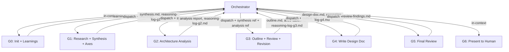

Orchestrate the **Design Doc Creation Workflow** using Phase Group Subagents.

This is an end-to-end workflow. The orchestrator dispatches phase groups as isolated Task subagents, communicating via durable files. Execute groups sequentially — each group's output feeds the next group's input. Human input is requested ONLY at G6.

## Phase Group Architecture

The workflow splits into 7 groups. G0 and G6 run **in the orchestrator's context** (lightweight, require direct human interaction). G1-G5 run as **Task subagents** with isolated context windows.



**Orchestrator principles**: Follow the orchestrator principles defined in `commands/implement.md` (file paths not contents, structural validation only, `.claude/context/progress.md` by orchestrator). Additionally:
- Delete reasoning-logs after their downstream group succeeds
- All intermediate files (`synthesis.md`, `outline.md`, `axes-table.md`, `reasoning-log-g*.md`, `review-findings.md`) are written to `claudedocs/design-docs/wip/`. This directory is created at workflow start and cleaned up after G6 approval. Permanent artifacts (Design Doc, analysis report) go to their standard locations

## G0: Check Past Learnings + Workspace Init (in-context)

Runs in the orchestrator's context. Two responsibilities: initialize the workspace and check past learnings.

**Workspace initialization**: Create the working directory `claudedocs/design-docs/wip/`. If it already exists (from a previous run), delete its contents to ensure a clean workspace. This prevents stale artifacts from a previous `/design` run from being read by subagents.

**Learnings check**: Invoke `check-past-learnings` (role: design). Carry relevant learnings forward into G1's dispatch prompt as constraints or starting points.

## G1: Research + Synthesis + Axes Resolution (subagent)

The most context-intensive group. Dispatches researchers in parallel, synthesizes findings, produces Design Axes Table, and resolves "Requires exploration" axes through per-axis evaluation — all within a single isolated subagent.

### Dispatch

Dispatch a `general-purpose` Task subagent with the following task prompt. The prompt must be **self-contained** — the subagent starts with a clean context and has no access to the orchestrator's conversation history.

**Input** (embedded in task prompt as text):
- Topic: The design topic from the user's request
- Learnings context: Output from G0 (relevant past learnings, carried as text)
- Rules constraints: Reference to `rules/design-doc-format.md` for format rules

**Task prompt template**:

> You are executing Phase Group G1 of the `/design` workflow: **Research + Synthesis + Axes Resolution**.
>
> **Topic**: [topic]
>
> **Past learnings context**: [learnings from G0, or "No relevant learnings found"]
>
> Execute the following steps:
>
> **Step 1: Plan and Research**
>
> Invoke `workflow-planner` with:
>
> | Parameter | Value |
> |-----------|-------|
> | `task` | Research and write a Design Doc for [topic] |
> | `domain` | design |
> | `domain_context` | Research strategy, architecture patterns, document structure. New technology selection → add counter-research + oss-research. Known pattern → codebase-scout + best-practices only. Cross-cutting change → full researcher team. When researching a feature/system design, codebase-scout should evaluate whether existing code has structural patterns that the design should leverage, consolidate, or restructure — this informs whether "extend current structure" vs "restructure first" is a relevant design axis. The mandatory Design Axes Table in Synthesis Rules structurally prevents conflating "What" clarity with "How" clarity. Axes marked "Requires exploration" trigger Independent Axis Evaluation (per-axis parallel agents) — see workflow-planner. |
> | `constraints` | (1) Research must produce a synthesis with findings and contradictions. (2) Synthesis must include a Design Axes Table — every design decision with multiple valid approaches must be enumerated with verdict (Clear winner / Requires exploration). (3) If Design Axes Table has "Requires exploration" axes, planner executes Independent Axis Evaluation to resolve them before returning. (4) Design Doc format rules (`rules/design-doc-format.md`) must be followed. |
> | `catalog_scope` | Reviewers: architecture, document-quality, simplicity, structural-patterns, feasibility, user-impact, security-perf, structural-fitness, axes-coherence, devils-advocate. Researchers: all (oss-research, codebase-scout, domain-research, best-practices, counter-research, axis-evaluator). |
>
> The planner will:
> 1. Analyze the topic and select relevant researchers from the catalog
> 2. Present the plan (transparency window)
> 3. Dispatch selected researchers in parallel
> 4. Synthesize findings — reconcile contradictions, identify candidate approaches
> 5. Produce Design Axes Table. For "Requires exploration" axes: dispatch per-axis evaluators, synthesize results, resolve axes
>
> **Step 2: Synthesis Rules**
>
> After researcher agents return:
> 1. Reconcile findings — where researchers recommend an approach, check counter-evidence against it
> 2. Resolve contradictions explicitly (state what conflicted and which finding was adopted)
> 3. Identify at least 2-3 candidate approaches with trade-offs informed by all perspectives
> 4. **Enumerate design axes (MANDATORY)** — produce a Design Axes Table covering every design decision where multiple valid approaches exist. This step CANNOT be skipped. "What" clarity does not imply "How" clarity
> 5. Carry synthesis forward — do NOT pass raw agent outputs
>
> **Design Axes Table (Required Output)**
>
> | Axis | Choices | Verdict | Rationale |
> |------|---------|---------|-----------|
> | [design decision] | A: [option] / B: [option] | Clear winner (A) / Requires exploration | [why A is clearly better, OR why both are viable] |
>
> Rules:
> - Every design decision from the synthesis must appear as an axis
> - "Requires exploration" = both choices have genuine trade-offs that affect the design direction
> - "Clear winner" = one choice is objectively better with stated rationale
> - A verdict of "0 axes require exploration" needs explicit justification
> - Common axes to check: data model structure, logic placement, consistency/integrity strategy, integration approach, state management, performance strategy, complexity trade-off
>
> **Step 3: Write Output Files**
>
> Write the following files:
>
> 1. `synthesis.md` — Must contain these sections:
>    - `## Findings` — Key research results with sources
>    - `## Approaches` — Candidate approaches with trade-offs
>    - `## Design Axes Table` — The resolved axes table
>
> 2. `reasoning-log-g1.md` — Must contain:
>    - `## Key Decisions` — What was decided during research and synthesis
>    - `## Alternatives Considered` — Approaches rejected and why
>    - `## Rationale` — The reasoning chain for the chosen direction
>
> Do NOT write to `.claude/context/progress.md` — the orchestrator handles that.

### Orchestrator post-G1

After G1 completes:
1. **Validate** output per the Validation Protocol (check synthesis.md and reasoning-log-g1.md)
2. **Record to `.claude/context/progress.md`**:

```markdown
## [timestamp] — /claude-praxis:design: G1 complete — Research + Synthesis
- Decision: [key findings and approaches identified, from subagent return summary]
- Rationale: [why certain approaches were rejected early]
- Domain: [topic tag for future matching]
```

3. Dispatch G2 with `synthesis.md` path

## G2: Architecture Analysis (subagent)

Self-contained analysis of the current codebase state. Reads the synthesis file to understand which areas to analyze and what candidate approaches exist.

### Dispatch

Dispatch a `general-purpose` Task subagent.

**Input** (as file paths in task prompt):
- `synthesis.md` path — for understanding the design topic and candidate approaches
- Topic text — for scoping the analysis

**Task prompt template**:

> You are executing Phase Group G2 of the `/design` workflow: **Architecture Analysis**.
>
> **Topic**: [topic]
>
> **Input file**: Read the synthesis at `[synthesis.md path]` to understand the design topic, candidate approaches, and Design Axes Table.
>
> **Execute**:
>
> **Architecture health scan** (TypeScript only — mandatory when tsconfig.json exists): If `tsconfig.json` exists at the project root, call `mcp__plugin_sekko-arch_sekko-arch__scan` with the project path. If the synthesis identifies specific directories as affected areas, pass the `include` filter matching those directories. Extract dimensions scoring D or F as quantitative friction signals. If tsconfig.json is absent, skip silently.
>
> Invoke `architecture-analysis` to capture the current codebase state:
>
> 1. **Determine scope**: Narrow to modules, directories, or layers named in the synthesis. If the synthesis identified specific integration points or affected areas, those become the analysis scope
> 2. **Invoke `architecture-analysis`** with:
>    - `scope`: Task-relevant area identified from synthesis findings
>    - `anticipated_changes`: The design topic and candidate approaches from the synthesis
>    - `research_context`: Key findings from the synthesis
>    - `health_scores`: Results from the health scan above (D/F dimensions and grades). Omit if health scan was skipped
> 3. **Output**: The analysis skill saves a durable report to `claudedocs/analysis/[scope-name].md`
> 4. **Pattern Consideration (mandatory)**: After the analysis report is saved, read `catalog/structural-pattern-review-points.md` and evaluate the report's Structural Observations and friction areas for design pattern applicability. For each catalog category, check whether the analysis findings match the recognition signal. Append a `## Pattern Opportunities` section to the analysis report with:
>    - Pattern opportunities: where a design pattern would reduce structural friction identified in the analysis (reference specific catalog point ID and the friction finding it addresses)
>    - Inconsistent pattern usage: where the analysis revealed a pattern partially applied
>    If no opportunities are found, note "Pattern consideration: no opportunities detected" in the section.
>    These findings should also be noted in `reasoning-log-g2.md` under Structural Friction, as they inform G3 about restructuring axes.
>
> If the analysis detects structural friction (existing architecture doesn't naturally support the proposed changes), note this in the reasoning-log — it should inform the Outline phase (G3) about whether "extend current structure" vs "restructure first" is a relevant axis.
>
> **Write output files**:
>
> 1. The analysis report is saved by the `architecture-analysis` skill itself (to `claudedocs/analysis/`)
> 2. `reasoning-log-g2.md` — Must contain:
>    - `## Key Decisions` — Scope selection rationale, areas analyzed
>    - `## Alternatives Considered` — Other scopes considered and why not chosen
>    - `## Rationale` — Why this scope and these findings matter for the design
>    - `## Structural Friction` — If detected, describe what doesn't fit and why. Include pattern opportunities from the mandatory pattern consideration step (catalog point IDs and suggested directions). This informs G3 about restructuring axes
>
> Do NOT write to `.claude/context/progress.md` — the orchestrator handles that.

### Orchestrator post-G2

After G2 completes:
1. **Validate** — Check analysis report exists in `claudedocs/analysis/` and `reasoning-log-g2.md` exists
2. **Delete** `reasoning-log-g1.md` (G1's reasoning-log — G2 has succeeded, so G1's log is no longer needed)
3. **Record to `.claude/context/progress.md`**:

```markdown
## [timestamp] — /claude-praxis:design: G2 complete — Architecture Analysis
- Decision: [scope analyzed, key structural findings]
- Rationale: [why this scope was chosen]
- Domain: [topic tag]
```

4. Dispatch G3 with `synthesis.md` path and analysis report path

## G3: Outline + Review + Revision (subagent)

Creates the Design Doc outline from synthesis and analysis inputs, dispatches reviewers internally, and revises based on feedback — a tight feedback loop within a single subagent.

### Dispatch

Dispatch a `general-purpose` Task subagent.

**Input** (as file paths in task prompt):
- `synthesis.md` path — for findings, approaches, and resolved Design Axes Table
- Analysis report path — for codebase structural context
- (Optional) `reasoning-log-g2.md` path — if structural friction was detected

**Task prompt template**:

> You are executing Phase Group G3 of the `/design` workflow: **Outline + Review + Revision**.
>
> **Input files**:
> - Synthesis: `[synthesis.md path]` — contains findings, candidate approaches, and resolved Design Axes Table
> - Analysis: `[analysis report path]` — contains codebase structural context
> - (Optional) Reasoning-log G2: `[reasoning-log-g2.md path]` — read if structural friction was noted
>
> **Step 1: Create Outline**
>
> Build the skeleton of the Design Doc following **abstract to concrete** ordering. By this point, all axes in the Design Axes Table are resolved.
>
> 1. Create an outline with section headers and 1-2 sentence summaries per section
> 2. Ordering principle — **abstract to concrete**:
>    - Start with WHY (problem, motivation, constraints)
>    - Then WHAT (goals, scope, proposed approach at the conceptual level)
>    - Then HOW boundaries (interface contracts, key design decisions — only where necessary)
>    - Within each section, follow the same pattern: context first, then specifics
> 3. The outline should make the document's argument visible at a glance
> 4. Ensure Alternatives Considered is included with at least the approaches from the synthesis
> 5. For axes that went through per-axis evaluation: the resolved decision and rationale should inform the Proposal section's argument structure
> 6. If the analysis detected structural friction, ensure the outline addresses this (e.g., as an axis in the proposal or an alternative)
>
> **Step 2: Outline Review**
>
> Save the outline to `outline.md` and the resolved Axes Table to `axes-table.md`.
>
> Invoke `dispatch-reviewers` with:
> - **Reviewers**: `document-quality` + `axes-coherence`
> - **Tier**: light
> - **Target**: `[outline.md path, axes-table.md path]`
>
> For `axes-coherence`, the reviewer cross-references the outline against the resolved Axes Table to detect contradictions.
>
> **Step 3: Revision**
>
> If any reviewer flags issues:
> - Revise the outline to address feedback
> - If `axes-coherence` flags an axis whose concretization contradicts the resolved verdict, re-evaluate the axis and update both `axes-table.md` and the outline
> - Do NOT ask the human — fix internally
>
> **Write output files**:
>
> 1. `outline.md` — The reviewed and revised outline (final version after revision)
> 2. `axes-table.md` — The resolved Axes Table (updated if axes-coherence required changes)
> 3. `reasoning-log-g3.md` — Must contain:
>    - `## Key Decisions` — Outline structure choices, review feedback received
>    - `## Alternatives Considered` — Alternative outline structures considered
>    - `## Rationale` — Why this structure best presents the design argument
>    - `## Review Feedback` — Summary of reviewer findings and how they were addressed
>
> Do NOT write to `.claude/context/progress.md` — the orchestrator handles that.

### Orchestrator post-G3

After G3 completes:
1. **Validate** — Check `outline.md`, `axes-table.md`, and `reasoning-log-g3.md` exist. Verify outline.md contains section headers
2. **Delete** `reasoning-log-g2.md` (G2's reasoning-log — G3 has succeeded)
3. **Record to `.claude/context/progress.md`**:

```markdown
## [timestamp] — /claude-praxis:design: G3 complete — Outline + Review
- Decision: [outline structure, review findings addressed]
- Rationale: [key structural decisions in the outline]
- Domain: [topic tag]
```

4. Dispatch G4 with `outline.md` path and `synthesis.md` path

## G4: Write Full Design Doc (subagent)

Expands the reviewed outline into the complete Design Doc. Benefits most from context isolation — the writer needs only the outline, synthesis conclusions, and format rules, not the accumulated research and review conversations.

### Dispatch

Dispatch a `general-purpose` Task subagent.

**Input** (as file paths in task prompt):
- `outline.md` path — the reviewed and revised outline
- `synthesis.md` path — for findings and Design Axes Table (referenced in Alternatives Considered)

**Task prompt template**:

> You are executing Phase Group G4 of the `/design` workflow: **Write Full Design Doc**.
>
> **Input files**:
> - Outline: `[outline.md path]` — the reviewed outline to expand
> - Synthesis: `[synthesis.md path]` — for research findings and Design Axes Table
>
> **Execute**:
>
> Expand the outline into the complete Design Doc:
>
> 1. Follow the **Why Over How** principle:
>    - **Write WHY generously**: problem context, constraints, decision rationale, rejected alternatives
>    - **Write HOW sparingly**: no code examples, directory structures, or implementation details unless they ARE the design decision
> 2. Follow the Design Doc format rules (`rules/design-doc-format.md`) for all formatting and structural rules
> 3. Within each section, maintain **abstract to concrete** ordering:
>    - Lead with context and motivation
>    - Follow with specifics and details
>    - End with implications and trade-offs
> 4. Write with the assumption this doc will NOT need editing — by focusing on WHY, the doc remains accurate even when implementation changes
> 5. Ensure Alternatives Considered includes all candidate approaches from the synthesis, with reasoning for why the proposal is preferred and when to reconsider each alternative
> 6. **Mermaid diagram constraint**: Every diagram ≤15 nodes, one abstraction level per diagram (per `rules/document-quality.md`)
> 7. **Stock document**: Write in a timeless voice — no temporal expressions ("currently", "recently", "as of now", "なぜ今か"). The doc should read the same in 6 months
> 8. **Self-contained**: Do NOT reference intermediate artifacts (Axes Table, synthesis, research notes). Weave conclusions naturally into Proposal and Alternatives. The reader should never see the scaffolding
> 9. **Diagram-first**: Express concepts and relationships as mermaid diagrams first, prose second. Proposal MUST include at least one structural diagram. Use comparison diagrams in Alternatives when the difference is structural. Do not repeat in prose what the diagram already shows
>
> **Write output files**:
>
> 1. Save the Design Doc to `claudedocs/design-docs/[name].md` (derive kebab-case name from the doc title)
> 2. `reasoning-log-g4.md` — Must contain:
>    - `## Key Decisions` — Writing choices (section emphasis, argument flow, depth of detail)
>    - `## Alternatives Considered` — Alternative ways to structure the argument
>    - `## Rationale` — Why this document structure best communicates the design
>
> Do NOT write to `.claude/context/progress.md` — the orchestrator handles that.

### Orchestrator post-G4

After G4 completes:
1. **Validate** — Check Design Doc exists in `claudedocs/design-docs/` and `reasoning-log-g4.md` exists. Verify Design Doc contains: `## Overview`, `## Context and Scope`, `## Proposal`, `## Alternatives Considered`
2. **Delete** `reasoning-log-g3.md` (G3's reasoning-log — G4 has succeeded)
3. Do NOT delete `outline.md` or `axes-table.md` yet — they may be needed if G6 revision requires re-dispatching G3. These are deleted after G6 approval (see G6 cleanup)
4. **Record to `.claude/context/progress.md`**:

```markdown
## [timestamp] — /claude-praxis:design: G4 complete — Design Doc written
- Decision: [chosen design direction, key design decisions]
- Rationale: [why this approach over alternatives]
- Domain: [topic tag]
```

5. Dispatch G5 with Design Doc path

## G5: Final Review (subagent)

Dispatches 3+ reviewers against the completed Design Doc. The reviewers read the document independently and form fresh judgment.

### Dispatch

Dispatch a `general-purpose` Task subagent.

**Input** (as file path in task prompt):
- Design Doc path

**Task prompt template**:

> You are executing Phase Group G5 of the `/design` workflow: **Final Review**.
>
> **Input file**: Design Doc at `[design-doc path]`
>
> **Execute**:
>
> This is a **thorough** review — structural floor applies (3+ reviewers including `devils-advocate`).
>
> Invoke `dispatch-reviewers` with:
> - **Reviewers**: `architecture` + `document-quality` + `simplicity` + `devils-advocate` (+ `user-impact` if the design affects users)
> - **Tier**: thorough
> - **Target**: `[design-doc path]`
>
> `simplicity` reviews Design Docs for architectural over-complexity — unnecessary layers, premature generalization, and whether simpler alternatives would meet the same goals.
>
> Do NOT include summaries or design rationale in the reviewer dispatch — reviewers read the document independently.
>
> **Write output file**:
>
> `review-findings.md` — Consolidated review results from all reviewers. Include:
> - Each reviewer's findings (pass/fail with specifics)
> - Severity ratings per finding
> - Whether any critical or important issues require revision
>
> No reasoning-log needed — the review findings themselves serve as the judgment record.
>
> Do NOT write to `.claude/context/progress.md` — the orchestrator handles that.

### Orchestrator post-G5

After G5 completes:
1. **Validate** — Check `review-findings.md` exists and contains reviewer results
2. **Delete** `reasoning-log-g4.md` (G4's reasoning-log — G5 has succeeded)
3. **Record to `.claude/context/progress.md`**:

```markdown
## [timestamp] — /claude-praxis:design: G5 complete — Final Review
- Decision: [review outcome — pass or issues found]
- Rationale: [summary of reviewer findings]
- Domain: [topic tag]
```

4. Proceed to G6 (in-context presentation to human)

## G6: Present for Human Approval (in-context)

**This is the ONLY point where the workflow pauses for human input.**

Runs in the orchestrator's context. Read the Design Doc file, `review-findings.md`, and `synthesis.md` (for research summary). This is the one exception where the orchestrator reads full file content — presentation to the human requires it.

Present to the human with:

1. A brief summary of the research that informed the design (3-5 key findings — read from synthesis.md)
2. The full Design Doc
3. **Review trace**: Which reviewers were selected at each stage and why (reconstructed from review-findings.md and reasoning-logs if still available)
4. Explicit request for approval: "Design Doc ready for review. Approve to proceed, or share feedback for revision."

**If the human requests changes**:
- For content revisions (wording, argument structure): re-dispatch **G4** with revision context, then G5
- For structural changes (different approach, new section needed): re-dispatch **G3** with revision context, then G4, then G5
- For fundamental direction changes (different approach entirely, missed alternatives, research gaps): re-dispatch from **G1** (or G2 if only codebase analysis needs updating), then all downstream groups. Acknowledge to the human that this restarts the workflow and will take significantly longer
- After any revision: always re-dispatch **G5** (final review) before presenting again

**After human approval — cleanup**:
- Delete temporary files: `outline.md`, `axes-table.md`, `synthesis.md`, `review-findings.md`, and any remaining `reasoning-log-g*.md` files
- The Design Doc in `claudedocs/design-docs/` and the analysis report in `claudedocs/analysis/` are permanent artifacts

**Record to `.claude/context/progress.md`** after G6 completes (approval or after final revision cycle):

```markdown
## [timestamp] — /claude-praxis:design: Design Doc complete
- Decision: [chosen design direction]
- Rationale: [why this approach over alternatives]
- Domain: [topic tag for future matching]
```

---

## Orchestrator Validation Protocol

Apply the Orchestrator Validation Protocol defined in `commands/implement.md`. The validation checks (file existence, section headers, non-empty) and error recovery (cleanup → re-dispatch → escalate) are identical across all orchestrating commands.

### Per-group required outputs

| Group | Required Files | Required Sections |
|-------|---------------|-------------------|
| G1 | `synthesis.md`, `reasoning-log-g1.md` | synthesis.md: `## Findings`, `## Approaches`, `## Design Axes Table` |
| G2 | Analysis report in `claudedocs/analysis/`, `reasoning-log-g2.md` | Analysis report: structure per `architecture-analysis` skill output |
| G3 | `outline.md`, `axes-table.md`, `reasoning-log-g3.md` | outline.md: section headers matching Design Doc format |
| G4 | Design Doc in `claudedocs/design-docs/`, `reasoning-log-g4.md` | Design Doc: `## Overview`, `## Context and Scope`, `## Proposal`, `## Alternatives Considered` |
| G5 | `review-findings.md` | review-findings.md: reviewer results |

## Data Contracts

| Group | Required Input | Required Output | Reasoning-Log |
|-------|---------------|-----------------|---------------|
| G0 (in-context) | Topic from user | Learnings context (stays in orchestrator) | None |
| G1 (subagent) | Topic text, learnings context text, rules constraints | `synthesis.md` (Findings, Approaches, Design Axes Table) | `reasoning-log-g1.md` |
| G2 (subagent) | `synthesis.md` path, topic | Analysis report in `claudedocs/analysis/` | `reasoning-log-g2.md` |
| G3 (subagent) | `synthesis.md` path, analysis report path, rules constraints | `outline.md`, `axes-table.md` | `reasoning-log-g3.md` |
| G4 (subagent) | `outline.md` path, `synthesis.md` path, format rules | Design Doc in `claudedocs/design-docs/` | `reasoning-log-g4.md` |
| G5 (subagent) | Design Doc path | `review-findings.md` | None |
| G6 (in-context) | Design Doc path, `review-findings.md` path | Human approval or revision request | None |

Inputs are passed as **file paths** in the subagent's task description. Subagents read input files independently — the orchestrator does not embed file contents in dispatch prompts. Exception: G1 receives topic and learnings as text (G0 output is lightweight and stays in orchestrator context).

## Reasoning-Log and `.claude/context/progress.md` Notes

**Reasoning-logs** are temporary files (`reasoning-log-g[N].md`) recording the judgment chain within each subagent. Format: `## Key Decisions`, `## Alternatives Considered`, `## Rationale`. Created by subagents, deleted by the orchestrator after the downstream group succeeds (see each group's "Orchestrator post-GN" section for specific deletion timing). Any remaining reasoning-logs are deleted during G6 cleanup.

**`.claude/context/progress.md`** entries are written by the orchestrator (not subagents) after each group completes. The format is shown in each group's "Orchestrator post-GN" section.
