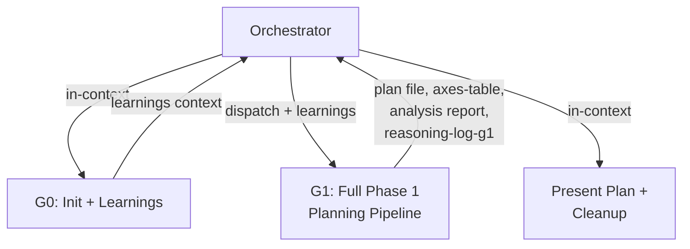

Orchestrate the **Implementation Planning Workflow** using Phase Group Subagents.

This command extracts the planning phase from `/implement` into a standalone workflow. It produces a thorough implementation plan — with Axes Table, per-axis evaluation, architecture analysis, and plan review — then terminates after presenting the plan to the user. No code is written.

The plan file produced here is directly consumable by `/implement`'s Plan Detection, which skips G1 and proceeds straight to implementation.

## Phase Group Architecture

The workflow splits into 2 groups (G0 and G1) and 1 in-context presentation step. G0 runs in the orchestrator's context. G1 runs as a Task subagent with an isolated context window.



**Orchestrator principles**: Follow the orchestrator principles defined in `commands/implement.md` (file paths not contents, structural validation only, progress.md by orchestrator). Additionally:
- Plan Presentation reads the plan file to present to the human (exception to structural-only validation)
- All intermediate files (`reasoning-log-g1.md`) are written to `claudedocs/plans/wip/`. This directory is created at G0 and cleaned up at Plan Presentation. Permanent artifacts (plan file, axes-table, analysis report) go to their standard locations

## G0: Check Past Learnings + Workspace Init (in-context)

Runs in the orchestrator's context. Two responsibilities: initialize the workspace and check past learnings.

**Workspace initialization**: Create the working directory `claudedocs/plans/wip/`. If it already exists (from a previous run), delete its contents to ensure a clean workspace.

**Learnings check**: Invoke `check-past-learnings` (role: implementation). Carry relevant learnings forward into G1's dispatch prompt as constraints or starting points.

## G1: Full Phase 1 Planning Pipeline (subagent)

The most context-intensive group. Executes the entire planning pipeline — architecture analysis, codebase scouting, axes enumeration, plan creation, and plan review — within a single isolated subagent. This includes architecture-analysis internally because planning forms a tightly coupled pipeline: analysis→scout→axes→plan.

### Dispatch

Dispatch a `general-purpose` Task subagent with a self-contained task prompt. The prompt follows the same G1 planning pipeline template as `commands/implement.md` (see "G1: Full Phase 1 Planning Pipeline" section), with these modifications:

- Workflow identifier: `/implement-plan` instead of `/implement`
- Topic, Design Doc path, learnings context, and rules constraints are provided as input (same as implement.md)

The implement.md G1 template is the canonical source. When the template is updated, implement-plan.md inherits the changes.

### Orchestrator post-G1

After G1 completes:
1. **Validate** output per the Validation Protocol (check plan file, axes-table file, analysis report, and reasoning-log-g1.md)
2. **Record to progress.md**:

```markdown
## [timestamp] — /claude-praxis:implement-plan: G1 complete — Planning Pipeline
- Decision: [key plan structure decisions, from subagent return summary]
- Rationale: [why certain approaches were selected]
- Domain: [topic tag for future matching]
```

3. Proceed to Plan Presentation

## Plan Presentation + Cleanup (in-context)

This is the terminal step. The workflow ends here.

Read the plan file — this is the one exception where the orchestrator reads full file content, because presentation to the human requires it. Present to the human with:

1. The full implementation plan
2. The planner's agent selection rationale (which reviewers selected for each task and why)
3. If per-axis evaluation was executed, the resolved axes and evaluation summary
4. If axes-coherence flagged issues, what was revised and why
5. The axes-table file path (kept as a review artifact alongside the plan)

**If the human requests changes**: Clean up G1's output files from `claudedocs/plans/wip/` (reasoning-log-g1.md) before re-dispatching. Re-dispatch G1 with revision context describing what to change. Validate and present the revised plan.

**After the human acknowledges the plan**:

1. **Record to progress.md**:

```markdown
## [timestamp] — /claude-praxis:implement-plan: Plan complete — [topic]
- Decision: [key plan structure decisions]
- Rationale: [why certain approaches were selected]
- Domain: [topic tag for future matching]
```

2. **Cleanup**: Delete the `claudedocs/plans/wip/` directory and its contents (`reasoning-log-g1.md`). This directory has no downstream consumers.

3. **Permanent artifacts** (kept):
   - Plan file at `claudedocs/plans/[name]-plan.md`
   - Axes Table at `claudedocs/plans/[name]-axes-table.md`
   - Analysis report at `claudedocs/analysis/[scope-name].md`

4. **Next step suggestion**:

```
Plan ready at `claudedocs/plans/[name]-plan.md`.
Axes Table at `claudedocs/plans/[name]-axes-table.md`.

To implement: run /claude-praxis:implement with this plan.
```

---

## Data Contracts

| Group | Required Input | Required Output | Reasoning-Log |
|-------|---------------|-----------------|---------------|
| G0 (in-context) | Topic from user, Design Doc path (optional) | Learnings context (stays in orchestrator), `claudedocs/plans/wip/` directory | None |
| G1 (subagent) | Topic, learnings context, Design Doc path, rules constraints | Plan file (`claudedocs/plans/`), Axes Table file (`claudedocs/plans/`), analysis report (`claudedocs/analysis/`) | `reasoning-log-g1.md` |
| Presentation (in-context) | Plan file path, axes-table path | progress.md entry, cleanup | None |

Inputs are passed as **file paths** in the subagent's task description. Subagents read input files independently — the orchestrator does not embed file contents in dispatch prompts. Exception: G1 receives topic and learnings as text (G0 output is lightweight and stays in orchestrator context).

## Orchestrator Validation Protocol

Apply the Orchestrator Validation Protocol defined in `commands/implement.md`. The validation checks (file existence, section headers, non-empty) and error recovery (cleanup → re-dispatch → escalate) are identical across all orchestrating commands.

### Required outputs

| Required Files | Required Sections |
|---------------|-------------------|
| Plan file in `claudedocs/plans/`, axes-table file in `claudedocs/plans/`, analysis report in `claudedocs/analysis/`, `reasoning-log-g1.md` in `claudedocs/plans/wip/` | Plan: task definitions with file paths. Axes Table: axis/choices/verdict/rationale columns |

## Reasoning-Log Notes

`reasoning-log-g1.md` is a temporary file recording the judgment chain within the G1 subagent. Format: `## Key Decisions`, `## Alternatives Considered`, `## Rationale`. Created by G1 in `claudedocs/plans/wip/`, deleted during Plan Presentation cleanup.

**progress.md** entries are written by the orchestrator (not subagents) after G1 completes and after Plan Presentation. The format is shown in each section above.
