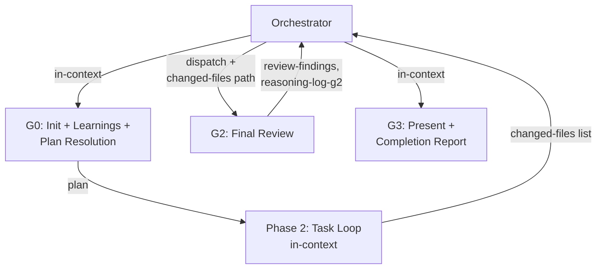

Orchestrate the **Implementation Workflow** using Phase Group Subagents.

This is an execution-focused workflow. The orchestrator resolves a plan (from `/plan` output or inline breakdown), then executes tasks with TDD and graduated review. Execute groups sequentially — each group's output feeds the next group's input. Human input is requested at specific points marked below.

## Phase Group Architecture

The workflow splits into 3 groups (G0, G2, G3) and 1 in-context execution zone (Phase 2). G0 and G3 run **in the orchestrator's context** (lightweight, require direct human interaction). G2 runs as a **Task subagent** with an isolated context window. Phase 2 runs in the orchestrator's context as a task loop controller.



**Orchestrator principles**:
- Pass **file paths**, not file contents, between groups
- Do NOT read full file contents — structural validation only (file existence + section headers). Exception: Plan Resolution reads the plan file to present to the human for inline breakdown acknowledgment
- Write progress.md entries after each group completes (subagents do not write progress.md)
- All intermediate files (`reasoning-log-g2.md`, `review-findings.md`, `changed-files.md`) are written to `claudedocs/plans/wip/`. This directory is created at G0 and cleaned up at G3. Permanent artifacts (plan file) go to their standard locations

## G0: Check Past Learnings + Workspace Init + Plan Resolution (in-context)

Runs in the orchestrator's context. Three responsibilities: initialize the workspace, check past learnings, and resolve the plan.

**Workspace initialization**: Create the working directory `claudedocs/plans/wip/`. If it already exists (from a previous run), delete its contents to ensure a clean workspace.

**Architecture baseline** (optional): If a `tsconfig.json` exists at the project root, call `mcp__plugin_sekko-arch_sekko-arch__session_start` with the project path. Do not pass an `include` filter — capture the full project baseline so that session_end comparison uses a consistent reference. If tsconfig.json is absent, skip silently — session monitoring is TypeScript-only.

**Learnings check**: Invoke `check-past-learnings` (role: implementation). Carry relevant learnings forward as constraints or context for implementation.

**Plan Resolution**: Determine how to proceed based on whether a plan file exists.

### When a plan file is provided

A plan file path is provided as input (e.g., from a prior `/plan` run).

1. **Validate the existing plan structurally**: Check the plan file exists, contains task definitions with file paths, and includes "Final Review" as the last task
2. **Verify topic alignment**: Confirm the plan's topic matches the current implementation request. If the plan targets a different feature or Design Doc, fall through to inline breakdown
3. **Check per-task review plans**: Verify that each task in the plan contains a per-task review specification (e.g., `### Per-Task Review` with reviewer IDs and tier). If any tasks lack per-task review plans, warn the human: "Plan lacks per-task review specifications for [N] tasks. Phase 2 Step C will apply baseline reviewers (code-quality + simplicity + general-review + devils-advocate)." Proceed — the Step C fallback handles missing review specs
4. If an axes-table file exists alongside the plan, delete it (it's a planning artifact, not needed for execution)
5. Proceed directly to **Phase 2**

### When no plan file is provided (inline breakdown)

Perform a lightweight task breakdown in-context:

1. **Understand the scope**: Read the Design Doc if it exists. If no Design Doc (direct implementation request), read the codebase to understand the current state and the user's intent
2. **Break into steps sized for ~500-line PRs**: Each step should produce a reviewable, self-contained change. If a step would exceed ~500 lines, split it further
3. For each step, specify:
   - Exact file paths to create or modify
   - What tests to write FIRST (TDD — RED before GREEN)
   - Expected line count estimate (keep under ~500 lines per step)
   - Verification steps (typecheck, lint, test, build)
   - Dependencies on other steps
4. **TDD ordering**: Within each step, list test files before implementation files. The test is the first deliverable, not an afterthought
5. Always include "Final Review" as the last task
6. **Per-task review**: Apply baseline reviewers for all tasks:
   - Baseline (ALL tasks): `code-quality` + `simplicity` + `general-review` + `devils-advocate`
   - API change / auth → add `security-perf`
   - External dependency / infra / recursive-graph data / input parsing / malformed-data risk → add `error-resilience`
7. Present the breakdown to the human for acknowledgment before proceeding to Phase 2

## Phase 2: Task Execution Loop (in-context)

The orchestrator runs as the task loop controller in its own context. This zone stays in-context to preserve tdd-cycle's human interaction points (Decision Point Consultation, Structural Friction Check).

Before executing any task, verify that the plan includes "Final Review" as the last task. If it does not, add it before proceeding.

If the plan contains only the Final Review task (zero implementation tasks), create an empty `claudedocs/plans/wip/changed-files.md` and proceed directly to G2.

For each task in the plan (excluding the Final Review task, which is handled by G2+G3), execute this cycle:

### Step A: Implement with TDD

Invoke `tdd-cycle` for the RED-GREEN-REFACTOR procedure and decision point consultation pattern.

For independent tasks (no mutual dependencies with other pending tasks), evaluate `subagent-driven-development` for parallel execution. For dependent tasks, execute in-context sequentially.

### Step B: Verify

Run the full verification suite after each task:

```bash
npm run typecheck
npm run lint
npm run test
npm run build       # if applicable
```

All four must pass before proceeding.

### Step C: Per-Task Review (MANDATORY)

After verification passes, invoke the per-task review. This step cannot be skipped regardless of whether the plan specifies per-task reviewers.

**Determine reviewers**: Read the task's per-task review plan from the plan file (typically a `### Per-Task Review` section within each task). If the plan specifies reviewers, use them. If the plan does not specify per-task reviewers for this task, apply the baseline:

- Baseline (ALL tasks): `code-quality` + `simplicity` + `general-review` + `devils-advocate`
- API change / auth → add `security-perf`
- External dependency / infra / recursive-graph data / input parsing / malformed-data risk → add `error-resilience`

Invoke `dispatch-reviewers` with the determined reviewers, tier (**thorough** for all tasks), and the **changed file paths** as target (e.g., `[src/auth.ts, src/auth.test.ts]`). Do NOT include task descriptions or implementation rationale — reviewers read the files independently.

Self-review checklist (applies regardless of tier):

| Check | Question |
|-------|----------|
| Plan alignment | Does the implementation match the spec from the plan? |
| TDD compliance | Were tests written BEFORE implementation code? |
| Code quality | No `as` assertions, no eslint-disable, no lazy assertions? |
| Simplicity | Could any abstraction, wrapper, or indirection be removed without losing functionality? Are functions short and flat (guard clauses over nesting)? |
| Pattern consistency | Does the code follow existing project patterns? |
| Edge cases | Are boundary conditions and error paths handled? |

If issues are found, fix them (return to Step A), re-verify (Step B), then re-review.

### Step D: Report and Proceed

Present a brief task completion report:

```markdown
## Task [N] Complete: [task name]

### Changes
- [file list with brief description]

### Key Decisions
- [decision]: [choice] — because [reason]

### Review (MANDATORY — Step C must have run)
- tier: [thorough]
- reviewers: [catalog IDs used]
- source: [plan-specified | baseline-fallback]

### Verification
- typecheck: PASS
- lint: PASS
- test: PASS (X tests)
- build: PASS
```

The `### Review` section is mandatory — it records which reviewers ran and at what tier. If Step C applied the baseline fallback (plan lacked per-task review specs), record `source: baseline-fallback`. If the plan specified reviewers, record `source: plan-specified`. A task completion report without a `### Review` section indicates Step C was skipped — this is a workflow violation.

If issues are found during the auto-review, propose rule additions via `rule-evolution` skill.

**Update changed-files list**: Append this task's changed file paths to `claudedocs/plans/wip/changed-files.md`:

```markdown
## Task [N]: [task name]
- [file path] — [brief description]
```

**Record to progress.md**: Append an entry with decisions made during this task. Include choices made at decision points (Step A) — these entries serve as comparison material for `/understanding-check`.

```markdown
## [timestamp] — /claude-praxis:implement: Task [N] complete — [task name]
- Decision: [key implementation decisions]
- Rationale: [why — the reasoning behind the choice]
- Domain: [topic tag for future matching]
```

**Update plan document**: Mark the completed task in the plan file (`claudedocs/plans/[name]-plan.md`) if one exists. Prepend `[DONE]` to the task heading and append the completion timestamp. This keeps the plan as a living document that reflects actual progress:

```markdown
## [DONE] Task 1: Setup project structure (completed 2025-01-15T10:30)
```

**PAUSE after every task**: Present the task completion report and wait for the human to acknowledge before proceeding to the next task:

> "Task [N] complete. Ready to continue to Task [N+1], or do you want to review the changes first?"

Always wait for the human's response. Do NOT proceed to the next task automatically. This gate exists because large implementations benefit from incremental human review — the human can inspect changes while context is fresh, catch issues early, and steer direction before more code is built on top.

## G2: Final Review (subagent)

Dispatches 3+ reviewers against all changed files. The reviewers read the files independently and form fresh judgment in a clean context window.

### Pre-dispatch Verification

Before dispatching, run the full verification suite one final time across the entire changeset:

```bash
npm run typecheck
npm run lint
npm run test
npm run build       # if applicable
```

All must pass before dispatching the review team.

### Dispatch

Dispatch a `general-purpose` Task subagent.

**Input** (as file path in task prompt):
- Changed-files list path: `claudedocs/plans/wip/changed-files.md`

**Task prompt template**:

> You are executing Phase Group G2 of the `/implement` workflow: **Final Review**.
>
> **Input file**: Changed-files list at `[changed-files.md path]`
>
> **Execute**:
>
> Read the changed-files list to identify all files that were modified during implementation.
>
> This is a **thorough** review — structural floor applies (3+ reviewers including `devils-advocate`).
>
> Invoke `dispatch-reviewers` with:
> - **Reviewers**: `spec-compliance` + `code-quality` + `simplicity` + `general-review` + `devils-advocate` (+ `security-perf` if the implementation touches auth/security, + `error-resilience` if external dependencies or recursive-graph data or malformed-data risk)
> - **Tier**: thorough
> - **Target**: All changed file paths from the changed-files list
>
> `simplicity` is mandatory in final reviews — it catches accumulated over-engineering across tasks.
>
> Do NOT include summaries or implementation rationale in the reviewer dispatch — reviewers read the files independently.
>
> **Write output files**:
>
> 1. `review-findings.md` at `claudedocs/plans/wip/` — Consolidated review results. Include:
>    - Each reviewer's findings (pass/fail with specifics)
>    - Severity ratings per finding
>    - Whether any critical or important issues require revision
>
> 2. `reasoning-log-g2.md` at `claudedocs/plans/wip/` — Must contain:
>    - `## Key Decisions` — Reviewer selection rationale
>    - `## Alternatives Considered` — Other reviewer combinations considered
>    - `## Rationale` — Why this reviewer set for this implementation
>
> Do NOT write to progress.md — the orchestrator handles that.

### Orchestrator post-G2

After G2 completes:
1. **Validate** — Check `review-findings.md` and `reasoning-log-g2.md` exist in `claudedocs/plans/wip/`
2. **Record to progress.md**:

```markdown
## [timestamp] — /claude-praxis:implement: G2 complete — Final Review
- Decision: [review outcome — pass or issues found]
- Rationale: [summary of reviewer findings]
- Domain: [topic tag]
```

3. **Architecture degradation check** (optional): If session_start was called in G0, call `mcp__plugin_sekko-arch_sekko-arch__session_end` with the project path (no `include` filter — matching session_start's full-project scope for consistent comparison). Present the comparison to the human:

   - If degradation is detected in **structural dimensions** (cycles, coupling, depth, godFiles, complexFn, cohesion — these reflect code quality):
     1. Present the degraded structural dimensions with before/after grades
     2. For each degraded structural dimension, drill into specifics:
        - `coupling` or `cohesion` degraded → call `mcp__plugin_sekko-arch_sekko-arch__coupling_detail` with the project path to identify the files and modules contributing to increased coupling
        - `cycles` degraded → call `mcp__plugin_sekko-arch_sekko-arch__cycles_detail` with the project path to identify the circular dependency chains introduced
        - Other structural dimensions (depth, godFiles, complexFn) → list the changed files (from `changed-files.md`) that overlap with the degraded dimension's scope
     3. For each degraded dimension, propose a concrete fix direction: which files to refactor, what structural change would restore the grade (e.g., "extract module X from Y to break the cycle", "split god file Z into A and B")
     4. **PAUSE** — present the degradation report with fix directions and ask: "Architecture degradation detected. Fix before proceeding, or continue to G3?"
     5. If the human chooses to fix: return to Phase 2 with fix tasks (each targeting one degraded dimension), then re-run session_end to verify improvement
   - If **process-oriented dimensions** only changed (busFactor, codeChurn, changeCoupling, codeAge): these fluctuate based on git history rather than code quality. Present as informational in the progress.md entry but do NOT trigger the PAUSE gate. Proceed to G3
   - If no degradation (grades stable or improved): note in the progress.md entry and proceed to G3.

4. Proceed to G3

## G3: Present + Completion Report (in-context)

Runs in the orchestrator's context. Read `review-findings.md` and the plan (if file exists). This is the final presentation phase.

1. **Present review findings**: Read `claudedocs/plans/wip/review-findings.md` and present to the human with:
   - Summary of review findings
   - Any critical issues that need attention
   - **Review trace**: Which reviewers were selected at each task and at the final review, and why

2. **Re-run verification**: Run the full verification suite to produce fresh evidence for the Completion Report (per `rules/verification.md` Iron Law — no claims without fresh evidence):

```bash
npm run typecheck
npm run lint
npm run test
npm run build       # if applicable
```

3. **Completion Report**: Present using the `rules/verification.md` template:

```markdown
## Completion Report

### Verification
- typecheck: [PASS/FAIL + key output]
- lint: [PASS/FAIL + key output]
- test: [PASS/FAIL + count]
- build: [PASS/FAIL or N/A]

### Architecture Health (optional — only when session_end was called in post-G2)
- Baseline: [composite grade at session_start]
- Final: [composite grade at session_end]
- Degraded dimensions: [list or "none"]
- Fixes applied: [list of fix tasks executed in post-G2, or "none" or "degradation accepted by human"]

### Summary
[What was changed and why]

### Next Phase
→ [Next phase suggestion per verification.md lookup table]
```

4. **Record to progress.md**:

```markdown
## [timestamp] — /claude-praxis:implement: Final review complete
- Decision: [review findings and actions taken]
- Rationale: [what was learned during review]
- Domain: [topic tag for future matching]
```

5. **Mark Final Review complete**: Touch the marker file:

```bash
touch "/tmp/claude-praxis-markers/${sessionId}-implement-final-review"
```

where `${sessionId}` is the current session ID. This marker signals that Phase 3 completed. The Stop hook will block termination if `/implement` was invoked but this marker is absent.

6. **Cleanup**: Delete the `claudedocs/plans/wip/` directory and its contents (reasoning-log-g2, review-findings, changed-files list). Permanent artifacts remain: plan file in `claudedocs/plans/` (if one was used).

---

## Data Contracts

| Group | Required Input | Required Output | Reasoning-Log |
|-------|---------------|-----------------|---------------|
| G0 (in-context) | Topic from user, Design Doc path (optional), plan file path (optional) | Learnings context (stays in orchestrator), `claudedocs/plans/wip/` directory, resolved plan, architecture baseline session (if TypeScript project) | None |
| Phase 2 (in-context) | Resolved plan | Changed files (filesystem), progress.md entries, changed-files list (`claudedocs/plans/wip/changed-files.md`) | None |
| G2 (subagent) | Changed-files list path | `review-findings.md` | `reasoning-log-g2.md` |
| G3 (in-context) | `review-findings.md` path, plan file path (optional) | Completion Report, Final Review marker | None |

Inputs are passed as **file paths** in the subagent's task description. Subagents read input files independently — the orchestrator does not embed file contents in dispatch prompts.

**Phase 2→G2 changed-files contract**: The orchestrator accumulates changed file paths to `claudedocs/plans/wip/changed-files.md` after each task in Phase 2. This file is G2's sole input — it replaces the implicit context-based handoff.

## Orchestrator Validation Protocol

After each subagent group (G2) completes, the orchestrator performs structural validation before proceeding. The orchestrator does NOT evaluate content quality — that is handled by review tiers within each group.

### Validation checks

1. **File existence** — All required output files exist
2. **Section headers** — Output files contain required section headers (read only the first ~50 lines or use grep for `## ` headers, do NOT read full content)
3. **Non-empty** — Files are not empty or truncated (check file size > 0)

### Per-group required outputs

| Group | Required Files | Required Sections |
|-------|---------------|-------------------|
| G2 | `review-findings.md` in `claudedocs/plans/wip/`, `reasoning-log-g2.md` in `claudedocs/plans/wip/` | review-findings.md: reviewer results with severity ratings |

If validation fails, follow the Error Recovery Protocol.

## Error Recovery Protocol

When a subagent group produces invalid output (missing files, missing sections, empty files):

1. **Clean up partial outputs**: Delete all output files from the failed group before re-dispatching. This prevents the new subagent instance from finding stale or partial files from the previous attempt
2. **First failure**: Re-dispatch the same group with the original input PLUS error context describing what was missing and why validation failed. The new subagent instance uses the error context to avoid the same failure
3. **Second failure** (same group fails twice): Escalate to the human. Present: which group failed, what was expected, what was produced, and the error context from both attempts. Do NOT attempt a third re-dispatch

The orchestrator cannot fix failures in-context — it lacks the phase-specific context that the subagent had. Re-dispatch is the only recovery mechanism.

## Reasoning-Log Notes

**Reasoning-logs** are temporary files (`reasoning-log-g2.md`) recording the judgment chain within the subagent. Format: `## Key Decisions`, `## Alternatives Considered`, `## Rationale`. Created by G2 in `claudedocs/plans/wip/`, deleted during G3 cleanup.

**progress.md** entries are written by the orchestrator (not subagents) after each group and each task completes. The format is shown in each group's "Orchestrator post-GN" and Phase 2 Step D sections.

## G1: Full Planning Pipeline (canonical template)

This section is the canonical planning pipeline template. It is referenced by `commands/plan.md` for its G1 dispatch. It is NOT executed by `/implement` — it exists here only as the single source of truth.

### Dispatch

Dispatch a `general-purpose` Task subagent with the following task prompt. The prompt must be **self-contained** — the subagent starts with a clean context and has no access to the orchestrator's conversation history.

**Input** (embedded in task prompt):
- Topic: The implementation topic from the user's request
- Design Doc path: Path to the Design Doc (if exists)
- Learnings context: Output from G0 (relevant past learnings, carried as text)
- Health baseline: D/F dimensions and affected scope from G0's sekko-arch health scan (or "no issues detected" or "not available — non-TypeScript project")
- Rules constraints: Reference to `rules/code-quality.md` for code quality rules

**Task prompt template**:

> You are executing Phase Group G1 of the `/plan` workflow: **Full Planning Pipeline**.
>
> **Topic**: [topic]
>
> **Design Doc**: [Design Doc path, or "No Design Doc — implement from user's intent"]
>
> **Past learnings context**: [learnings from G0, or "No relevant learnings found"]
>
> **Health baseline**: [D/F dimensions with grades and affected scope from G0, or "no issues detected", or "not available — non-TypeScript project"]
>
> Execute the following steps:
>
> **Step 1: Read the Design Doc**
>
> If a Design Doc path is provided, read it to understand the full scope and design decisions. If no Design Doc exists, understand scope from the topic description and create the plan from the user's intent.
>
> **Step 2: Analyze Architecture**
>
> Invoke `architecture-analysis` with:
> - `scope`: Derived from the Design Doc's affected areas (or from the topic if no Design Doc)
> - `anticipated_changes`: From the Design Doc's proposal (or from the topic description)
>
> The skill handles registry lookup internally — if a recent analysis of the same scope exists, it returns the existing report without re-running the full analysis. The analysis produces a durable report at `claudedocs/analysis/[scope-name].md`.
>
> **Step 3: Scout the Codebase**
>
> Invoke `workflow-planner` for codebase exploration:
>
> | Parameter | Value |
> |-----------|-------|
> | `task` | Plan implementation of [topic] |
> | `domain` | implement |
> | `domain_context` | Task decomposition (PR-sized ~500 lines), dependency analysis, TDD. Security-sensitive change → add security-perf to per-task review. Internal refactor → code-quality only. External dependency/infra OR recursive/graph data structures OR input parsing OR functions where malformed data could cause unbounded behavior → add error-resilience. Change that extends or modifies existing architecture → add structural-fitness. The mandatory Implementation Axes Table structurally prevents conflating Design Doc clarity with implementation approach clarity. Axes marked "Requires exploration" trigger Independent Axis Evaluation (per-axis parallel agents) — see workflow-planner. |
> | `constraints` | (1) TDD mandatory for all tasks. (2) Final review mandatory with 3+ reviewers including devils-advocate. (3) Each task produces a reviewable, self-contained change (~500 lines). (4) Scout findings are required input for the plan. (5) Context gathering must produce an Implementation Axes Table — every implementation decision with multiple valid approaches must be enumerated with verdict (Clear winner / Requires exploration). (6) If Implementation Axes Table has "Requires exploration" axes, planner executes Independent Axis Evaluation to resolve them before plan creation. |
> | `catalog_scope` | Reviewers: spec-compliance, code-quality, simplicity, general-review, security-perf, structural-fitness, axes-coherence, error-resilience, devils-advocate. Researchers: codebase-scout, best-practices, axis-evaluator. |
>
> The planner will dispatch `codebase-scout` (and optionally `best-practices` for unfamiliar patterns) to explore the codebase.
>
> **Skip criteria**: Scout may be skipped ONLY when: (a) the change targets a single file explicitly specified with no cross-module integration points, or (b) a Scout was dispatched in the immediately preceding task covering the same codebase area. When skipping, state the specific reason in the plan header. Generic reasons ("scope is clear", "straightforward change") are not sufficient — name the file and explain why no unknown patterns exist.
>
> **Step 4: Enumerate Implementation Axes (MANDATORY)**
>
> After context gathering, produce an Implementation Axes Table covering every implementation decision where multiple valid approaches exist. This step CANNOT be skipped.
>
> | Axis | Choices | Verdict | Rationale |
> |------|---------|---------|-----------|
> | [implementation decision] | A: [option] / B: [option] | Clear winner (A) / Requires exploration | [why A is clearly better, OR why both are viable] |
>
> Rules:
> - Every implementation decision from the context gathering must appear as an axis
> - "Requires exploration" = both choices have genuine trade-offs that affect the implementation approach
> - "Clear winner" = one choice is objectively better with stated rationale
> - A verdict of "0 axes require exploration" needs explicit justification
> - Common axes: test strategy, implementation ordering, refactoring scope, dependency management, error handling approach
>
> If any axes require exploration, the planner will execute Independent Axis Evaluation (per-axis parallel agents) to resolve them.
>
> **Step 5: Create Plan**
>
> By this point, all axes are resolved. Create a single plan:
>
> 1. Break into steps sized for ~500-line PRs — each produces a reviewable, self-contained change
> 2. **Refactoring-first tasks** (when `health_baseline` contains D/F dimensions): If D/F dimensions overlap with the implementation scope, create refactoring tasks targeting those areas BEFORE feature tasks. Each refactoring task should: (a) target a specific D/F dimension and its affected files, (b) include verification that `mcp__plugin_sekko-arch_sekko-arch__health` shows improvement after the refactoring, (c) be self-contained — the codebase should be in a better state even if feature implementation is deferred. Present these as "Refactoring (pre-implementation)" in the plan. If D/F dimensions do not overlap with the implementation scope, note "health baseline reviewed — no pre-implementation refactoring needed" in the plan header
> 3. For each step specify: exact file paths, existing patterns (cite Scout findings), tests to write FIRST (TDD), expected line count, verification steps, dependencies, per-task review plan
> 4. Per-task review plan selection (all tasks get **thorough** tier):
>    - Baseline (ALL tasks): `code-quality` + `simplicity` + `general-review` + `devils-advocate`
>    - API change / auth → add `security-perf`
>    - External dependency / infra / recursive-graph data / input parsing / malformed-data risk → add `error-resilience`
>    - `simplicity`, `general-review`, and `devils-advocate` are included in ALL per-task reviews
> 5. TDD ordering: list test files before implementation files within each step
> 6. Dependency analysis: identify sequential vs parallel tasks. If 3+ independent: evaluate `subagent-driven-development`. If 1-2: note "sequential execution"
> 7. Always include "Final Review (dispatch-reviewers, thorough)" as the last task
>
> **Step 6: Plan Review**
>
> Save the plan to `claudedocs/plans/[name]-plan.md` and the resolved Axes Table to `claudedocs/plans/[name]-axes-table.md`.
>
> Invoke `dispatch-reviewers` with:
> - **Reviewers**: `axes-coherence` + `simplicity` + `devils-advocate` + `spec-compliance` (if Design Doc exists) + `structural-fitness` (if the plan involves extending or restructuring existing architecture)
> - **Tier**: thorough
> - **Target**: both file paths (plan + axes table)
>
> If the review flags critical or important issues — axes contradictions, over-engineered decomposition, missing Design Doc coverage, questionable fundamental direction, or structural fitness concerns — revise the plan and update the Axes Table before proceeding.
>
> **Write output files**:
>
> 1. Plan file at `claudedocs/plans/[name]-plan.md` — the reviewed and revised plan
> 2. Axes Table file at `claudedocs/plans/[name]-axes-table.md` — the resolved axes
> 3. Analysis report at `claudedocs/analysis/[scope-name].md` (saved by `architecture-analysis` skill)
> 4. `reasoning-log-g1.md` at `claudedocs/plans/wip/` — Must contain:
>    - `## Key Decisions` — What was decided during planning
>    - `## Alternatives Considered` — Approaches rejected and why
>    - `## Rationale` — The reasoning chain for the chosen plan structure
>
> Do NOT write to progress.md — the orchestrator handles that.
