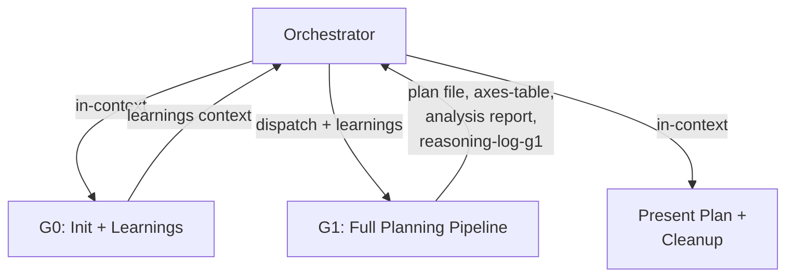

Orchestrate the **Planning Workflow** using Phase Group Subagents.

This command produces a thorough implementation plan — with Axes Table, per-axis evaluation, architecture analysis, and plan review — then terminates after presenting the plan to the user. No code is written.

The plan file produced here is directly consumable by `/implement`, which skips inline breakdown and proceeds straight to implementation.

## Phase Group Architecture

The workflow splits into 2 groups (G0 and G1) and 1 in-context presentation step. G0 runs in the orchestrator's context. G1 runs as a Task subagent with an isolated context window.



**Orchestrator principles**: Follow the orchestrator principles defined in `commands/implement.md` (file paths not contents, structural validation only, progress.md by orchestrator). Additionally:
- Plan Presentation reads the plan file to present to the human (exception to structural-only validation)
- All intermediate files (`reasoning-log-g1.md`) are written to `claudedocs/plans/wip/`. This directory is created at G0 and cleaned up at Plan Presentation. Permanent artifacts (plan file, axes-table, analysis report) go to their standard locations

## G0: Check Past Learnings + Workspace Init + Health Baseline (in-context)

Runs in the orchestrator's context. Three responsibilities: initialize the workspace, check past learnings, and capture architecture health baseline.

**Workspace initialization**: Create the working directory `claudedocs/plans/wip/`. If it already exists (from a previous run), delete its contents to ensure a clean workspace.

**Learnings check**: Invoke `check-past-learnings` (role: implementation). Carry relevant learnings forward into G1's dispatch prompt as constraints or starting points.

**Architecture health baseline** (TypeScript only): If `tsconfig.json` exists at the project root, call `mcp__plugin_sekko-arch_sekko-arch__scan` with the project path. If the implementation scope is known (from Design Doc or user request), pass the `include` filter matching the scope directories. This is a scoped, point-in-time assessment for planning — distinct from `/implement` G0's `session_start` (full-project baseline for before/after comparison). Extract dimensions scoring D or F — these are refactoring candidates. Pass the results to G1 as `health_baseline` context:

- If D/F dimensions exist: include dimension names, grades, and affected scope as refactoring context for G1
- If no D/F dimensions: pass `health_baseline: no issues detected` to G1

If `tsconfig.json` is absent, skip silently — health baseline is TypeScript-only.

## G1: Full Planning Pipeline (subagent — canonical template)

The most context-intensive group. Executes the entire planning pipeline — architecture analysis, codebase scouting, axes enumeration, plan creation, and plan review — within a single isolated subagent. This includes architecture-analysis internally because planning forms a tightly coupled pipeline: analysis→scout→axes→plan.

This section is the canonical planning pipeline template. When the template is updated here, all consumers inherit the changes.

### Dispatch

Dispatch a `general-purpose` Task subagent with the following task prompt. The prompt must be **self-contained** — the subagent starts with a clean context and has no access to the orchestrator's conversation history.

**Input** (embedded in task prompt):
- Topic: The implementation topic from the user's request
- Design Doc path: Path to the Design Doc (if exists)
- Learnings context: Output from G0 (relevant past learnings, carried as text)
- Health baseline: D/F dimensions and affected scope from G0's sekko-arch health scan (or "no issues detected" or "not available — non-TypeScript project")
- Rules constraints: Reference to `rules/code-quality.md` for code quality rules

**Task prompt template**:

> You are executing Phase Group G1 of the `/plan` workflow: **Full Planning Pipeline**.
>
> **Topic**: [topic]
>
> **Design Doc**: [Design Doc path, or "No Design Doc — implement from user's intent"]
>
> **Past learnings context**: [learnings from G0, or "No relevant learnings found"]
>
> **Health baseline**: [D/F dimensions with grades and affected scope from G0, or "no issues detected", or "not available — non-TypeScript project"]
>
> Execute the following steps:
>
> **Step 1: Read the Design Doc**
>
> If a Design Doc path is provided, read it to understand the full scope and design decisions. If no Design Doc exists, understand scope from the topic description and create the plan from the user's intent.
>
> **Step 2: Analyze Architecture**
>
> Invoke `architecture-analysis` with:
> - `scope`: Derived from the Design Doc's affected areas (or from the topic if no Design Doc)
> - `anticipated_changes`: From the Design Doc's proposal (or from the topic description)
>
> The skill handles registry lookup internally — if a recent analysis of the same scope exists, it returns the existing report without re-running the full analysis. The analysis produces a durable report at `claudedocs/analysis/[scope-name].md`.
>
> **Step 3: Scout the Codebase**
>
> Invoke `workflow-planner` for codebase exploration:
>
> | Parameter | Value |
> |-----------|-------|
> | `task` | Plan implementation of [topic] |
> | `domain` | implement |
> | `domain_context` | Task decomposition (PR-sized ~500 lines), dependency analysis, TDD. Security-sensitive change → add security-perf to per-task review. Internal refactor → code-quality only. External dependency/infra OR recursive/graph data structures OR input parsing OR functions where malformed data could cause unbounded behavior → add error-resilience. Change that extends or modifies existing architecture → add structural-fitness. The mandatory Implementation Axes Table structurally prevents conflating Design Doc clarity with implementation approach clarity. Axes marked "Requires exploration" trigger Independent Axis Evaluation (per-axis parallel agents) — see workflow-planner. |
> | `constraints` | (1) TDD mandatory for all tasks. (2) Final review mandatory with 3+ reviewers including devils-advocate. (3) Each task produces a reviewable, self-contained change (~500 lines). (4) Scout findings are required input for the plan. (5) Context gathering must produce an Implementation Axes Table — every implementation decision with multiple valid approaches must be enumerated with verdict (Clear winner / Requires exploration). (6) If Implementation Axes Table has "Requires exploration" axes, planner executes Independent Axis Evaluation to resolve them before plan creation. |
> | `catalog_scope` | Reviewers: spec-compliance, code-quality, simplicity, general-review, security-perf, structural-fitness, axes-coherence, error-resilience, devils-advocate. Researchers: codebase-scout, best-practices, axis-evaluator. |
>
> The planner will dispatch `codebase-scout` (and optionally `best-practices` for unfamiliar patterns) to explore the codebase.
>
> **Skip criteria**: Scout may be skipped ONLY when: (a) the change targets a single file explicitly specified with no cross-module integration points, or (b) a Scout was dispatched in the immediately preceding task covering the same codebase area. When skipping, state the specific reason in the plan header. Generic reasons ("scope is clear", "straightforward change") are not sufficient — name the file and explain why no unknown patterns exist.
>
> **Step 4: Enumerate Implementation Axes (MANDATORY)**
>
> After context gathering, produce an Implementation Axes Table covering every implementation decision where multiple valid approaches exist. This step CANNOT be skipped.
>
> | Axis | Choices | Verdict | Rationale |
> |------|---------|---------|-----------|
> | [implementation decision] | A: [option] / B: [option] | Clear winner (A) / Requires exploration | [why A is clearly better, OR why both are viable] |
>
> Rules:
> - Every implementation decision from the context gathering must appear as an axis
> - "Requires exploration" = both choices have genuine trade-offs that affect the implementation approach
> - "Clear winner" = one choice is objectively better with stated rationale
> - A verdict of "0 axes require exploration" needs explicit justification
> - Common axes: test strategy, implementation ordering, refactoring scope, dependency management, error handling approach
>
> If any axes require exploration, the planner will execute Independent Axis Evaluation (per-axis parallel agents) to resolve them.
>
> **Step 5: Create Plan**
>
> By this point, all axes are resolved. Create a single plan:
>
> 1. Break into steps sized for ~500-line PRs — each produces a reviewable, self-contained change
> 2. **Adaptive hierarchy** — choose hierarchy depth based on plan scale:
>    - **3 levels (Phase / Group / Task)** — 10+ tasks spanning multiple concerns. Phase represents a major implementation milestone (500+ lines), corresponding to a primary section of the Design Doc Proposal
>    - **2 levels (Group / Task)** — 5–10 tasks. Group represents a PR-sized change unit (~500 lines) and serves as the natural unit for range-based execution
>    - **1 level (Task only)** — fewer than 5 tasks. Equivalent to the current flat format
>
>    Terminology is consistent regardless of depth: a 2-level plan uses Group/Task (not Phase/Task). This keeps the reader's mental model stable across plans of different sizes. Hierarchy depth is the planner's judgment — these size guidelines are defaults, not hard rules.
>
>    Each Phase includes a table of contents listing its Groups. Each Group includes a table of contents listing its Tasks.
>
>    Format:
>    - Phase header: `## Phase N: [name]`
>    - Group header: `### Group N: [name]`
>    - Task header: `#### Task N: [name]`
> 3. **Plan overview section** — place at the top of the plan, before any Phase/Group/Task:
>    - **Narrative summary**: 2–3 sentences describing what the plan achieves and why
>    - **Design Doc correspondence table**: map each Phase (or Group, if no Phases) to the Design Doc Proposal section it implements. Format: `| Phase/Group | Design Doc Section | What It Achieves |`
>    - **Dependency summary**: which groups depend on which, and which can run in parallel
> 4. **Refactoring-first tasks** (when `health_baseline` contains D/F dimensions): If D/F dimensions overlap with the implementation scope, create refactoring tasks targeting those areas BEFORE feature tasks. Each refactoring task should: (a) target a specific D/F dimension and its affected files, (b) include verification that `mcp__plugin_sekko-arch_sekko-arch__health` shows improvement after the refactoring, (c) be self-contained — the codebase should be in a better state even if feature implementation is deferred. Present these as "Refactoring (pre-implementation)" in the plan. If D/F dimensions do not overlap with the implementation scope, note "health baseline reviewed — no pre-implementation refactoring needed" in the plan header
> 5. For each step specify: exact file paths, existing patterns (cite Scout findings), tests to write FIRST (TDD), expected line count, verification steps, dependencies, per-task review plan
> 6. **Per-task Why field** (mandatory): Every Task must have a `**Why**:` line explaining its purpose. Tasks that implement a Design Doc decision describe the connection to that decision. Tasks that don't directly correspond to the Design Doc (refactoring prerequisites, test infrastructure, etc.) state the implementation reason. Why is descriptive prose — mechanical references like "Implements Proposal section 2.1" are forbidden; explain the purpose in the reader's terms
> 7. Per-task review plan selection (all tasks get **thorough** tier):
>    - Baseline (ALL tasks): `code-quality` + `simplicity` + `general-review` + `devils-advocate`
>    - API change / auth → add `security-perf`
>    - External dependency / infra / recursive-graph data / input parsing / malformed-data risk → add `error-resilience`
>    - **TypeScript project** (tsconfig.json exists) → add `ts-patterns` to ALL per-task reviews
>    - `simplicity`, `general-review`, and `devils-advocate` are included in ALL per-task reviews
> 8. TDD ordering: list test files before implementation files within each step
> 9. Dependency analysis: identify sequential vs parallel tasks. If 3+ independent: evaluate `subagent-driven-development`. If 1-2: note "sequential execution"
> 10. Always include "Final Review (dispatch-reviewers, thorough)" as the last task
>
> **Step 6: Plan Review**
>
> Save the plan to `claudedocs/plans/[name]-plan.md` and the resolved Axes Table to `claudedocs/plans/[name]-axes-table.md`.
>
> Invoke `dispatch-reviewers` with:
> - **Reviewers**: `axes-coherence` + `simplicity` + `devils-advocate` + `spec-compliance` (if Design Doc exists) + `structural-fitness` (if the plan involves extending or restructuring existing architecture)
> - **Tier**: thorough
> - **Target**: both file paths (plan + axes table)
>
> If the review flags critical or important issues — axes contradictions, over-engineered decomposition, missing Design Doc coverage, questionable fundamental direction, or structural fitness concerns — revise the plan and update the Axes Table before proceeding.
>
> **Write output files**:
>
> 1. Plan file at `claudedocs/plans/[name]-plan.md` — the reviewed and revised plan
> 2. Axes Table file at `claudedocs/plans/[name]-axes-table.md` — the resolved axes
> 3. Analysis report at `claudedocs/analysis/[scope-name].md` (saved by `architecture-analysis` skill)
> 4. `reasoning-log-g1.md` at `claudedocs/plans/wip/` — Must contain:
>    - `## Key Decisions` — What was decided during planning
>    - `## Alternatives Considered` — Approaches rejected and why
>    - `## Rationale` — The reasoning chain for the chosen plan structure
>
> Do NOT write to progress.md — the orchestrator handles that.

### Orchestrator post-G1

After G1 completes:
1. **Validate** output per the Validation Protocol (check plan file, axes-table file, analysis report, and reasoning-log-g1.md)
2. **Record to progress.md**:

```markdown
## [timestamp] — /claude-praxis:plan: G1 complete — Planning Pipeline
- Decision: [key plan structure decisions, from subagent return summary]
- Rationale: [why certain approaches were selected]
- Domain: [topic tag for future matching]
```

3. Proceed to Plan Presentation

## Plan Presentation + Cleanup (in-context)

This is the terminal step. The workflow ends here.

Read the plan file — this is the one exception where the orchestrator reads full file content, because presentation to the human requires it. Present to the human with:

1. The full implementation plan
2. The planner's agent selection rationale (which reviewers selected for each task and why)
3. If per-axis evaluation was executed, the resolved axes and evaluation summary
4. If axes-coherence flagged issues, what was revised and why
5. The axes-table file path (kept as a review artifact alongside the plan)

**If the human requests changes**: Clean up G1's output files from `claudedocs/plans/wip/` (reasoning-log-g1.md) before re-dispatching. Re-dispatch G1 with revision context describing what to change. Validate and present the revised plan.

**After the human acknowledges the plan**:

1. **Record to progress.md**:

```markdown
## [timestamp] — /claude-praxis:plan: Plan complete — [topic]
- Decision: [key plan structure decisions]
- Rationale: [why certain approaches were selected]
- Domain: [topic tag for future matching]
```

2. **Cleanup**: Delete the `claudedocs/plans/wip/` directory and its contents (`reasoning-log-g1.md`). This directory has no downstream consumers.

3. **Permanent artifacts** (kept):
   - Plan file at `claudedocs/plans/[name]-plan.md`
   - Axes Table at `claudedocs/plans/[name]-axes-table.md`
   - Analysis report at `claudedocs/analysis/[scope-name].md`

4. **Next step suggestion**:

```
Plan ready at `claudedocs/plans/[name]-plan.md`.
Axes Table at `claudedocs/plans/[name]-axes-table.md`.

To implement: run /claude-praxis:implement with this plan.
```

---

## Data Contracts

| Group | Required Input | Required Output | Reasoning-Log |
|-------|---------------|-----------------|---------------|
| G0 (in-context) | Topic from user, Design Doc path (optional) | Learnings context (stays in orchestrator), `claudedocs/plans/wip/` directory, health baseline (D/F dimensions or "no issues") | None |
| G1 (subagent) | Topic, learnings context, health baseline, Design Doc path, rules constraints | Plan file (`claudedocs/plans/`), Axes Table file (`claudedocs/plans/`), analysis report (`claudedocs/analysis/`) | `reasoning-log-g1.md` |
| Presentation (in-context) | Plan file path, axes-table path | progress.md entry, cleanup | None |

Inputs are passed as **file paths** in the subagent's task description. Subagents read input files independently — the orchestrator does not embed file contents in dispatch prompts. Exception: G1 receives topic and learnings as text (G0 output is lightweight and stays in orchestrator context).

## Orchestrator Validation Protocol

Apply the Orchestrator Validation Protocol defined in `commands/implement.md`. The validation checks (file existence, section headers, non-empty) and error recovery (cleanup → re-dispatch → escalate) are identical across all orchestrating commands.

### Required outputs

| Required Files | Required Sections |
|---------------|-------------------|
| Plan file in `claudedocs/plans/`, axes-table file in `claudedocs/plans/`, analysis report in `claudedocs/analysis/`, `reasoning-log-g1.md` in `claudedocs/plans/wip/` | Plan: task definitions with file paths. Axes Table: axis/choices/verdict/rationale columns |

## Reasoning-Log Notes

`reasoning-log-g1.md` is a temporary file recording the judgment chain within the G1 subagent. Format: `## Key Decisions`, `## Alternatives Considered`, `## Rationale`. Created by G1 in `claudedocs/plans/wip/`, deleted during Plan Presentation cleanup.

**progress.md** entries are written by the orchestrator (not subagents) after G1 completes and after Plan Presentation. The format is shown in each section above.
