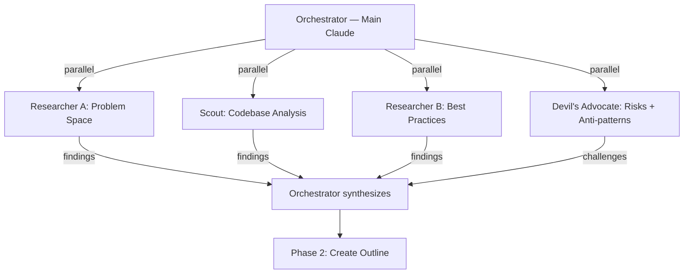
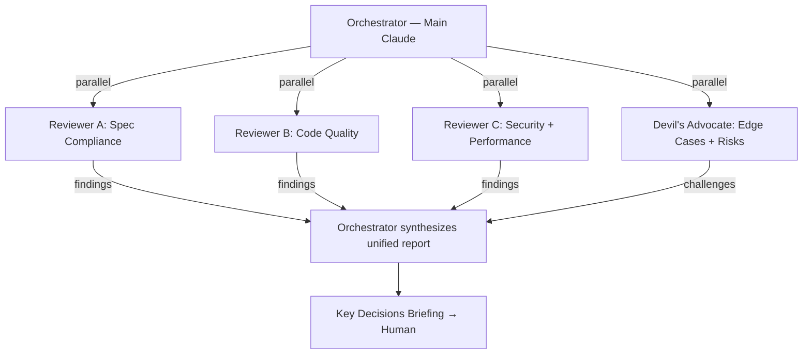
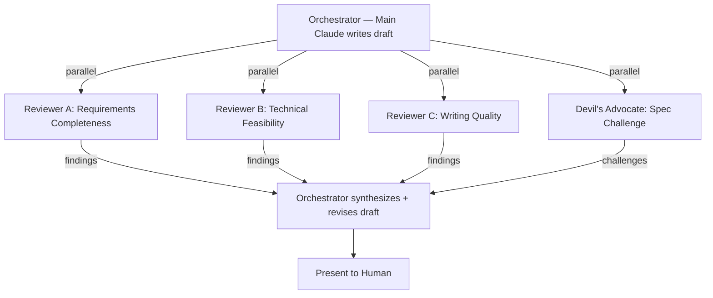
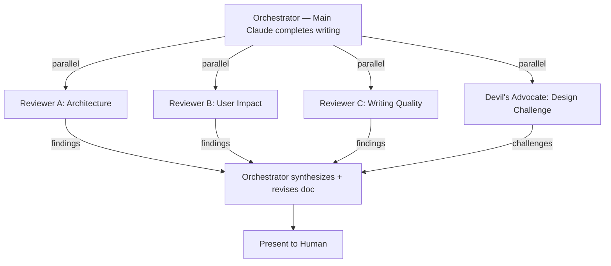

# Collaborative Multi-Agent Workflows for Design and Implementation

## Overview

Praxisの`/feature-spec`、`/design`、`/implement`ワークフローを、単一エージェント実行から協調型マルチエージェント実行へ進化させる。CodeBuffの「小さな専用エージェントが協調する」思想を取り入れつつ、Claude Codeの制約とPraxisの哲学に適合させる。核心は「全ワークフローのレビューポイントに、観点別の並列レビューチームを配置する」こと — コードレビューもドキュメントレビューも、複数の独立した視点で同時にチェックする。

## Context and Scope

### Current State: Single-Agent Bottleneck

Praxisの4つのメインワークフローのうち、エージェント協調を使っているのは`/implement`だけであり、それも部分的にとどまる。

| Workflow | Collaboration | Reality |
|----------|--------------|---------|
| `/feature-spec` | None | Main Claude interviews human alone |
| `/design` | None | Main Claude executes all 6 phases (Research → Outline → Review → Write → Quality Check → Present) in a single context |
| `/implement` | Partial | SDD dispatches implementer + reviewer per task. Planning phase is single-agent |
| `/debug` | Optional | Agent team suggested for 3+ hypotheses but not default |

`/design`が抱える問題は顕著である。Research（Web検索+コードベース探索+ベストプラクティス調査）、Outline作成、本文執筆、品質チェックを全て同一コンテキストで実行するため、Researchフェーズの中間結果（検索結果、ファイル内容）がコンテキストを圧迫し、後続フェーズ（執筆・品質チェック）で使える余裕が減る。

`/implement`ではSDD（Subagent-Driven Development — 1タスクにつき1つの新しいエージェントをdispatchし、タスク完了後にreviewer agentがチェックするパイプライン）が実装タスクを並列化しているが、最終レビューは単一のreviewer agentが全観点（仕様準拠+コード品質+セキュリティ+パフォーマンス）を1回で見る。複数の独立した観点を1つのエージェントに詰め込むと、見落としが増える。

### What CodeBuff Demonstrated

CodeBuff（オープンソースAIコーディングツール）は、175以上のタスクでClaude Code（53%）を上回る61%の成功率を達成した。その核心は「Toolless Orchestrator Pattern」— オーケストレーターはサブエージェントをspawnするツール以外一切持たず、全ての作業を専用エージェントに委任する。

この設計がもたらす利点:
- **Context Window効率**: サブエージェントの最終出力のみがオーケストレーターの履歴に残る（中間のツール結果は含まない）
- **強制的な委任**: オーケストレーターは自分で作業できないため、常に最適な専門エージェントを選ぶ判断が求められる
- **精度向上**: 各エージェントが狭い責務に集中するため、その領域でのパフォーマンスが汎用エージェントを上回る

### Independent Verification Source — Specialization's Prerequisite

リサーチの結果、エージェント分割が効果を発揮する条件が明確になった。**エージェントが互いに独立した検証ソースを持つ場合に限り、分割は精度を向上させる。**

「独立した検証ソース」とは、あるエージェントの判断が他のエージェントの推論に依存せず、外部の客観的基準で検証できることを意味する。

| 分割の例 | 検証ソース | 独立性 | 効果 |
|----------|-----------|--------|------|
| セキュリティレビュー vs パフォーマンスレビュー | CVEデータベース / プロファイラー | 独立 | 高い — 見落とし減少 |
| Web検索リサーチ vs コードベース探索 | 外部ドキュメント / ソースコード | 独立 | 高い — 並列実行可能 |
| テスト設計 vs テスト実装 | 仕様書 / 実装コード | 依存 | 低い — 認知的結合が強すぎる |
| Outline作成 vs 本文執筆 | なし（前工程の出力に完全依存） | 依存 | 低い — ハンドオフコストが利益を超える |

この原則が、どのフェーズを協調型にし、どのフェーズを単一エージェントのまま残すかの判断基準となる。

### Claude Code's Constraints

- **2階層制限**: サブエージェントはさらにサブエージェントをspawnできない（`disallowedTools: Task`）。エージェントツリーはOrchestrator → Workersの1段のみ
- **ツール許可リストは静的**: エージェント定義時に決まり、タスク中に変更できない
- **モデル選択もエージェント単位**: タスクの難易度に応じた動的切替は不可
- **Agent Team機能は実験フラグ依存**: `CLAUDE_CODE_EXPERIMENTAL_AGENT_TEAMS`が必要

## Goals / Non-Goals

### Goals

- `/feature-spec`、`/design`、`/implement`の全レビューポイントに観点別の並列レビューチームを配置し、単一エージェントの注意資源競合と見落としを構造的に解消する
- `/design`のResearchフェーズを並列専門エージェントチームに分割し、多角的な調査と主要コンテキストの軽量化を実現する
- 両ワークフローにScout Agent（コードベース探索専門）を追加し、実装パターン・構造理解の精度を上げる
- 人間の理解ポイント（Key Decisions Briefing、Design Doc承認）を維持する — エージェント協調は品質手段であり、人間の関与を減らす手段ではない

### Non-Goals

- CodeBuffの完全再現（Toolless Orchestratorパターン、深いエージェント階層）
- 認知的に結合したタスクの分割（テスト設計とテスト実装、Outline作成と本文執筆）
- `/debug`の協調型化（別途検討。本Design Docのスコープ外）
- Agent Team実験フラグなしでの動作（Agent Teamを使う部分はフラグ依存を前提とする）

## Proposal

### Selection Principle

**独立した検証ソースを持つフェーズのみを協調型にする。** 残りは単一エージェントのまま維持する。

この原則を`/feature-spec`、`/design`、`/implement`に適用すると、協調型にすべきフェーズが特定される。

### Cross-Cutting Pattern: Parallel Review Team at Every Review Point

全ワークフローに共通するパターンとして、**レビューが発生するポイントには必ず観点別の並列レビューチームを配置する**。コードレビューでもドキュメントレビューでも、単一エージェントが全観点を担うのではなく、独立した検証ソースを持つ複数の専門レビューアーが並列でチェックする。

このパターンが有効な理由は「注意資源の競合」にある。単一エージェントに「仕様準拠も、品質も、セキュリティも、文章構成も見てください」と依頼すると、ある観点に集中している間に他の観点が見落とされる。観点ごとにエージェントを分ければ、各エージェントは自分の観点に100%集中できる。

レビューチームの構成はレビュー対象（コード vs ドキュメント）によって異なるが、構造は共通:

| Workflow | Review Point | チーム構成 |
|----------|-------------|-----------|
| `/feature-spec` | Phase 3: Draft Review | Requirements Completeness + Technical Feasibility + Writing Quality + Devil's Advocate |
| `/design` | Phase 5: Auto-Review | Architecture + User Impact + Writing Quality + Devil's Advocate |
| `/implement` | Phase 3: Final Review | Spec Compliance + Code Quality + Security/Performance + Devil's Advocate |

全チームに共通してDevil's Advocateが含まれる。Devil's Advocateの検証ソースは「現在の提案に対する反証」であり、他のレビューアーの検証ソース（仕様書、品質ルール、セキュリティ基準等）とは本質的に独立している。仕様に準拠しているかどうかと、そもそもその仕様が正しいかどうかは別の問題である。

### Change 1: /design Research → Parallel Research Team

現状の`/design` Phase 1（Research）は、メインClaudeが1つのコンテキストでWeb検索、コードベース探索、ベストプラクティス調査を逐次実行する。これを4つの並列エージェントに分割する。

**Researcher A（Problem Space）**: Web検索で prior art、類似実装、既知の課題を調査する。検証ソースは外部ドキュメント・ブログ・GitHubリポジトリ。

**Scout（Codebase Analysis）**: プロジェクトのコードベースを探索し、関連ファイル、既存パターン、統合ポイント、制約を特定する。検証ソースはソースコード自体。

**Researcher B（Best Practices）**: 理想的なアーキテクチャ、業界標準、well-designedなOSS実装を調査する。検証ソースは公式ドキュメント・標準仕様。

**Devil's Advocate（Risks + Anti-patterns）**: 他のResearcherが見つけたアプローチの失敗事例、既知のアンチパターン、隠れたリスク、「なぜやるべきでないか」の根拠を積極的に探す。検証ソースはpostmortem記事・issue tracker・障害事例・批判的レビュー。

Devil's Advocateの役割は`agent-team-execution`のParallel Researchパターンで実証済みであり、groupthink（全員が同じ方向を向く偏り）を構造的に防止する。Researcher A/Bが「これが良い」と結論づけた選択肢に対して、Devil's Advocateが「これで失敗した事例」を提示することで、Orchestratorの統合判断の質が上がる。

**Orchestrator（Main Claude）の役割**: 4つのエージェントの最終出力のみを受け取る。Researcher A/Bの推薦とDevil's Advocateの反論を突き合わせ、矛盾があれば解決し、Phase 2（Outline作成）の材料として統合する。中間のWeb検索結果やファイル内容はメインコンテキストに入らない。

この分割により:
- Research結果の多角性が向上する（4つの独立した視点、うち1つは批判的視点）
- groupthinkを構造的に防止する（Devil's Advocateが常にリスクと失敗事例を探す）
- メインコンテキストにはResearch要約のみが残り、後続フェーズ（Outline〜Quality Check）に使える余裕が増える
- 各エージェントの検証ソースが完全に独立しているため、並列実行しても品質が落ちない

### Change 2: /implement Final Review → Parallel Review Team

現状の`/implement` Phase 3（Final Review）は、単一のreviewer agentが全観点をチェックする。これを観点別の並列レビューチームに分割し、Devil's Advocateを含める。

**Reviewer A（Spec Compliance）**: コードが仕様（Design Doc/Plan）通りかチェック。検証ソースはDesign DocとPlan。

**Reviewer B（Code Quality）**: 品質ルール準拠、パターン一貫性、テスト品質をチェック。検証ソースはcode-quality-rulesとプロジェクト規約。

**Reviewer C（Security + Performance）**: セキュリティ脆弱性、パフォーマンスボトルネックをチェック。検証ソースはOWASP Top 10、パフォーマンスプロファイリング。

**Devil's Advocate（Edge Cases + Risks）**: 見落としたエッジケース、本番で最初に壊れる箇所、隠れた技術的負債を積極的に探す。他のReviewerが「問題なし」とした箇所にも疑問を投げる。検証ソースはバグレポートパターン、リグレッション事例、production incident事例。

各レビューアーの検証ソースが独立しているため、同じコードを異なる観点から並列にチェックできる。単一レビューアーでは「仕様準拠チェックに集中するとセキュリティを見落とす」といった注意資源の競合が起きるが、専門化により解消される。Devil's Advocateが加わることで、他の3 Reviewerが「合格」と判断した実装に対しても「本当にそうか？」という批判的検証が構造的に行われる。

### Change 3: Scout Agent Addition

新しいエージェントとしてScout Agentを追加する。コードベースの構造理解に特化し、`/design`と`/implement`の両方で使われる。

**Scout Agentの責務**:
- プロジェクト構造（ディレクトリ、主要ファイル）の把握
- 既存の実装パターン・規約の特定
- 変更対象ファイルと影響範囲の洗い出し
- 統合ポイント（どのモジュールとどう繋がるか）の特定

**使用箇所**:
- `/design` Phase 1 — Research Team の一員として並列実行
- `/implement` Phase 1 — Planning前のコードベース探索として実行

ScoutはResearcher（haiku、Web検索中心）とは異なり、コードベース探索ツール（Read, Grep, Glob）に特化する。モデルはhaiku（構造把握は推論よりパターン認識に近い）、maxTurnsは20（探索範囲を制限）。

### Change 4: /feature-spec Draft Review → Parallel Review Team

現状の`/feature-spec` Phase 3（Draft and Iterate）は、メインClaudeがドラフトを書き、人間に提示する。人間に提示する前に、並列レビューチームによる多角的レビューを挟む。

**Reviewer A（Requirements Completeness）**: ユーザーストーリーの網羅性、エッジケースの見落とし、受け入れ基準の曖昧さをチェックする。検証ソースは類似プロダクトの機能一覧、ユーザージャーニーマップのパターン、要件定義のベストプラクティス。

**Reviewer B（Technical Feasibility）**: 仕様が技術的に実現可能か、既存システムの制約と矛盾しないか、依存関係や統合ポイントが明確かをチェックする。検証ソースはコードベースの現状（Scout的な探索を含む）、技術的制約、プラットフォームの仕様。

**Reviewer C（Writing Quality）**: ドキュメント構造、用語の一貫性、Abstract-to-Concrete構成、自己完結性をチェックする。検証ソースはdocument-quality-rulesで定義された品質基準。

**Devil's Advocate（Spec Challenge）**: スコープ境界は現実的か？問題定義自体が本当の問題を捉えているか？In Scope/Out of Scopeの線引きに無理はないか？検証ソースは競合製品の失敗事例、要件定義アンチパターン、類似プロジェクトの教訓。

FeatureSpecは人間とのインタビューで作られるため、AIが人間の発言を「そのまま受容」する傾向がある。4つの独立した視点でレビューすることで、要件の漏れ（Reviewer A）、技術的な無理（Reviewer B）、読みにくさ（Reviewer C）、前提の誤り（Devil's Advocate）をそれぞれ専門的に検出できる。人間は「自分の言ったことに対する多角的なフィードバック」を受け取ることで、スコープや前提の見直しを促される。

### Change 5: /design Auto-Review → Parallel Review Team

現状の`/design` Phase 5（Auto-Review）は、メインClaudeがチェックリストに基づいて自己レビューする。これを並列レビューチームに置き換え、チェックリストの形式的検証を超えた多角的レビューを行う。

**Reviewer A（Architecture）**: 設計判断の妥当性、スケーラビリティ、保守性、パターン一貫性をチェックする。提案されたアプローチが既存アーキテクチャとどう整合するか、将来の拡張を不必要に制約しないかを評価する。検証ソースは設計原則、アーキテクチャパターンのベストプラクティス、同領域のwell-designedなOSS。

**Reviewer B（User Impact）**: UI/UXへの影響、後方互換性、マイグレーションパス、ユーザー体験の変化をチェックする。技術的に正しい設計でもユーザーに負の影響を与える場合を検出する。検証ソースはUXヒューリスティクス、アクセシビリティ基準、既存ユーザーフローへの影響分析。

**Reviewer C（Writing Quality）**: ドキュメント構造（Abstract-to-Concrete）、用語の一貫性、Progressive Detailing、セクションの自己完結性をチェックする。新メンバーが読んでフォローアップ質問なしに理解できるかを評価する。検証ソースはdocument-quality-rulesおよびdesign-doc-formatで定義された品質基準。

**Devil's Advocate（Design Challenge）**: この設計はどういう状況で失敗するか？前提条件が崩れるシナリオは何か？却下した代替案が実は正解である可能性は？見落としたcross-cutting concernは？検証ソースはアーキテクチャ障害事例、postmortem記事、over-engineering事例。

従来の自己レビューチェックリストはWriting Quality Reviewerに吸収される。4つのレビューアーの検証ソースは完全に独立しており — アーキテクチャ原則、UX基準、ドキュメント品質ルール、障害事例 — 同じDesign Docを異なる観点から並列にチェックできる。

### What Does NOT Change

| Phase | Reason to Keep Single-Agent |
|-------|-----------------------------|
| `/feature-spec` Phase 1-2 (Interview + Gap-Filling) | 人間との対話は単一エージェントが最適。並列化の余地なし |
| `/design` Phase 2-4 (Outline → Write) | 各フェーズが前工程の出力に完全依存。分割するとハンドオフコストが利益を超える |
| `/implement` Phase 1 (Planning) | 計画立案はDesign Doc+Scout結果の統合判断。単一コンテキストでの推論が最適 |
| `/implement` Phase 2 (Task Execution) | 既にSDD（1タスク=1エージェント）で最適化済み。TDDのRED/GREEN/REFACTORは認知的に結合しており分離不可 |
| Per-task review (SDD Stage 1-2) | タスク単位のレビューは軽量。チーム化のオーバーヘッドが利益を超える |

### Orchestrator Role

Main Claude（オーケストレーター）は引き続きツールを持ち、人間と対話する。CodeBuffの「Toolless Orchestrator」は採用しない。

理由:
- Praxisの哲学は「人間の理解」であり、オーケストレーターは人間にKey Decisions Briefingを提示し、Design Docの承認を受ける対話役を担う
- Claude Codeの制約上、オーケストレーターがツールを使えないと、エージェント結果の軽微な確認（ファイル存在チェック等）もサブエージェントに委任する必要があり非効率
- ただし、Research/Review フェーズではオーケストレーターは**委任に徹する**（自分でWeb検索やコードレビューを行わない）。この「特定フェーズでの委任強制」がCodeBuffの思想から取り入れる部分

## Alternatives Considered

### Alternative: Full Team-Based Workflow

全フェーズを専用エージェントに委任する。Scout → Researcher → Architect → Planner → Test Writer → Implementer → Refactorer → Reviewer の8エージェント体制。

| Aspect | Detail |
|--------|--------|
| How it works | 各フェーズに専用エージェント。オーケストレーターは判断と委任のみ |
| Why Proposal is preferred | 認知的に結合したフェーズ（Outline→Write、RED→GREEN→REFACTOR）を無理に分割すると、ハンドオフコストが品質向上を相殺する。Architect AgentとPlanner Agentは検証ソースが独立していないため、分割の根拠が弱い。さらにトークンコストが7-10倍に跳ね上がる |
| When to reconsider | Claude Codeがサブエージェントのネスト（3階層以上）をサポートし、かつトークンコストが現在の1/3以下になった場合。または、認知的に結合したフェーズでも分割が有効であるエビデンスが得られた場合 |

### Alternative: Enhanced SDD Only (Incremental)

現在のSDD構造はそのまま維持し、レビューの観点を増やす（プロンプトに「セキュリティも見てください」を追加する程度）だけの最小変更。

| Aspect | Detail |
|--------|--------|
| How it works | 既存のreviewer agentのプロンプトにセキュリティ・パフォーマンスチェック項目を追加。/designは変更なし |
| Why Proposal is preferred | 単一エージェントに観点を追加しても、注意資源の競合は解消しない。仕様チェック中にセキュリティを見落とす構造的問題は、プロンプト追加では解決できない。/designのResearch単一エージェント問題も未解決のまま残る |
| When to reconsider | プロジェクトが小規模（ファイル数30未満、単一モジュール）でエージェントチームのコストが正当化されない場合。この場合は単一reviewerで十分 |

### Alternative: CodeBuff-Style Toolless Orchestrator

オーケストレーターからツールを全て除去し、サブエージェントspawn以外の能力を持たせない。

| Aspect | Detail |
|--------|--------|
| How it works | Main Claudeはエージェントspawnのみ。ファイル読み取りもサブエージェント経由 |
| Why Proposal is preferred | Praxisの哲学は「人間の理解」であり、オーケストレーターは人間との対話（briefing、承認、decision point提示）を担う。ツールを剥奪すると、人間への説明に必要な軽微な確認（ファイル存在、テスト結果確認）すらサブエージェント委任が必要になり、対話のレスポンスが悪化する。Claude Codeの2階層制限もこのパターンの効率を下げる |
| When to reconsider | Claude Codeが3階層以上のエージェントネストをサポートし、オーケストレーターが「判断のみ」に専念できる構造が実現可能になった場合 |

## Cross-Cutting Concerns

### Cost

Agent Teamは単一エージェントの4-6倍のトークンを使用する。本提案では:

- `/feature-spec` Draft Review: 4 parallel reviewers = 5-8x（Draft後の1回のみ）
- `/design` Research: 4 parallel agents = 5-8x（Research phaseのみ）
- `/design` Auto-Review: 4 parallel reviewers = 5-8x（Quality Check後の1回のみ）
- `/implement` Final Review: 4 parallel reviewers = 5-8x（Final Reviewのみ）

**判断基準**: プロジェクトのリスクレベルに応じて使い分ける。小規模な変更や低リスクタスクでは従来の単一エージェントフローを維持し、アーキテクチャ変更や新規機能開発など品質が重要な場合にチーム型を使う。この選択はオーケストレーターが判断し、人間に提案する。

### Backward Compatibility

既存の`/design`と`/implement`コマンドの外部インターフェース（human approval points、出力形式、ファイル保存先）は変更しない。変わるのは内部実行モデルのみ。Agent Team実験フラグが無効な環境では、現行の単一エージェントフローにフォールバックする。

## Concerns

| Concern | Mitigation |
|---------|------------|
| Agent Team実験フラグ(`CLAUDE_CODE_EXPERIMENTAL_AGENT_TEAMS`)が将来削除または変更される可能性 | Research Teamはagent-team-executionスキルに依存するが、フォールバック（単一researcher）を常に用意する。Review Teamは通常のTask tool並列呼び出しで実現可能（agent teamフラグ不要） |
| Research結果の統合時にオーケストレーターのコンテキストが膨張する | 各エージェントの出力形式を構造化し、要約のみを返すよう制約する。最大でエージェント1つあたり500トークン以内の出力を目安とする |
| Scout Agentの探索範囲が広すぎると、不要な情報を返す | maxTurns: 20 + 探索対象ディレクトリをオーケストレーターが指定することで制限 |
| 並列レビューで同じ問題を複数エージェントが報告する（重複） | オーケストレーターが統合時に重複を排除し、最も厳しい severity rating を採用する |

## Review Checklist

- [ ] Architecture approved — 2-level agent hierarchy within Claude Code constraints
- [ ] Security implications reviewed — reviewer agents are read-only (no Write/Edit tools)
- [ ] Performance impact assessed — token cost increase justified by quality improvement
- [ ] Migration plan — backward-compatible, fallback to single-agent when agent team flag is disabled
