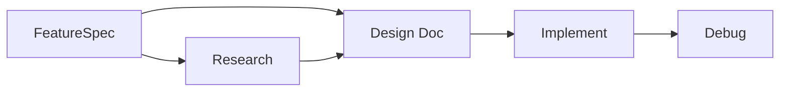

# FeatureSpec Phase

## Overview

FeatureSpec is a new phase that captures "what to build and why" before any design or implementation work begins. It addresses a structural gap in the current workflow: when a user has an idea but jumps straight into design, the scope, target users, and success criteria remain implicit — leading to design work that solves the wrong problem or addresses an unclear scope.

The core mechanism is an AI-driven interview. Rather than asking the user to fill out a template, the AI acts as an interviewer — drawing out the problem, scope, and intent through conversation, then producing a structured document for the user to approve.

## Context and Scope

claude-praxis orchestrates software development through phased workflows. The current main phases are:

- **Research** (`/research`): Explores the problem space, compares approaches, surfaces constraints
- **Design** (`/design`): Produces a Design Doc — architectural decisions, alternatives considered, and rationale for the chosen approach
- **Implement** (`/implement`): Plans from the Design Doc, executes with TDD, auto-reviews each task
- **Debug** (`/debug`): Systematically investigates problems and documents findings

The workflow assumes that by the time `/design` begins, the user already knows what they want to build. In practice, this assumption often fails. Users arrive with varying levels of clarity:

- "I want to add caching" — but caching what? For whom? What's the acceptable staleness?
- "We need better error handling" — but which errors? What's the current pain point? What does "better" mean?
- "Add a FeatureSpec phase" — but what exactly should it contain? How does it relate to the Design Doc?

Without structured elicitation, these ambiguities propagate into research (researching the wrong things) and design (designing for the wrong requirements). The Design Doc's "Why" sections end up thin because the "What" was never properly defined.

This problem is well-documented in software engineering practice. Lightweight pre-design specification formats — Peroli's "mini spec," Basecamp's Shape Up pitch, Amazon's PR/FAQ — all exist to solve the same gap: forcing clarity about the problem and scope before investing in design.

## Goals

- Structure the transition from "vague idea" to "clear requirements" through AI-driven conversation
- Produce a persistent document that defines what to build, for whom, and what success looks like — without making technical decisions
- Create a clear boundary: FeatureSpec owns "What and Why," Design Doc owns "How"
- Integrate into the existing phase detection and workflow so users don't need to remember when to use it

### Non-Goals

- Assessing technical feasibility — that belongs in the Design Doc's research phase
- Creating implementation plans or task breakdowns — that belongs in `/implement`
- Replacing the Design Doc — FeatureSpec defines the problem; Design Doc solves it
- Project management features (timelines, team allocation, sprint planning)

## Proposal

### The Interview Approach

FeatureSpec uses an A+C hybrid interview pattern rather than a template-filling exercise:

**Phase A (Free Form)**: The user describes what they want in their own words. No structure imposed. The AI listens and identifies what's clear, what's vague, and what's missing.

**Phase B (Gap-Filling)**: The AI asks targeted questions to fill gaps. Not a checklist interrogation — questions are contextual, building on what the user already said. If the user said "I want better error handling," the AI might ask "Which errors are causing the most pain right now?" rather than mechanically going through template fields.

**Phase C (Draft and Iterate)**: The AI produces a structured FeatureSpec draft. The user reviews, provides feedback, and the AI revises. This loop continues until the user approves.

This approach matters because it respects how people actually think about features — starting messy and getting clearer through conversation, not by filling forms. The AI's role is to bring structure to the user's thinking without constraining it.

### Template Structure

The FeatureSpec document contains six sections, chosen to cover the essential "What/Why" without straying into "How":

**Problem Statement** — What problem exists today? What's the current workaround or pain point? This anchors the entire spec: if the problem isn't clear, nothing else matters.

**User Stories** — Who benefits, and what does their experience look like? Written as narratives, not technical specifications. Includes all relevant actors (not just end users — operators, administrators, external systems if applicable).

**Scope** — What's in and what's explicitly out. The most important section for preventing scope creep during design. "Out of scope" items are as valuable as "in scope" items.

**Purpose** — What does success look like? Can be quantitative (measurable metrics) or qualitative (user experience improvements). This gives the Design Doc a target to design toward.

**Risks** — Known risks and uncertainties at the requirement level. Not technical risks (those belong in Design Doc) — business risks, user adoption risks, dependency risks.

**References** — Links to related discussions, competitor implementations, user feedback, prior art. Provides context for anyone reading the spec later.

### Workflow Position

The new phase fits at the beginning of the workflow:

After FeatureSpec is approved, the user decides whether to proceed to Research (when the problem space needs exploration) or directly to Design Doc (when the approach is already clear enough). This decision belongs to the user — the AI suggests but doesn't force.

### Integration with Existing Framework

FeatureSpec becomes a new orchestrating command alongside `/design`, `/implement`, and `/debug`. It follows the same patterns:

- Phase detection recognizes when a user's message suggests unclear requirements and suggests `/feature-spec`
- The command produces a persistent document that subsequent phases can reference
- Progress entries record the spec's key decisions for the learning loop
- The Getting-started skill's phase completion table gains a new entry for FeatureSpec → Research or Design Doc

### When to Use FeatureSpec vs. Going Directly to Design

Not every task needs a FeatureSpec. The distinction:

- **Use FeatureSpec**: The problem or scope is unclear. The user says "I want to add X" but hasn't articulated who benefits, what's in scope, or what success looks like. Multiple interpretations are possible.
- **Skip to Design**: The requirements are already clear. The user can articulate the problem, scope, and success criteria without prompting. What remains is the technical "how."
- **Skip to Implement**: Both requirements and design are clear. A Design Doc exists, or the task is small enough that design is implicit.

Phase detection handles this by classifying user messages. Vague feature descriptions ("add caching," "improve performance") trigger a FeatureSpec suggestion. Specific descriptions with clear scope ("implement JWT authentication for the API endpoints, replacing the current session-based auth") suggest Design Doc directly.

## Alternatives Considered

### Alternative: Embed FeatureSpec as Phase 0 of /design

Fold the interview into the beginning of the existing `/design` command, before research begins.

| Aspect | Detail |
|--------|--------|
| How it works | `/design` starts with an interview phase, then proceeds to research and Design Doc creation as before |
| Why Proposal is preferred over this | Conflates two distinct concerns — "what to build" and "how to build it" — in a single command. FeatureSpec should be usable independently (the user might write a FeatureSpec, then wait days before proceeding to design). It also prevents reusing a single FeatureSpec for multiple Design Docs (e.g., when a feature is large enough to split into separate design phases) |
| When to reconsider this alternative | If FeatureSpec is almost always followed immediately by `/design` and separate invocation adds friction without value |

### Alternative: Freeform Document Without Template

Let the AI produce an unstructured document capturing whatever the user described, with no fixed sections.

| Aspect | Detail |
|--------|--------|
| How it works | AI interviews the user and produces a free-form narrative summary |
| Why Proposal is preferred over this | No consistent structure means no quality gate — how do you know when a spec is "complete"? The template's six sections serve as a checklist: if Problem Statement is empty, the spec isn't ready. Freeform documents also make it harder for downstream phases to extract specific information (scope, success criteria) |
| When to reconsider this alternative | If the template proves too rigid for certain domains where requirements don't fit the six-section model |

### Alternative: User Writes Manually, AI Reviews

The user writes the FeatureSpec themselves using a template, and the AI provides review feedback.

| Aspect | Detail |
|--------|--------|
| How it works | A template is provided. The user fills it out. The AI reviews for completeness and clarity, suggesting improvements |
| Why Proposal is preferred over this | Misses the core value of AI-driven elicitation — many users don't know what they don't know. The interview approach surfaces blind spots (missing actors in user stories, implicit scope assumptions, undefined success criteria) that a self-written spec would leave hidden. The AI-as-interviewer pattern is also more aligned with claude-praxis's philosophy of AI as a mirror for human thinking |
| When to reconsider this alternative | For experienced product managers who already think in structured requirements and find the interview process slower than writing directly |

## Concerns

**Template flexibility**: Some features may not map cleanly to all six sections. For example, an infrastructure improvement might not have meaningful "User Stories" in the traditional sense. The interview should adapt — if a section genuinely doesn't apply, it can be marked as not applicable with a brief explanation, rather than forced.

**Interview depth calibration**: Too shallow and the spec doesn't add value over a casual conversation. Too deep and it feels like an interrogation that delays getting to work. The AI needs to calibrate based on how much clarity the user already has — if they arrive with a clear problem and scope, the interview should be brief.

**FeatureSpec-to-Design Doc handoff**: The FeatureSpec must be written at a level that the Design Doc's research phase can build on it. If the FeatureSpec is too vague, research has no direction. If it's too specific, it encroaches on design territory. The boundary is "What and Why, never How" — but in practice this boundary requires judgment.

## Review Checklist

- [ ] Architecture approved
- [ ] Existing workflow compatibility verified (no breaking changes to /design, /implement, /debug)
- [ ] Phase detection integration planned
- [ ] Document persistence strategy confirmed
- [ ] Template sections validated against real use cases
