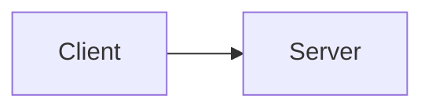

# Design Doc Format

Write documents that work in Notion and are ready for team review.

## Why Over How

A Design Doc is a **decision record**, not an implementation guide.

### The Core Principle

**Write WHY generously. Write HOW sparingly.**

- **WHY this design**: What problem it solves, what constraints shaped it, why alternatives were rejected — this stays valid even when the implementation changes
- **HOW it's implemented**: Code examples, directory structures, API details — these become lies the moment someone refactors

### What the Doc Must Answer

When a newcomer joins the team and reads the doc, they should NOT need to ask:
- "Why did we choose this approach over X?"
- "Was Y considered? Why not?"
- "What assumptions is this design based on?"
- "Under what conditions would we reconsider this?"

If they still have these questions after reading, the doc is incomplete.

### Acceptable Level of Detail

- **Interface contracts** (function signatures, type definitions, API endpoints): OK — these describe boundaries and are part of the design
- **Method implementations, logic flow, error handling details**: NOT OK — these are implementation, not design
- **Directory structures, file organization**: NOT OK — these change with refactoring
- **Data model schemas**: Only the conceptual model (what entities exist and how they relate), not column types or indexes

**Rule of thumb**: If changing the code would require updating the doc, it's too detailed. Design Docs describe WHAT and WHY at the boundary level, not HOW things work internally.

**Exception**: When a specific implementation detail IS the design decision (e.g., "we use CQRS pattern because..."), include just enough to illustrate the concept, marked as **Conceptual**.

## Abstract to Concrete Ordering

Every Design Doc follows an **abstract-to-concrete** structure at two levels:

### Document Level

The overall document flows from abstract to concrete:

1. **WHY** — Overview, Context, Goals (problem space and motivation)
2. **WHAT** — Proposal at the conceptual level (the chosen approach and its reasoning)
3. **HOW boundaries** — Interface contracts, key design decisions (only where the implementation IS the design decision)
4. **Verification** — Alternatives, Concerns, Review Checklist

### Section Level

Within each section, follow the same pattern:

1. Start with context and motivation (why this section matters)
2. Follow with specifics (the actual content)
3. End with implications and trade-offs (what this means for the reader)

A reader should be able to stop reading at any point and still have a coherent (if incomplete) understanding. If the document starts with implementation details, a reader who stops early has specifics without context — useless for decision-making.

## Outline-First Process

When creating a Design Doc, always create the outline first:

1. **Write the outline**: Section headers with 1-2 sentence summaries per section
2. **Review the outline**: Does the argument flow? Are alternatives present? Is abstract-to-concrete ordering maintained?
3. **Then write the full doc**: Expand each section following the reviewed outline

This prevents two common failure modes:
- **Burying the lede**: Important decisions hidden in the middle of the doc
- **Missing alternatives**: Jumping to the proposal without considering options

## Absolute Rules

### No Local File Links

```markdown
❌ Forbidden
[See implementation](./src/auth/middleware.ts)
[Details here](../docs/architecture.md)
[Related skill](skills/code-quality-rules/SKILL.md)

✅ Correct
Describe inline — the reader doesn't have access to your local file system.
If referencing code, quote the relevant snippet directly.
If referencing another document, describe its content or link to a shared URL (Notion page, GitHub permalink).
```

**Why**: Notion does not resolve local paths. Links like `[text](./path)` become dead text.
This also applies to any document shared with the team — they can't click into your repo.

### No `####` (h4) or Deeper

```markdown
❌ Forbidden
#### Sub-sub-section
##### Even deeper

✅ Correct
### Sub-section (h3 is the maximum depth)
```

**Why**: Notion's heading hierarchy goes to h3. Deeper headings lose their formatting and become ambiguous.

### No ASCII Diagrams

```markdown
❌ Forbidden
+--------+     +--------+
| Client | --> | Server |
+--------+     +--------+

✅ Correct — use mermaid

```

**Why**: ASCII diagrams break with font changes and don't render well in Notion. Mermaid diagrams are supported and remain editable.

## Document Structure

Every Design Doc follows this structure:

```markdown
# [Feature/Change Name]

## Overview
One paragraph: what this is and why it matters.

## Context and Scope
Objective background facts that orient the reader WITHOUT requiring prior knowledge of the project.
Include: current state of the system, what triggered this proposal, relevant constraints.
A reader unfamiliar with the project should understand the problem after reading this section alone.

## Goals / Non-Goals

### Goals
- What this design WILL achieve (measurable where possible)

### Non-Goals
- What this design explicitly WILL NOT address
- Prevents scope creep and sets clear boundaries for reviewers

## Proposal
**This is the main section.** The single best approach chosen from research, described at the boundary/interface level.

Explain:
- What the design is
- Why this approach is the best fit given the constraints
- Where this sits on the spectrum: ideal architecture vs. pragmatic middle ground vs. incremental extension of current code — and why that position is right for now
- Key design decisions with reasoning and accepted trade-offs

### System-Context Diagram (optional)
Show where this design fits within the existing system.
Use mermaid diagrams to illustrate how new components relate to what already exists.
Focus on boundaries and interactions, not internal implementation.

## Alternatives Considered
**This section is mandatory.** List the other approaches that were researched but NOT chosen.
For each alternative, explain **why Proposal is better than this option** in the current context.

For each alternative:

### Alternative: [Approach name]

Brief description of the approach.

| Aspect | Detail |
|--------|--------|
| How it works | ... |
| Why Proposal is preferred over this | ... |
| When to reconsider this alternative | ... |

## Cross-Cutting Concerns
Explicitly address how this design handles:
- **Security**: Authentication, authorization, data protection implications
- **Privacy**: User data handling, compliance requirements
- **Observability**: Logging, monitoring, debugging in production
Only include sections relevant to this design. Skip what doesn't apply.

## Concerns
Known risks, uncertainties, ambiguities, and unresolved questions about this design.
For each concern: state what is unclear or risky, and how it will be addressed (mitigation, further investigation, or accepted as-is).

## Review Checklist
- [ ] Architecture approved
- [ ] Security implications reviewed
- [ ] Performance impact assessed
- [ ] Migration plan (if applicable)
```

### Why "Alternatives Considered" Is Mandatory

- New team members will ask "why didn't we do X?" — the answer is already in the doc
- You will forget why you chose this approach in 3 months — the doc remembers
- Reviewers may suggest an approach you already evaluated — point to the doc instead of re-investigating
- If conditions change later, "When to reconsider" tells you when to revisit

## Code Snippets — Use Sparingly

**Default: don't include code.** The Design Doc explains WHY, not HOW. Code changes; rationale doesn't.

### When Code IS Appropriate

Only include code when the code itself IS the design decision (e.g., a specific pattern, interface contract, or data structure that is central to the proposal).

### Rules for Included Code

1. **Always mark as Conceptual**: All code in Design Docs is illustrative, not final.
   > **Conceptual** — illustrates the approach, not the final implementation.
2. **Keep under 10 lines**: If you need more, summarize in prose instead.
3. **No local file links**: Notion can't resolve them. Describe inline or quote directly.

## Lifecycle

- By focusing on WHY over HOW, a well-written Design Doc should NOT need editing — rationale stays valid even when implementation changes
- If implementation reveals a significant deviation from the original design rationale, add an amendment section explaining what changed and why — don't rewrite the original
- The doc remains the entry point for anyone encountering the system later

## Size Guidance

- **Large designs** (new system, architectural change): aim for thoroughness, not brevity. Cover all decisions and alternatives
- **Small changes** (incremental improvement, single component): a mini design doc is fine — Overview, Proposal, Alternatives Considered may be enough
- The right length is determined by the number of decisions that need explaining, not by page count

## Integration

- Used by the `/claude-praxis:design` command, which orchestrates research, outline, review, writing, and quality check internally
- Documents are presented for human approval before implementation begins
- After approval, `/claude-praxis:implement` creates the implementation plan as its first step — the Design Doc itself contains NO implementation plan
