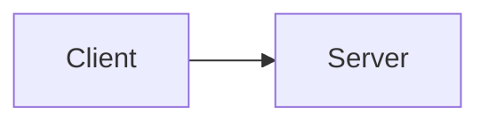

# Design Doc Format

Write documents that work in Notion and are ready for team review.

## Absolute Rules

### No Local File Links

```markdown
❌ Forbidden
[See implementation](./src/auth/middleware.ts)
[Details here](../docs/architecture.md)
[Related skill](skills/code-quality-rules/SKILL.md)

✅ Correct
Describe inline — the reader doesn't have access to your local file system.
If referencing code, quote the relevant snippet directly.
If referencing another document, describe its content or link to a shared URL (Notion page, GitHub permalink).
```

**Why**: Notion does not resolve local paths. Links like `[text](./path)` become dead text.
This also applies to any document shared with the team — they can't click into your repo.

### No `####` (h4) or Deeper

```markdown
❌ Forbidden
#### Sub-sub-section
##### Even deeper

✅ Correct
### Sub-section (h3 is the maximum depth)
```

**Why**: Notion's heading hierarchy goes to h3. Deeper headings lose their formatting and become ambiguous.

### No ASCII Diagrams

```markdown
❌ Forbidden
+--------+     +--------+
| Client | --> | Server |
+--------+     +--------+

✅ Correct — use mermaid

```

**Why**: ASCII diagrams break with font changes and don't render well in Notion. Mermaid diagrams are supported and remain editable.

## Document Structure

Every Design Doc follows this structure:

```markdown
# [Feature/Change Name]

## Overview
One paragraph: what this is and why it matters.

## Goals / Non-Goals

### Goals
- What this design WILL achieve (measurable where possible)

### Non-Goals
- What this design explicitly WILL NOT address
- Prevents scope creep and sets clear boundaries for reviewers

## Background
The problem in detail. Current state, pain points, and what triggered this proposal.

## Proposal
What we're proposing. High-level approach and rationale.

### Architecture
Mermaid diagrams for system design.

### API / Interface Changes
New or changed interfaces with code snippets.

### Data Model Changes
Schema changes if applicable.

## Alternative Concerns
**This section is mandatory.** Its purpose is to prevent repeated discussions.

For each major decision, document:
1. What options were considered
2. Pros/cons of each
3. Why this option was chosen
4. Under what conditions we'd revisit this decision

Format:

### Decision: [What was decided]

| Option | Pros | Cons |
|--------|------|------|
| A: [option] | ... | ... |
| B: [option] | ... | ... |
| **C: [chosen]** | ... | ... |

**Why C**: [Clear reasoning for the choice]
**Revisit if**: [Conditions that would change this decision]

## Implementation Plan
Phases/steps with scope per PR.

## Open Questions
Unresolved decisions that need team input.

## Review Checklist
- [ ] Architecture approved
- [ ] Security implications reviewed
- [ ] Performance impact assessed
- [ ] Migration plan (if applicable)
```

### Why "Alternative Concerns" Is Mandatory

- New team members will ask "why didn't we do X?" — the answer is already in the doc
- You will forget why you chose this approach in 3 months — the doc remembers
- Reviewers may suggest an approach you already evaluated — point to the doc instead of re-investigating
- If conditions change later, "Revisit if" tells you when to reconsider

## Code Snippets in Documents

### No Local File Links

When referencing code, include the relevant snippet directly:

```markdown
❌ Don't do this
See the implementation in [auth.ts](src/auth.ts#L42-L55).

✅ Do this
The auth middleware validates the JWT token:
```

### Mark Code Intent Explicitly

Every code block in a Design Doc must be labeled as either **conceptual** or **implementation-ready**.

```markdown
❌ Ambiguous (causes unnecessary debate about code details)
```typescript
function validateToken(token: string): Claims {
  return jwt.verify(token, SECRET_KEY);
}
```

✅ Clear intent
> **Conceptual** — illustrates the approach, not the final implementation.
```typescript
function validateToken(token: string): Claims {
  return jwt.verify(token, SECRET_KEY);
}
```

✅ Or if it IS the intended implementation
> **Implementation-ready** — implement as written.
```typescript
function validateToken(token: string): Claims {
  return jwt.verify(token, SECRET_KEY);
}
```
```

**Why**: Without this label, reviewers will argue about variable names, error handling, and edge cases in code that was only meant to convey an idea. Labeling saves everyone's time.

- **Conceptual**: "This shows the general approach. Details will be refined during implementation."
- **Implementation-ready**: "This is the exact code to write. Review it for correctness."

Keep snippets short (< 20 lines). If more context is needed, summarize the logic in prose.

## Integration

- Used during the Design Phase (`/design` command)
- Documents are reviewed by the team before implementation begins
- Feeds into `/plan` for implementation planning
